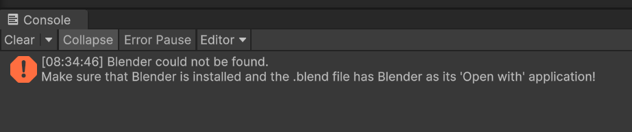
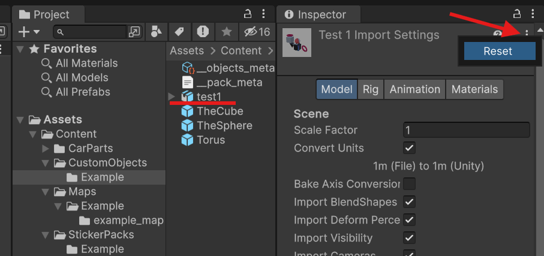

# Настройка Blender интеграции

> [!WARNING]  
> Этот гайд написан на примере CustomObjects (ресурс паков). Однако если вы создаёте **карты**, или **детали авто** единственным различием будет папка сохранения `.blend` файла.

Импорт `.blend` файлов - это самый быстрый и простой способ добавления моделей в редактор.

Сохраните проект Blender в папку с **ресурс паком** / **картой** / **деталями авто**, рядом с файлом **метаданных** (на пример `__objects_meta`).

```
📂 Assets
 └ 📁 Content
    └ 📁 CustomObjects
       └ 📁 Example
          └ 📁 Textures                <- тут могут быть текстуры
          └ 📄 __objects_meta
          └ 📄 your_model_name.blend   <- вот сюда
 └ 📁 SharedTextures                   <- тут могут быть текстуры
```

> [!WARNING]  
> Обратите внимание, что текстуры, которые вы используете в `Blender` для должны находится в папке `Assets` проекта, иначе Unity **не увидит** их.  

Если после сохранения `.blend` файла вы видите в консоли **Unity** такую или подобную ошибку:



Исправить это очень просто. Откройте папку с `.blend` файлом, далее перейдите в его свойства: `RMB -> Properties`


После чего в поле `Open with` нажмите `Change`, а затем укажите путь к `blender-launcher.exe`, который лежит в **корневой директории** Blender. Затем нажмите **Apply** в окне свойств файла.

Затем откройте Unity, выберите `.blend` файл в списке, нажмите на `...` в инспекторе и выберите `Reset`.
