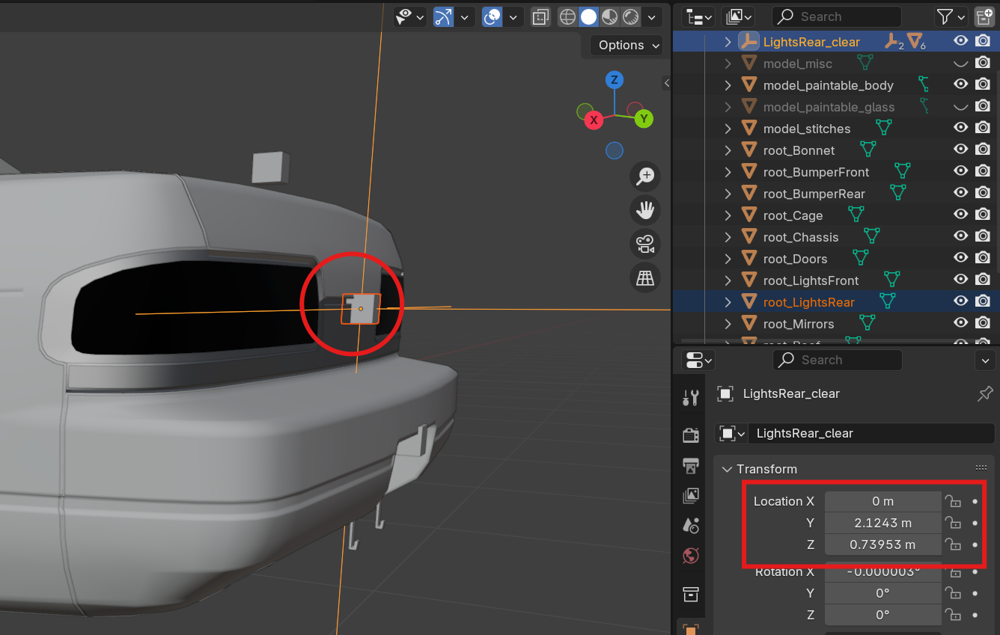
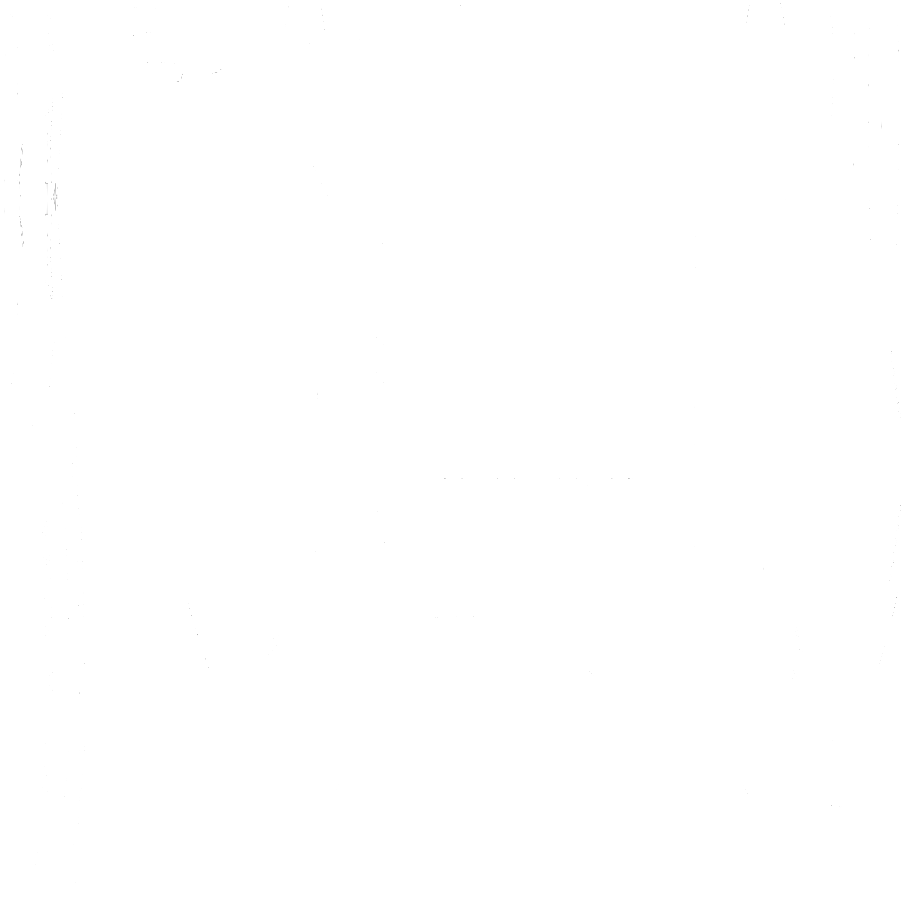
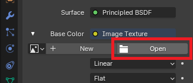
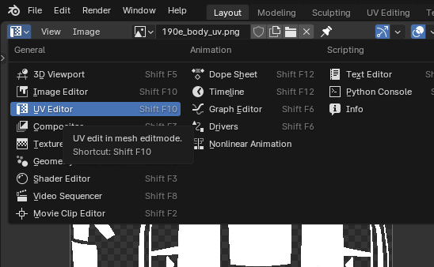
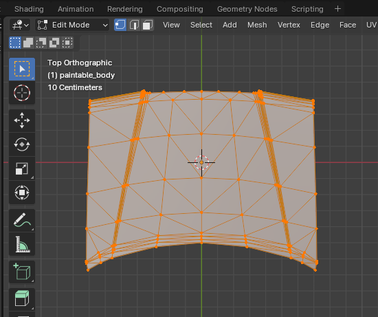
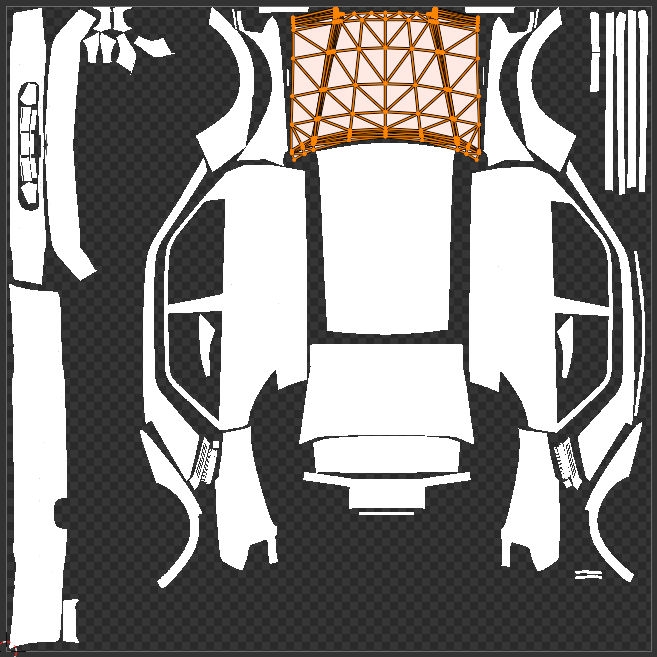
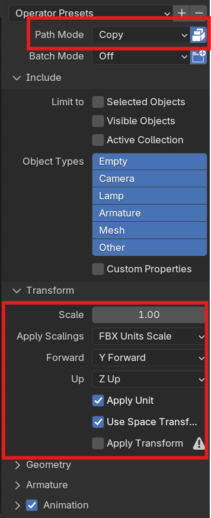

# Создание деталей обвеса авто

## Content SDK

Прежде чем переходить к созданию деталей, убедитесь что у вас установлена последняя версия [ContentSDK](../ContentSDK/ContentSDKInstallation_RU.md).

Если у вас установлен ContentSDK, но вы не последней версии, то обновите его по [этому гайду](../ContentSDK/ContentSDKUpdate_RU.md).

## Подготовка и создание пака

Если вы уже создали пак и хотите добавить в него детали, то этот шаг можно пропустить.

Не нужно создавать для каждой детали отдельный пак, группируйте их по типам, производителям и т.д.

Для создания пака воспользуйтесь [этим гайдом](CustomPartsPackCreation_RU.md).

# Создание модели

> [!NOTE]
> Модель можно создать в любом удобном для вас 3D софте. В примере будет использован `Blender`.

### Подготовка

Перед работой рекомендуется сдампить модель авто, исключив из неё часть, которую вы хотите создать, для этого выполните следующие действия:

1. перейдите в меню дампа авто: `Tools -> Car dumper -> Dump model`
2. в списке отключите части, которые вам не нужны
3. сдампите модель нажав `Dump selected parts`

> [!IMPORTANT]
> Обязательно сдампите `PartRoots`, с ними будет гораздо проще установить объекты в нужные позиции.

### Создание

При создании модели, установите её **нулевую точку** на позицию нужного **рута**. На примере ниже показано правильное позиционирование фонарей.

> [!IMPORTANT]
> Обязательно ознакомьтесь со [структурой](CustomPartsStructure_RU.md) деталей. Составные части детали обязательно нужно правильно назвать и разместить.

Создайте модель в соответствии со [структурой](CustomPartsStructure_RU.md) необходимой детали, после чего можно приступать к экспорту.

### Настройка UV-развертки

Если вы хотите добавить наложение ливрей для вашей детали, то её необходимо правильно замапить. Если вы не хотите добавлять наложение ливрей, то этот шаг можно пропустить.

Для удобной настройки UV-развертки рекомендуется подготовить шаблон, для этого выполните следующие действия:

1. создайте новую ливрею в игре
2. нанесите несколько стикеров на авто, так что бы **полностью** его покрыть со всех сторон
3. сдампите получившуюся ливрею с помощью Kino: `Tools -> Car dumper -> Dump livery`

После вы получите что-то похожее на это:

После чего можно приступать к настройке UV-развертки.

Создайте материал и установите ему текстуру в качестве `Base Color`.

Укажите путь к текстуре развёртки.

Перейдите в `UV Editor` и выберите только что добавленную текстуру.

Далее перейдите в `Edit Mode` и выберите нужную геометрию.

Расположите геометрию на UV-карте правильным образом.

### Экспорт

Вы можете сохранить `.blend` проект прямо в папку `Assets` ContentSDK, и если у вас настроена интеграция с Blender, то можете сразу приступать к [импорту модели](#импорт-моделей-в-unity).

Если же вы хотите экспортировать только часть проекта, то выберите желаемые части и нажмите `File -> Export -> FBX`.

Далее в окне экспорта обязательно установите такие настройки:

После чего экспортируйте модель в подпапку **Assets** в ContentSDK. Далее можно переходить к [импорту](#импорт-моделей-в-unity).

## Импорт моделей в Unity

Для импорта моделей в Unity вы можете перетащить нужные файлы в окно `Project` или поместить их туда вручную, через проводник.

После импорта выберите нужную модель и в окне `Inspector` перейдите на вкладку `Materials`.

Если кнопки `Extract Textures` и `Extract Materials` серые и не кликабельные, то ничего делать не нужно.

Если же они активны, то сперва извлеките текстуры, а после материалы.

Так же вы можете настроить [интеграцию с Blender](../Blender/BlenderIntegration_RU.md), для большего удобства импорта моделей.

> [!IMPORTANT]
> Если вы хотите добавить возможность наложения ливрей на объект, то во вкладке `Model` включите опцию `Read/Write Enabled`.

## Подготовка префаба

После того как вы импортировали и подготовили модель из неё нужно создать префаб для дальнейшей настройки.

Создайте префаб по инструкции:

После чего можно приступать к дополнительной настройке префаба. А если всё готово, то можно [собирать пак](CustomPartsCreation_RU.md#сборка-паков).

> [!NOTE]
> Если вы хотите добавить дополнительные источники света (фары, поворотники и т.д.), то перейдите к [настройке источников света](CustomPartsStructure_RU.md#настройка-источников-света).
