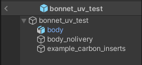
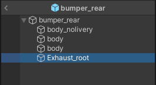
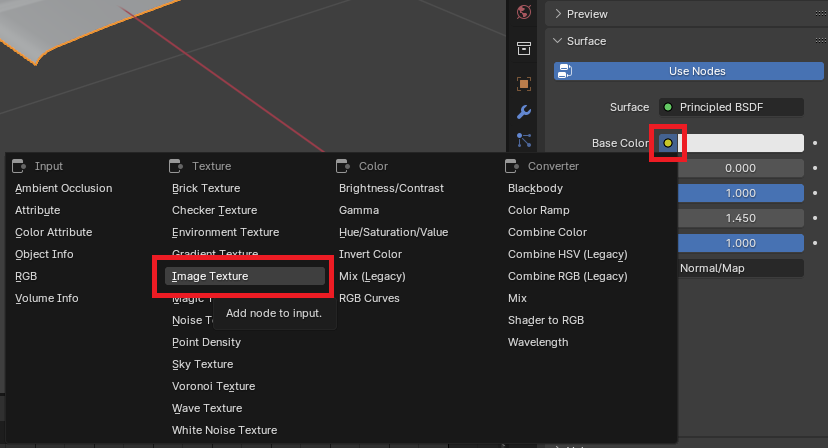

# Kino Content SDK

Убедитесь, что у вас установлена последняя версия [Kino Content SDK](https://github.com/trbflxr/kino_content_sdk/releases).

Если у вас уже был установлен Kino Content SDK, то обновите его, распаковав содержимое архива в ту же папку, с заменой файлов.

# Создание модели

> [!NOTE]
> Модель можно создать в любом удобном для вас 3D софте.

Для большего удобства можно сдампить модель авто, исключив из неё часть, которую вы хотите создать, для этого выполните следующие действия:

1. перейтиде в меню дампа авто: `Tools -> Car dumper -> Dump model`
2. в списке отключите части, которые вам не нужны
3. сдампите модель нажав `Dump selected parts`

# Создание пака с деталями

Если вы уже создали пак, то этот шаг можно пропустить.

> [!NOTE]
> Рекомендуется создавать папку для каждого пака, для нормальной организации проекта.

> [!IMPORTANT]
> В пак можно и даже нужно добавлять несколько деталей. Тогда эти детали будут сгруппированы в своей категории в меню игры и пользователям будет удобнее их использовать.

Первым делом нужно создать папку внутри проекта. Папка должна находится внутри папки `Assets`. Для этого кликните правой кнопкой по пустому месту в окне **Project**, и создайте папку `Create -> Folder`.

Назовите папку как вам угодно, на пример **ExteriorParts**, и перейдите в неё.

> [!NOTE]
> Если вы планируете создавать несколько паков с деталями, то рекомендуется для каждого из них создавать свою папку.

Далее создайте папку для пака, на пример **190e_body_parts** и перейдите в неё.

Затем создайте метаданные для пака, нажав ПКМ по пустой области и выбрав `Kino -> Cerate car parts meta`.

> [!WARNING]
> Файл метаданных обязательно должен называтся `__meta` и никак иначе.

После заполните базовые метаданные пака. У каждого поля есть тултип, наведите курсор на него, что бы узнать более подробную информацию.

> [!IMPORTANT]
> Для создания пака с деталями обвеса нужно выбрать тип `Car Parts`. **Обязательно** укажите ID авто, для которого предназначен этот пак, в поле `Target car ID`.
>
> Узнать ID текущего авто можно в меню Kino: `Tools -> Developer tools`

# Импорт моделей в Unity

Для импорта моделей в Unity вы можете перетащить нужные файлы в окно `Project` или поместить их туда вручную, через проводник.

После импорта выберите нужную модель и в окне `Inspector` перейдите на вкладку `Materials`.

Если кнопки `Extract Textures` и `Extract Materials` серые и некликабельные, то ничего делать не нужно.

Если же они активны, то сперва извлеките текстуры, а после материалы.

> [!IMPORTANT]
> Если вы хотите добавить возможность наложения ливрей на объект, то во вкладке `Model` включите оацию `Read/Write Enabled`.

Далее создайте префаб, для этого выполните следующие действия:

1. Создайте пустой объект на сцене
2. Сбросьте его `Transform`
3. Добавьте модель в только что созданный объект
4. Сохраните префаб и удалите его со сцены
5. Выберите префаб в окне `Project` и двойным кликом перейдите в режим редактирования

После можно приступать к созданию детали.

# Создание деталей обвеса

> [!NOTE]
> В Kino Content SDK есть примеры всех деталей в папке `Assets/Examples/ExteriorParts`. Обязательно ознакомтесь с ними, для большего понимания процесса.

Доступные детали:

* Передний бампер
* Задний бампер
* Пороги
* Двери
* Зеркала
* Капот
* Багажник
* Спойлер
* Крыша
* Каркас
* Выхлоп

Все детали создаются по одному принципу. Нужно импортировать модель в Unity, создать префаб и настроить иерархию.

У некоторых деталей могут быть дополнительные компоненты, об этом [ниже](#настройка-префаба).

## Настройка префаба

> [!NOTE]
> Очень важно установить правильные имена для компонентов префаба, так как будет зависить его отображение в игре.

Материалы детали:

* `body` - компоненты с таким названием можно будет красить и на них будет нанесена ливрея (при [правильной настройке](#настройка-uv-развертки))
* `body_nolivery` - такие компоненты можно будет только красить

Дополнительные компоненты и материалы:

* `mirrors` - назовите так поверхности на **зеркалах**, которые должны иметь отражения
* `Exhaust_root` - точка крепления выхлопа, доступно только для **заднего бампера**
* `Flame_root_<N>` - точка для отстрелов, доступно только для **выхлопа**. Замените `N` на число `0-inf`, называйте точки по порядку.

## Настройка UV-развертки

Для удобной настройки UV-развертки рекомендуется подготовить шаблон, для этого выполните следующие действия:

1. создайте новую ливрею в игре
2. нанесите несколько стикеров на авто, так что бы **полностью** его покрыть со всех сторон
3. сдампите получившуюся ливрею с помощью Kino: `Tools -> Car dumper -> Dump livery`

После вы получите что-то похожее на это:

После чего можно приступать к настройке UV-развертки.

Создайте материал и установите ему текстуру в качестве `Base Color`

Укажите путь к текстуре развёртки

Перейдите в `UV Editor` и выберите только что добавленную текстуру

Далее перейдите в `Edit Mode` и выберите нужную геометрию

Расположите геометрию на UV-карте правильным образом

После чего экспортируйте модель в формате `.FBX` или же `.blend` и [импортируйте](#импорт-моделей-в-unity) её в Unity