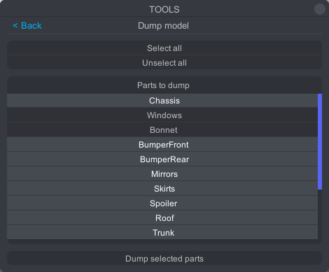

# Kino Content SDK

Make sure you have the latest version of [Kino Content SDK](https://github.com/trbflxr/kino_content_sdk/releases) installed.

If you already had the Kino Content SDK installed then make sure to update it by unpacking teh archive to the same folder with file replacement.

# Model creation

> [!NOTE]
> The model can be created in any 3D software you're accustomed with.

To make the process easier you can dump the CarX car model or the specific parts. Here's how you can do that:

1. Go to the car dump menu: `Tools -> Car dumper -> Dump model`
2. Disable the parts you don't need, or press deselect all and select the ones you want.
3. Dump the model by pressing `Dump selected parts`

# Parts pack creation

If you've already created the pack you can skip this step.

> [!IMPORTANT]
> You can and should add more parts to the same pack. The parts will be grouped inside their own category within the game's manu making them easier to use.

First of all you need to create a folder inside of the project. The folder must be inside the `Assets` folder. You can do it by clicking on an empty space in the **Project** window and going to `Create -> Folder`

Name the folder however you want, for an example **InteriorParts**, then open it.

> [!NOTE]
> It is recommended to create a dedicated folder for each pack so that your project would be better organized and easier to work with

Then create a folder for the pack, for an example **custom_interior_parts** and open it.

Then create metadata for the pack by clicking RMB on an empty space and going to `Kino -> Create car parts meta`

> [!WARNING]
> Metadata file has to be be named `__meta` (exactly)

Then fill out the base pack metadata. Each field has a tooltip, hover over it to get additonal information. 

> [!IMPORTANT]
> To create a pack with interior parts you need to select `Interior Parts` type.

## Unity model import

To import models in Unity you can drag and drop the needed files to the `Project` window or put manually put them there using the windows explorer.

After importing select the needed model and in the `Inspector` window switch to the `Materials` tab.

If `Extract textures` and `Extract Materials` buttons are grayed out and unclickable you can just go to the next step.

If the buttons are active, first extract the textures and then the materials.

> [!IMPORTANT]
> If you want to be able to put stickers on the part select `Red/Write Enabled` in the `Model` tab.

Now you need to create a `prefab` from this model.
You can do so by following these steps:

1. Create an empty object in the scene
2. Reset its `Transform`
3. Add the model to the created object
4. Save the prefab and delete it from the scene
5. Select the prefab in the `Project` windows and double click it to enter editing mode

Now you can get to creating the part

# Interior parts creation

> [!NOTE]
> Kino Content SDK has examples of each part in the `Assets/Examples/InteriorParts` folder. Make sure to examine them for a better understanding of the creation process.

Available parts:

* [Steering wheels](#custom-steering-wheel-creation)
* [Hand brakes](#custom-hand-brake-creation)
* [Shifters](#custom-shifter-creation)
* [Seats](#custom-seat-creation)

### Custom steering wheel creation

Steering wheel model must contain the following components:
`st_wheel_alcantar` and `st_wheel_parts`. You can have an unlimited amount of these components (within the lines of reason).

If `st_wheel_alcantar` and `st_wheel_parts` components are present the wheel will work in the game correctly and you will be able to instal and paint it.

Add a new element to the pack with the `Steering Wheel` type. Also set its size in the `Steering Wheel Size` field.

> [!NOTE]
> If you're creating a steering wheel for the first time, leave the size at the default values. You'll be able to adjust it after checking in the game. If the hands are not placed on the wheel proparly you can readjust the scale and rebuild the pack.

### Custom hand brake creation

Custom hand break must contain the following components:

* `hbrakeA` - the base
* `hbrakeB` - the handle
* `pivot` - the point at which the handle is attached to the base
* `target` - the point at which the driver will grab the handle

> [!NOTE]
> You can have more components, hoever the ones mentioned above are absolutely necessary.

> [!WARNING]
> Hierarchy must match the screenshot provided. The names of the necessary components must also match.

If the driver's hand placement on the handle is wrong you can rotate the `target` on the required axis to fix it.

Add the new element to the pack, then select the `Handbrake` type and fill out the fields.

### Custom shifter creation

Custom hand break must contain the following components:

* `shifterA` - the base
* `shiferB` - the handle
* `pivot` - the point at which the handle is attached to the base
* `target` - the point at which the driver will grab the handle

> [!NOTE]
> You can have more components, hoever the ones mentioned above are absolutely necessary.

> [!WARNING]
> Hierarchy must match the screenshot provided. The names of the necessary components must also match.

If the driver's hand placement on the handle is wrong you can rotate the `target` on the required axis to fix it.

To add the shifter to the pack you need to a new element with `Shifter H Pattern` or `Shifter Sequential` type and fill out the fields. Selected type will decide the animation when shifting gears in the game.

### Custom seat creation

Custom seats must contain the following components:

* `seat_alcantar1` - seat material #1
* `seat_alcantar2` - seat material #2
* `driver_root` - driver position

> [!NOTE]
> You can have more components, hoever the ones mentioned above are absolutely necessary.

> [!WARNING]
> Hierarchy must match the screenshot provided. The names of the necessary components must also match.

To add the seat to the pack you need to create a new element with the `Seat left` or `Seat right` type and fill out the fields.

