# Creating a Custom Interior

## Content SDK

Before proceeding with creation, ensure you have the latest version of [ContentSDK](../ContentSDK/ContentSDKInstallation_EN.md).

If you have ContentSDK installed, but it’s not the latest version, update it using [this guide](../ContentSDK/ContentSDKUpdate_EN.md).

## Preparing and Creating the Pack

If you’ve already created a pack and want to add details to it, you can skip this step.

You don’t need to create a separate pack for every detail - group them by type, manufacturer, etc.

To create a pack, use [this guide](CustomPartsPackCreation_EN.md).

# Creating the Model

> [!NOTE]
> You can create the model in any 3D software of your choice. This example will use `Blender`.

> [!IMPORTANT]
> ContentSDK includes examples of interiors with source files in the `CarParts\Examples\CustomInterior` folder. We recommend reviewing these examples.

## Preparation

Before working, it’s recommended to dump the **stock** interior model. To do so, follow these steps:

1. Navigate to the car dumping menu: `Tools -> Car dumper -> Dump model`
2. Keep only the `StockInterior` and `PartRoots` options active.
3. Dump the model by clicking `Dump selected parts`.

> [!IMPORTANT]
> Be sure to dump `PartRoots`, as they make it much easier to position objects correctly.

## Creation

Import the dumped model into your 3D editor.

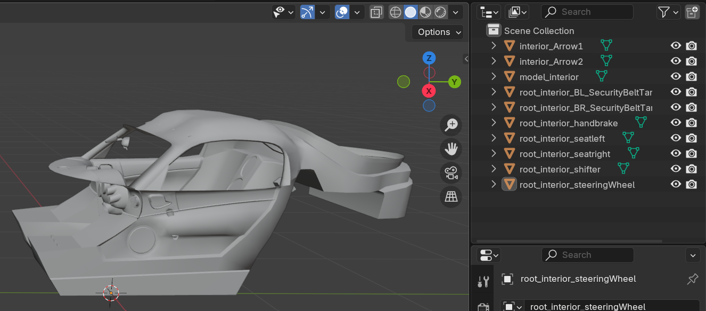

You can modify the stock interior or create a new one based on its shape and dimensions.

### Creating Roots for Interior Parts

For proper functionality, it is **necessary** to create roots for interior parts. Without these roots, seats, steering wheels, shifters, and other components cannot be installed in the car.

If you dumped the model and roots, your hierarchy will include several objects named starting with `root_interior_` - these are the stock roots for the parts.

> [!IMPORTANT]
> Note that a root should be an empty object (`Plain Axes` in Blender).

To create a root, follow these steps:
1. Select one of the `root_interior_` objects.
2. Switch to Edit Mode by pressing `Tab`.
3. Center the cursor on it: `Shift + S -> Cursor to Selected`.
4. Switch back to Object Mode by pressing `Tab`.
5. Create a `Plain Axes` via the menu: `Add -> Empty -> Plain Axes`.
6. Name the root as the original object, but remove the `root_interior_` prefix and add `_root` at the end (example: `root_interior_shifter` -> `shifter_root`).

Repeat the above steps for all roots (2 seats, handbrake, shifter, steering wheel). Optionally, add roots for seatbelt mounts.

### Importing Models into Unity

To import models into Unity, you can drag and drop the files into the `Project` window or manually place them there via the file explorer.

After importing, select the desired model, and in the `Inspector` window, navigate to the `Materials` tab.

- If the `Extract Textures` and `Extract Materials` buttons are gray and unclickable, no action is needed.
- If they are active, extract the textures first and then the materials.

You can also set up [Blender integration](../Blender/BlenderIntegration_EN.md) for more convenient model imports.

> [!IMPORTANT]
> Ensure you select the imported model and enable the `Read/Write Enabled` option in the `Inspector` under the `Model` tab.

### Preparing a Prefab

Once the model is imported and prepared, you need to create a prefab for further configuration.

You can do this in any way convenient for you, or follow this guide:

### Configuring Interior Materials

You can use any materials and shaders for the interior.
However, if you want to add lighting when the ignition is turned on, you need to create and configure a material using the `CarInterior` shader and assign it to the desired objects.

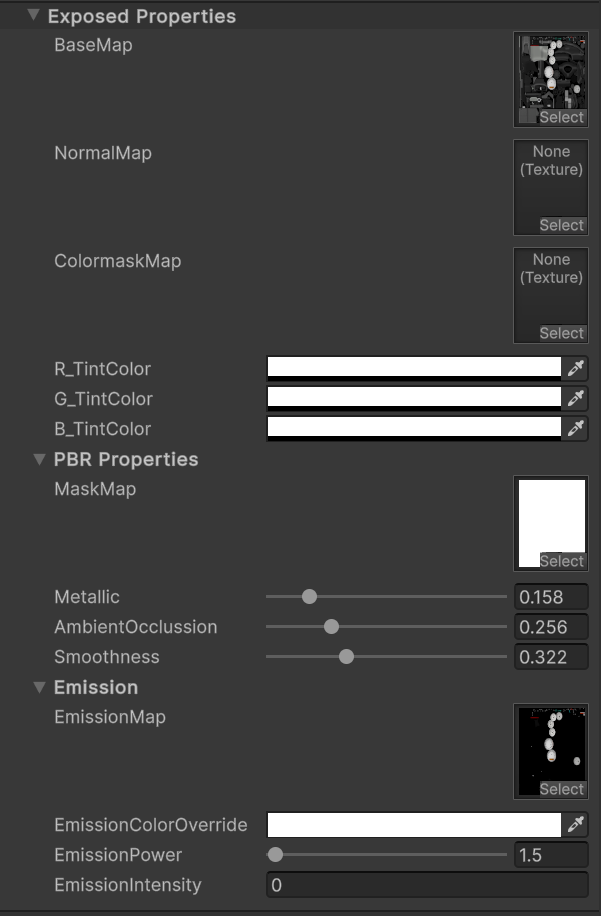

Parameters of the `CarInterior` Shader:
* `BaseMap` - Standard diffusion texture.
* `NormalMap` - Normal map.
* `ColormaskMap` - Mask for specifying the additional paint channels of the object.
* `R_TintColor` - Color for the **Red (R)** channel of the mask.
* `G_TintColor` - Color for the **Green (G)** channel of the mask.
* `B_TintColor` - Color for the **Blue (B)** channel of the mask.
* PBR Properties:
    * `MaskMap` - Mask with PBR properties. More details can be found [here](https://docs.unity3d.com/Packages/com.unity.render-pipelines.high-definition@13.1/manual/Mask-Map-and-Detail-Map.html). The multipliers described below also affect this mask.
    * `Metallic` - Metallic multiplier of the material.
    * `AmbientOcclusion` - Ambient Occlusion multiplier.
    * `Smoothness` - Smoothness multiplier.
* Emission:
    * `EmissionMask` - Emission mask. This mask determines how the object's texture will be illuminated.
    * `EmissionColorOverride` - Emission color modifier.
    * `EmissionPower` - Emission intensity.
    * `EmissionIntensity` - This parameter is controlled by Kino. It can be used for previewing emission but its values **will not be saved**.

---

### Adding Gauges and Indicators

The following gauges and indicators are available for creation:

* `Arrow_Speed`
* `Arrow_Rpm`
* `Arrow_Boost`
* `Arrow_Dummy`
* `DigitalArrow_Speed`
* `DigitalArrow_Rpm`
* `DigitalArrow_Boost`
* `DigitalArrow_Dummy`
* `Text_Speed`
* `Text_Rpm`
* `Text_Boost`
* `Text_Gear`
* `Text_Odometer`
* `Canvas_Root`
* `Canvas_ImageSpeed`
* `Canvas_ImageRpm`
* `Canvas_ImageBoost`
* `Indicator_Left`
* `Indicator_Right`
* `Indicator_HandBrake`
* `Indicator_RunningLights`
* `Indicator_HighBeams`
* `Indicator_CheckEngine`

> [!NOTE]
> Keep in mind that gauges with the `Text` and `Canvas` prefixes can only be created in the Unity editor.

Gauges with the `Arrow` prefix are mechanical gauges with a pointer, without additional animation. They will function even when the **ignition is off**.

Gauges with the `DigitalArrow` prefix are electronic gauges with a pointer. When the ignition is turned on, they will play an "initialization" animation where the pointer moves from the start of the scale to the end and back again. These gauges will display values only when the **ignition is on**.

Gauges with the `Text` prefix are digital and can have any fonts applied, as well as a [display format](https://learn.microsoft.com/en-us/dotnet/standard/base-types/standard-numeric-format-strings). These gauges will display values only when the **ignition is on**.

Gauges with the `Canvas` prefix are 2D elements intended for creating digital dashboards and screens. They will be active only when the **ignition is on**.

Indicators with the `Indicator` prefix are essentially "lights" that display the activity of a specific state. These indicators will reflect their state only when the **ignition is on**.

> [!IMPORTANT]
> Kino will search for gauges and indicators **only** in the `kino_indicators` object, which must be in the **parent object** of the interior.

### Naming Gauges

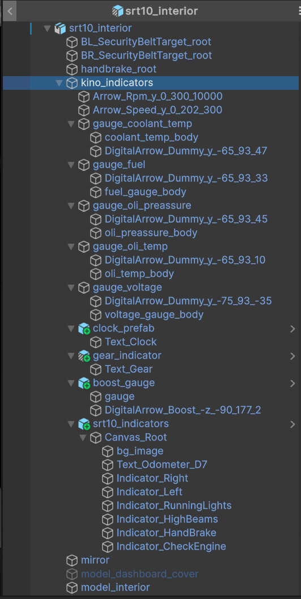

For Kino to recognize an interior object as a gauge or indicator, it must be properly named.

**All** gauges and indicators must have names starting with one of the [prefixes](#adding-gauges-and-indicators).

Some gauges **require** additional values to be included in the name. Values should be separated by an underscore `_`.

> [!NOTE]
> Keep in mind that the needles on the gauge rotate along the `Z` axis in Unity (`Y` in Blender). Consider this when creating them.

Description of values for gauges:
* `Arrow_*` and `DigitalArrow_*` must include **3** additional values:
    * 1: The angle at which the needle indicates the **minimum** value (e.g., 0 RPM).
    * 2: The angle at which the needle indicates the **maximum** value.
    * 3: The **maximum** value on the dial (e.g., 300 km/h, 10k RPM, etc.).
    * 4: **[Optional]** Add the argument `inv` to make the needle rotate counterclockwise.
* `Canvas_Image***` must include **one** additional argument:
    * 1: The **maximum** value on the dial.
* `Text_*` may **optionally** include one argument specifying the [text format](https://learn.microsoft.com/en-us/dotnet/standard/base-types/standard-numeric-format-strings).

> [!IMPORTANT]
> For speed gauge, always specify the value in `KM/H`. Even if the speedometer is marked in miles, convert its maximum value to kilometers and use that.

#### Creating Arrow and DigitalArrow gauges

Name the gauge needle `Arrow` or `DigitalArrow` and include the additional arguments.
For example: `Arrow_Speed_0_202_300` means that the gauge will show speed with the starting point (0 km/h) at **0** degrees and the endpoint (**300** km/h) at **202** degrees.

The needle can be either a 3D object with any material or a 2D object on a `Canvas`; there are no restrictions.

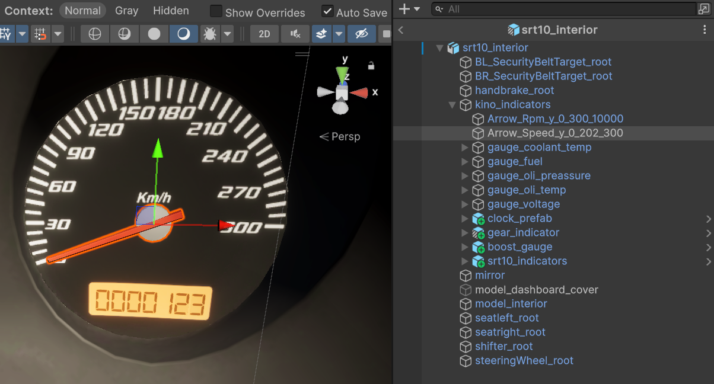

Example of a digital boost gauge: `DigitalArrow_Boost_-90_177_2` means that the starting point is at **-90** degrees and the endpoint (**2** atm) is at **177** degrees of rotation.

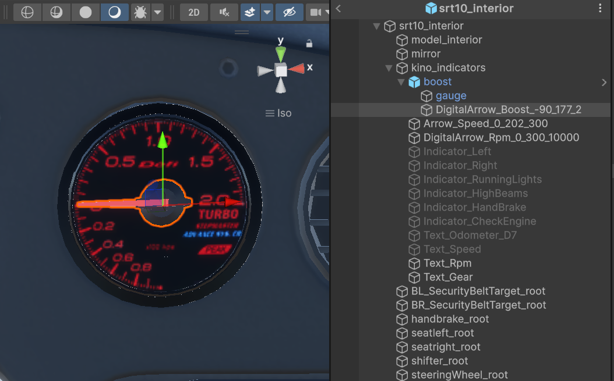

As you know, our game does not feature oil pressure, coolant temperature, voltage, or other values. However, you can add "dummy" gauges with animations to enhance the overall look of the interior.

There are two types of dummy gauges available:
* `Arrow_Dummy` - Mechanical with a pointer
* `DigitalArrow_Dummy` - Electronic with a pointer

Please note that the naming convention for these gauges is similar to standard `Arrow` and `DigitalArrow` gauges, but the **third argument** specifies the **angle** to which the pointer will rotate when the ignition is turned on.

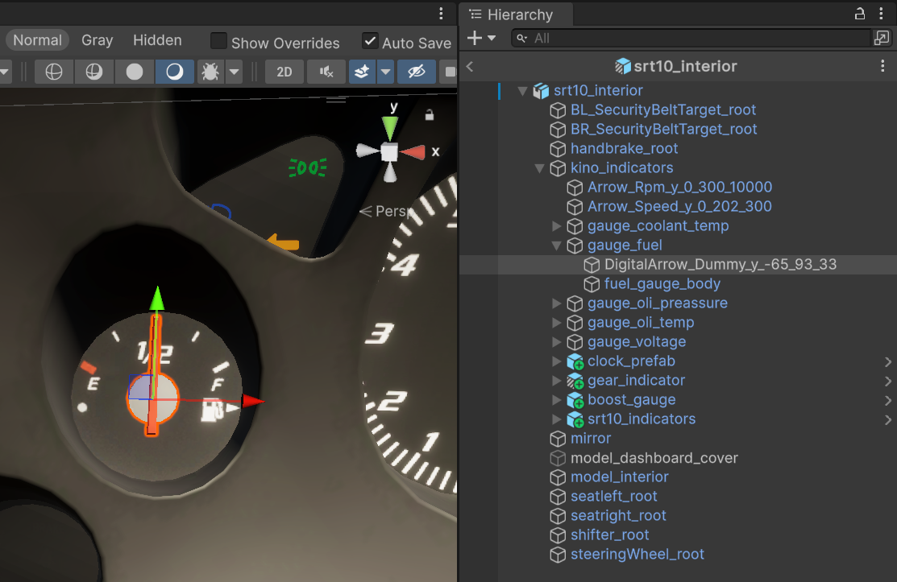

#### Creating Text gauges

To create digital gauges, use the prefix `Text`, then specify the value it will display. Optionally, you can define a text display format.
Example of creating a digital odometer: `Text_Odometer_D7`. **D7** means the text will display in the format `0000069`, i.e., text of 7 characters with leading zeros.

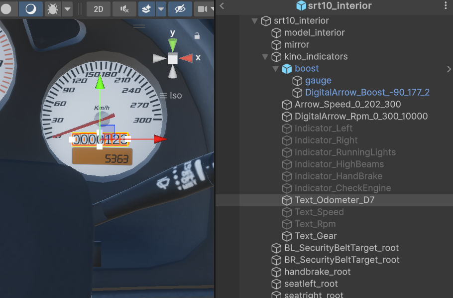

Example of an RPM gauge: `Text_Rpm`.

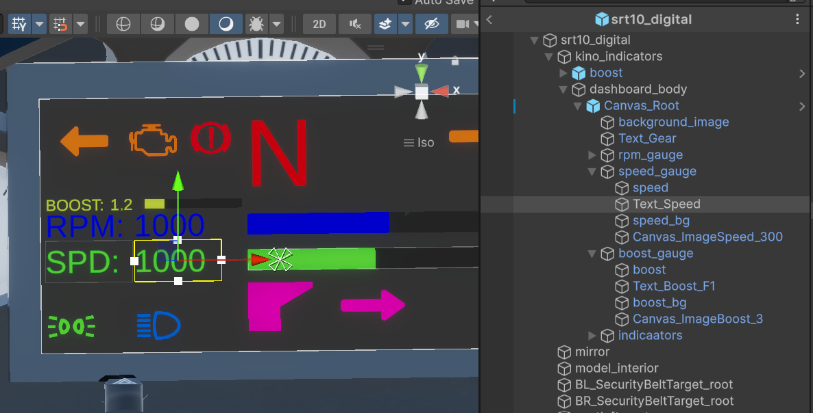

> [!IMPORTANT]
> To create `Text_*` gauges, you must add the `TextMeshPro - Text` component for 3D objects or `TextMeshPro - Text (UI)` for Canvas.

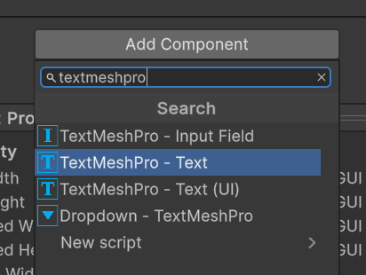

You can configure the text component as desired, including font, formatting, and color. There are no restrictions.

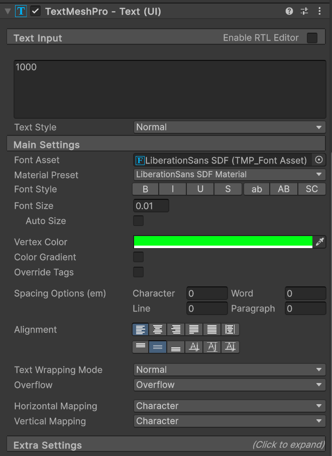

#### Creating Indicators

Indicators can be of **two** types:
* Emissive objects with the `CarEmissiveIndicator` material - 3D objects that illuminate when activated.
* Objects with an `Image` component on a **Canvas** - 2D images/icons on a Canvas.

Example of creating a 3D object `Indicator_Right` - the right turn signal.

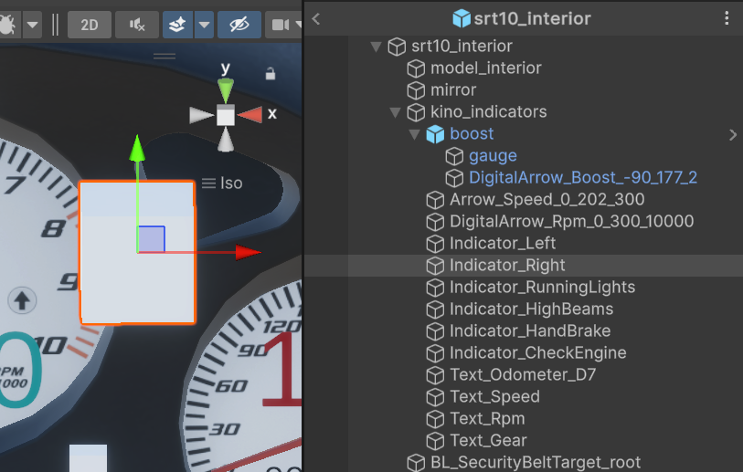

To ensure the indicator is recognized in Kino, assign it a material with the `CarEmissiveIndicator` shader and configure it.

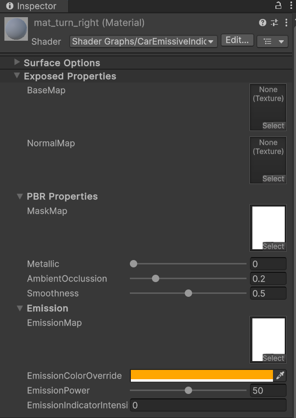

The `CarEmissiveIndicator` shader is a simplified version of the `CarInterior` shader with similar parameters.

> [!IMPORTANT]
> Note that each indicator must have its own separate material.

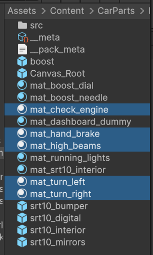

Example of creating a 2D indicator `Indicator_Right` - the right turn signal on a Canvas.

For 2D indicators to function, they **must** be child objects of the `Canvas_Root` object.

Additionally, indicator objects must include an `Image` component, which can be customized as desired.

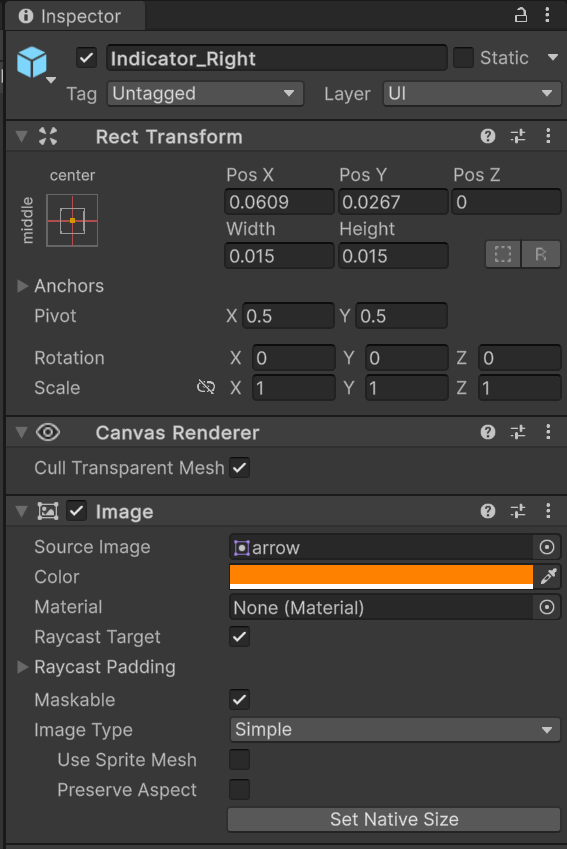

#### Creating Canvas Indicators

There are two types of `Canvas` group elements:
* `Canvas_Root` - A container element, essentially a "screen", where all 2D elements will be displayed. There can be an unlimited number of `Canvas_Root` elements.
* `Canvas_Image***` - A 2D element with an `Image` component and a `Filled` display type. These elements, along with additional images and text, allow for the creation of complex digital dashboards and screens.

All elements with the prefix `Canvas_Image***` must be located within an object named `Canvas_Root`, which itself must include a `Canvas` component.

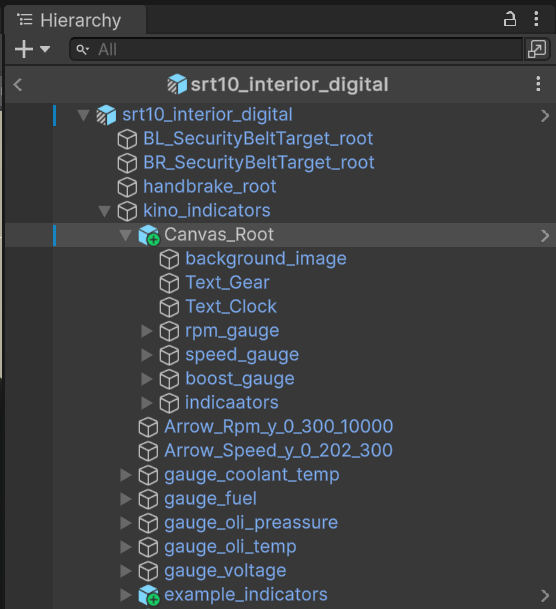

Also, select `World Space` in the `Render Mode` field so that the canvas displays correctly.

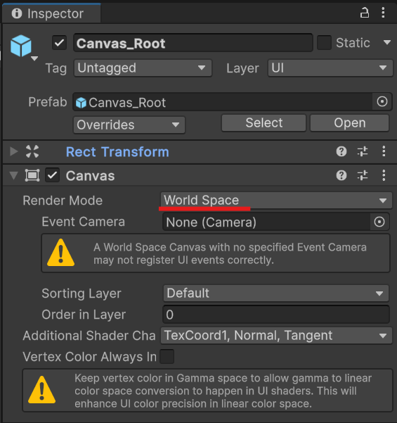

All `Canvas_Image***` elements must have an additional argument specifying the maximum value on the scale, such as 10k RPM for a tachometer scaled to 10k RPM.

Example of creating a 2D RPM gauge `Canvas_ImageRpm_10000`.

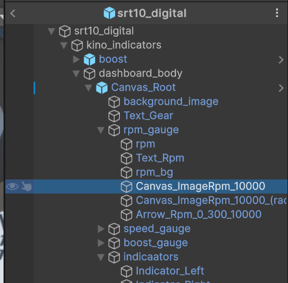

Note that the RPM gauge `Canvas_ImageRpm` is a child object of `Canvas_Root`.
