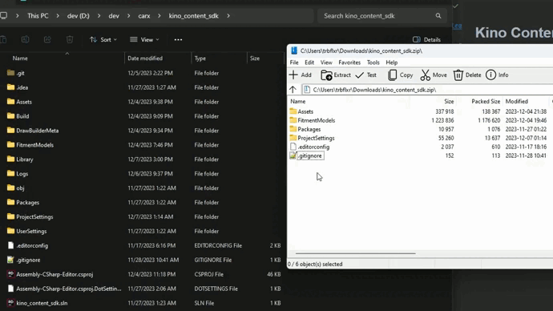
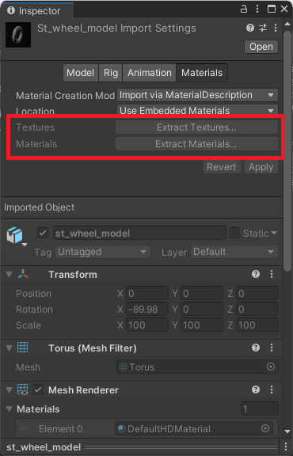
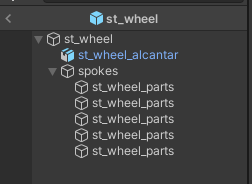
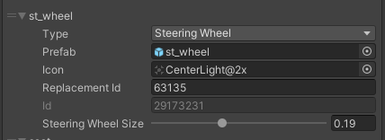
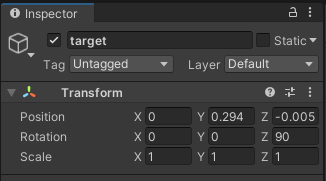

# Kino Content SDK

Убедитесь, что у вас установлена последняя версия [Kino Content SDK](https://github.com/trbflxr/kino_content_sdk/releases).

Если у вас уже был установлен Kino Content SDK, то обновите его, распаковав содержимое архива в ту же папку, с заменой файлов.

# Создание пака с деталями

Если вы уже создали пак, то этот шаг можно пропустить.

> [!NOTE]
> Рекомендуется создавать папку для каждого пака, для нормальной организации проекта.

> [!IMPORTANT]
> В пак можно и даже нужно добавлять несколько деталей. Тогда эти детали будут сгруппированы в своей категории в меню игры и пользователям будет удобнее их использовать.

Первым делом нужно создать папку внутри проекта. Папка должна находится внутри папки `Assets`. Для этого кликните правой кнопкой по пустому месту в окне **Project**, и создайте папку `Create -> Folder`.

Назовите папку как вам угодно, на пример **InteriorParts**, и перейдите в неё.

> [!NOTE]
> Если вы планируете создавать несколько паков с деталями, то рекомендуется для каждого из них создавать свою папку.

Далее создайте папку для пака, на пример **custom_interior_parts** и перейдите в неё.

Затем создайте метаданные для пака, нажав ПКМ по пустой области и выбрав `Kino -> Cerate car parts meta`.

> [!WARNING]
> Файл метаданных обязательно должен называтся `__meta` и никак иначе.

После заполните базовые метаданные пака. У каждого поля есть тултип, наведите курсор на него, что бы узнать более подробную информацию.

> [!IMPORTANT]
> Для создания пака с деталями интерьера нужно выбрать тип `Interior Parts`.

# Импорт моделей в Unity

Для импорта моделей в Unity вы можете перетащить нужные файлы в окно `Project` или поместить их туда вручную, через проводник.

После импорта выберите нужную модель и в окне `Inspector` перейдите на вкладку `Materials`.

Если кнопки `Extract Textures` и `Extract Materials` серые и некликабельные, то ничего делать не нужно.

Если же они активны, то сперва извлеките текстуры, а после материалы.

Далее создайте префаб, для этого выполните следующие действия:

1. Создайте пустой объект на сцене
2. Сбросьте его `Transform`
3. Добавьте модель в только что созданный объект
4. Сохраните префаб и удалите его со сцены
5. Выберите префаб в окне `Project` и двойным кликом перейдите в режим редактирования

После можно приступать к созданию детали.

# Создание деталей салона

> [!NOTE]
> В Kino Content SDK есть примеры всех деталей в папке `Assets/Examples/InteriorParts`. Обязательно ознакомтесь с ними, для большего понимания процесса.

Доступные детали:

* [Рули](#создание-кастомных-рулей)
* [Ручники](#создание-кастомных-ручников)
* [Шифтеры](#создание-кастомных-шифтеров)
* [Сидения](#создание-кастомных-сидений)

### Создание кастомных рулей

Модель руля обязательно должна содержать следующие компоненты: `st_wheel_alcantar` и `st_wheel_parts`. Компонентов этих может быть неограниченное количество (в пределах разумного).

При наличии компонентов `st_wheel_alcantar` и `st_wheel_parts` руль будет корректно воспринят игрой, его можно будет установить и покрасить.

Добавьте новый элемент в пак с типом `Steering Wheel`. Так же установите его размер в поле `Steering Wheel Size`.

> [!NOTE]
> Если вы создаёте руль в первый раз, то оставьте дефолтный размер. Размер нужно будет подобрать, установив руль в игре и включив камеру от первого лица. Если руки будут смещены, то подправьте размер руля и пересоберите пак.

### Создание кастомных ручников

Кастоный ручник обязательно должен содержать следующие компоненты:

* `hbrakeA` - база ручника
* `hbrakeB` - рычаг
* `pivot` - точка крепления рычага к базе
* `target` - точка, за которую пилот будет хватать рычаг

> [!NOTE]
> Компонентов может быть и больше, приведенные выше - обязательные.

> [!WARNING]
> Иерархия обязательно должна соответствовать скриншоту. Имена обязательных компонентов так же должны быть идентичными.

В случае если пилот неверно располагает руку на рычаге, вы можете повернуть `target` по нужной оси, что бы исправить это.

Добавьте новый элемент в пак, выберите тип `Handbrake` и заполните поля.

### Создание кастомных шифтеров

Кастоный шифтер обязательно должен содержать следующие компоненты:

* `shifterA` - база шифтера
* `shifterB` - рычаг
* `pivot` - точка крепления рычага к базе
* `target` - точка, за которую пилот будет хватать рычаг

> [!NOTE]
> Компонентов может быть и больше, приведенные выше - обязательные.

> [!WARNING]
> Иерархия обязательно должна соответствовать скриншоту. Имена обязательных компонентов так же должны быть идентичными.

В случае если пилот неверно располагает руку на рычаге, вы можете повернуть `target` по нужной оси, что бы исправить это.

Для добавления шифтера в пак вам нужно добавить новый элемент с типом `Shifter H Pattern` или `Shifter Sequential` и заполнить поля. От выбранного типа будет зависить анимация переключения передач.

### Создание кастомных сидений

Кастоные сидения обязательно должены содержать следующие компоненты:

* `seat_alcantar1` - материал сидения №1
* `seat_alcantar2` - материал сидения №2
* `driver_root` - точка посадки пилота

> [!NOTE]
> Компонентов может быть и больше, приведенные выше - обязательные.

> [!WARNING]
> Иерархия обязательно должна соответствовать скриншоту. Имена обязательных компонентов так же должны быть идентичными.

Для добавления сидения в пак вам нужно добавить новый элемент с типом `Seat Left` или `Seat Right` и заполнить поля.

