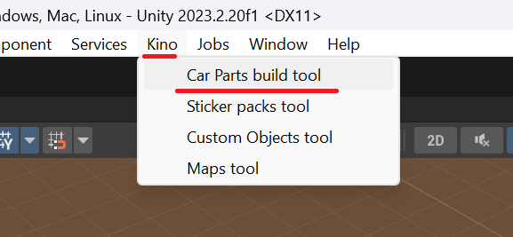
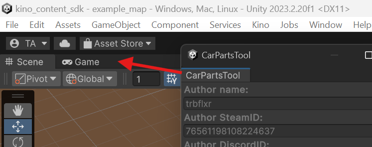
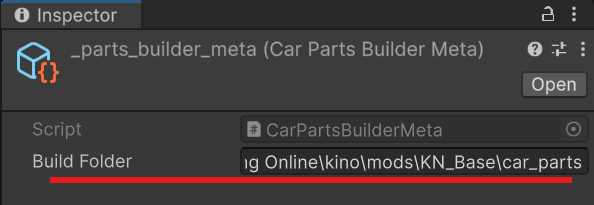
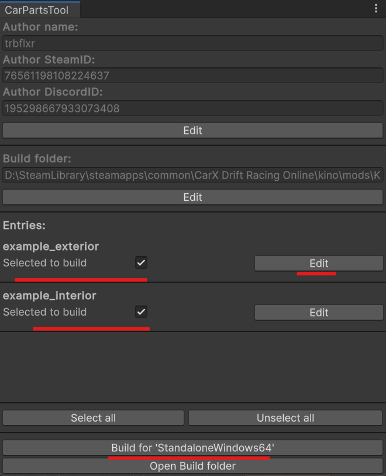

# Создание паков кастомных деталей

## Установка Unity и Content SDK

Установите редактор Unity используя [этот гайд](../UnityInstallation/UnityInstallation_RU.md).

Затем установите и настройте [Content SDK](../ContentSDK/ContentSDKInstallation_RU.md).

> [!NOTE]  
> В папке `Assets/Content/CarParts/Examples` есть примеры паков кастомных деталей, с которыми вы можете ознакомиться.

## Создание контента

Можно приступать к созданию кастомных деталей.

> [Диски](CustomWheels_RU.md)

> [Обвесы](CustomExterior_RU.md)

> [Интерьер](CustomInterior_RU.md)

> [Универсальные детали интерьера](CustomUniversalInterior_RU.md)

## Сборка паков

После того как вы закончили создание пака и заполнили его метаданные, можно приступать к сборке.

Если у вас не открыт инструмент сборки, то сделать это можно через меню `Kino -> Car Parts build tool`.

Можете перетащить **Build tool** в любую зону, для удобства работы

Если вы видете вот такое сообщение, то нажмите на кнопку создания меты.

В поле **Build Folder** можете указать любую удобную папку. Я же указал путь к `KN_Base\car_parts` что бы готовые паки сразу устанавливались в игру.

В окне инструмента сборки выберите ресурс паки, которые хотите собрать используя поле `Selected to build`. После нажмите на кнопку `Build for ...`.

Так же из этого инструмента можно настроить данные об авторе, папку билда, а так же открыть настройки для каждого пака деталей.

После завершения сборки готовые паки будут помещены в указанную вами папку.