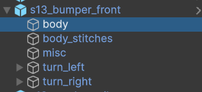

# Parts Structure

> [!TIP]
> Content SDK includes good examples of parts for the Silvia S13 and Mercedes 190e, complete with the original `.blend` files. These examples clearly demonstrate the structure of the parts.

Parts can be roughly divided into two types:
* Body parts:
    * Front bumper
    * Rear bumper
    * Side skirts
    * Doors
    * Mirrors
    * Hood
    * Trunk
    * Spoiler
    * Roof
    * Roll cage
    * Exhaust
* [Headlights and Taillights](#headlights-taillights-turn-signals)

Parts can consist of any number of objects and materials.

The part may contain the following materials that the game interacts with:
* `body` - Material allowing the part to be painted and have decals applied.
* `body_nolivery` - Material allowing only painting.
* `glass_lights` - Material allowing glass painting. Available only for **headlights** and **taillights**.

To enable painting, the Mesh that you want to allow for coloring in-game must be named `body` or `body_nolivery`.

> [!NOTE]
> Parts can also have **additional components**, some of which can be added to all types of parts, while others are specific to certain types.

Additional components:
* `mirrors` - This is the mirror surface, and it will reflect. Available only for the **Mirrors** part.

If you name the object this way, its material will be replaced with a mirror material.

* `Exhaust_root` - Exhaust attachment point.

You can add this point to any part, but note that there should only be **one**. If there are several parts with _Exhaust_root_ on the car, the exhaust will be added to the first one in the list.

* `Flame_root_<N>` - Particle emitter point for exhaust flames, smoke, etc.

You can add this point to any objects in any location. It doesn't have to be the muffler.
You can create a _Hood dump_, an exhaust in the _front fender_, or a bumper with a pre-installed muffler.

Replace `N` with a number `0-inf`, and name the points sequentially.

* `Headlights, taillights, turn signals` - Additional light sources. These can be added to **any part**.

The creation of additional light sources is described below.

# Headlights, Taillights, Turn Signals

These are also additional components for parts but are added via Kino. These components are more flexible in configuration, though this flexibility requires more setup.

You can add the following types of light sources to a part:
* `light_left`, `light_right` - Headlights, left and right. Activated when _running lights_ and _headlights_ are turned on.
* `brake_light_left`, `brake_light_right`, `brake_light` - Brake lights. Activated when _running lights_ and _brakes_ are engaged.
* `turn_left`, `turn_right` - Turn signals. Activated when _turn signals_ or _hazards_ are engaged.
* `reverse_light` - Reverse light. Activated when reverse gear is engaged.

These components can be added in any quantity to any part.

> [!NOTE]
> These are basic components that activate under certain conditions, but each of these components must consist of **specific parts**.

## Light Source Components

Each light source works similarly, with the only difference being the activation condition.

Light source components:
* [emissive](#emissive) - Object with an emissive material (`CarLights` shader). There can be only one for each light source.
* [illumination_light](#illumination_light) - Light source for illumination. There can be multiple, and they should be directed at the object to provide additional lighting.
* [toggle_running](#toggle_running) - Object or group that activates when _running lights_, _headlights_, or in the case of taillights, _brakes_ are engaged. One per light source.
* [toggle_light](#toggle_light) - Object or group that activates only when _headlights_ or in the case of taillights, _brakes_ are engaged. One per light source.

The components can be named either as presented above or with a prefix.

Names like `emissive`, `emissive_left`, `illumination_light_123`, etc., are valid and will be recognized. However, names like `left_emissive`, `my toggle_light`, etc., will not be recognized.

> [!NOTE]
> All components are optional, but for the light source to function, it must have **at least one** of them.

> [!IMPORTANT]
> If you're in the model creation stage, it's enough to give the parts correct names and structure for now.

The main part of the light source setup process will take place in the `Unity editor`. At the modeling stage, you only need to correctly name the part components.

Once the model is ready, if needed, set up the [UV mapping](CustomExterior_RU.md#настройка-uv-развертки), then [export the model](CustomExterior_RU.md#экспорт).

After that, [import the model](CustomExterior_RU.md#импорт-моделей-в-unity) into Unity and [prepare the prefab](CustomExterior_RU.md#подготовка-префаба).

## Light Source Setup

At this stage, you should already have a **prefab** created. Enter edit mode by double-clicking the prefab in the `Project` window.

### emissive

To add glowing properties to an object, it must be assigned a material with the `CarLights` shader, which is included in the Content SDK project.

Please note that the **emissive** object must have correct `UV-mapping` and should look appropriate when a headlight/taillight texture is applied.

> [!IMPORTANT]
> It is very important to separate materials for the left and right sides of the car to ensure the correct operation of the turn signals and headlights.

First, you need to create a material. Open the context menu in the `Project` window, select `Create -> Material`, and name it. Remember to separate the left and right sides, and you can create the material for the opposite side of the car right away.

Set the shader to `CarLights` for the created material. Select the material in the `Project` window, and in the `Inspector` window, open the shader selection.

You can immediately assign the created materials to the objects. In this example, I am assigning the left and right materials to the headlights.

Now let’s configure the material. Select it in the `Project` window and go to the `Inspector` window.

> [!NOTE]
> The setup for the left and right materials is identical. You can select both materials by holding `Ctrl` and configure them simultaneously, or you can configure them one at a time.

The `CarLights` shader material has the following fields:
* `BaseMap` - This is the diffuse texture.
* `NormalMap` - Normal map.
* PBR properties:
    * `MaskMap` - PBR mask with properties, more information can be found [here](https://docs.unity3d.com/Packages/com.unity.render-pipelines.high-definition@13.1/manual/Mask-Map-and-Detail-Map.html).
      This mask is also affected by the multipliers described below.
    * `Metallic` - Material metallicity multiplier.
    * `AmbientOcclusion` - Ambient Occlusion multiplier.
    * `Smoothness` - Smoothness multiplier.
* Emission:
    * `EmissionMask` - Emission mask. This mask controls how the texture will glow. Details on creating and configuring this are in the section [Creating an Emission Mask](#creating-an-emission-mask).
    * `LightColorOverride` - Light color modifier for **headlights** or **brake lights**, depending on the source.
    * `TurnColorOverride` - Color modifier for **turn signals**.
    * `ReverseColorOverride` - Color modifier for the **reverse light**.
    * `EmissionLights_R` - Intensity of the **headlight** or **brake light** glow zone, depending on the source.
    * `EmissionRunning_G` - Intensity of **running lights**.
    * `EmissionTurn_B` - Intensity of **turn signal** indicators.
    * `EmissionReverse_A` - Intensity of the **reverse light** signal.
    * `HeatSpeed` - Multiplier for how quickly the light source reaches **peak brightness**.
    * `CoolSpeed` - Controls how quickly the glow **dims** after deactivation.
    * `EmissionIntensity` - This parameter is controlled by Kino. You can use it for preview purposes. Its values **will not be saved**.

The `HeatSpeed` and `CoolSpeed` multipliers can be used to create the effect of **halogen** bulbs, which heat up quickly but cool down more slowly.

> [!NOTE]
> Color modifiers are used to set a specific glow color. By default, they are **white**, which means the glow will match the color of the `BaseMap`.
>
> However, when creating, for example, **clear taillights**, the texture color will be white, but the brake lights are _usually_ red. This is where the color modifier comes in. You can set **red** in the `LightColorOverride` for the correct glow.

#### Creating an Emission Mask

The Emission mask defines the illuminated zones. Essentially, it’s a regular texture consisting of 4 channels: Red (R), Green (G), Blue (B), and Alpha (A).

Emission channels:
* `R` - The Red channel controls the illumination of **headlights** and **brake lights**.
* `G` - The Green channel controls the illumination of **running lights**.
* `B` - The Blue channel controls the illumination of **turn signal indicators**.
* `A` - The Alpha channel controls the illumination of the **reverse light indicator**.

To create the mask, you can use any photo editing software. This can be Photoshop, Gimp, or in this example, we’ll use the online editor [Photopea](https://www.photopea.com/).

In this example, we will create a mask for taillights since they use the `A channel`. For headlights, only `RGB` channels are used, as headlights cannot have a **reverse light indicator**.

1. For convenience, you can load the **diffuse** texture and make it more transparent to simplify drawing the illuminated zones.
2. Create a **new layer** and fill it with **black**.
3. Using any method you like, draw the necessary **illumination zones** on this layer, following the **channel** guidelines described above.
   If a zone needs to be illuminated in **multiple channels**, combine them. For example, if the zone is illuminated by both the **running lights** and **brake lights**, paint it **yellow** (`R` + `G` = `Yellow`).
4. Go to the `Channels` menu and add a **new layer**.
5. On the new layer (`Alpha`), paint the **reverse light** zones in **white**.
6. Turn off the **diffuse** layer visibility, so only the **mask** layer is visible.
7. Save the file either as `PSD` or export it as `TIFF`.
8. Place the mask in the **project** folder. Then **apply** it in the **material** settings.

### illumination_light

These are additional objects with `Light` components that are needed for extra **illumination**.

There can be multiple `illumination_light` objects for each light source (meaning headlights, brake lights, turn signals, etc.).

As mentioned above, each `illumination_light` object must contain a `Light` component.

The light source type can only be `Spot`, `Point`, or `Area`. Be sure to **disable** `Shadow Map` and `Volumetrics` if such options are available, as this will greatly improve performance.

You can also adjust the **color** of the illumination, its **intensity**, and **range**. However, note that the **headlight** color will be **overwritten** by the user-defined color in the Kino light controller.

> [!IMPORTANT]
> Try to add as few `illumination_light` objects as possible to minimize the impact on game performance.

### toggle_running

This object will toggle depending on the current headlight state. Each light source can have only one `toggle_running` object, or none at all.

The `toggle_running` object will be active when the **running lights** and/or **headlights** are turned on.

However, keep in mind that this object can only be present on **headlights** and **taillights**. It cannot be used on turn signals or reverse lights.

You can add as many objects as you like to `toggle_running`, and the entire group will toggle depending on the current headlight mode.

### toggle_light

This object will be active only when the **headlights** are on, the **brake** is pressed, or the **turn signal** or **reverse indicator** is active.

Each light source may **optionally** have only one `toggle_light` object.

When creating headlights, it is in the `toggle_light` object that you need to add objects with the `Light` component and `Spot` type.

These light sources will illuminate the area in front of the car.

#### Setting Up Headlight Light Sources

When setting up headlight light sources, you can also configure several important parameters.

You can set the lights at the **correct angle** so that they shine on the road rather than straight ahead, and set the **lighting range**.

The project includes two types of masks: `head_lights_mask_left` and `head_lights_mask_right` for **left-hand** and **right-hand** drive vehicles.

Set them in the `Cookie` field to add extra details to your headlights.

You can also enable **shadows** and **Volumetric interaction** for the headlight light sources.

> [!IMPORTANT]
> If your headlights have multiple light sources, enable **shadows** and **Volumetric** for only one of them, as these options significantly impact performance.

#### Additional Metadata for Headlights and Taillights

You can set additional parameters for the headlights and taillights:
* `Override Turn Signals` - When this option is enabled, Kino **will not add** standard light sources for turn signal indicators. We recommend **enabling** this option.
* `Override Headlights Mask` - If this option is enabled, the mask set in the headlight light sources' `Cookie` field will be used as the headlight mask. We recommend **enabling** this option.
* `Override BrakeLight` - When activated, it allows you to **disable** the standard brake light source.

