# Custom wheels creation

> [!IMPORTANT]
> Before you begin, make sure you have `kino_content_sdk` installed. More about it [here](https://github.com/trbflxr/kino/blob/master/ContentCreation/CustomCarPartsCreation_EN.md).

## Bundle preparation

If you have already created a bundle you can skip this step.

> [!NOTE]
> It recommended to create a separate folder for each pack for a proper project organization.

> [!IMPORTANT]
> You can and should add **multiple** wheels to a **single** pack. That way the wheels will be in their own group inside the menu and will make navigation easier.

First you need to create a folder inside a project. The folder should be located inside the `📁 Assets` folder. To do that right click on an empty space inside of the **Project** window and create a folder:
> `Create`  
> └ `Folder`

Name the folder whatever you want (for an example **Wheels**) and open it.

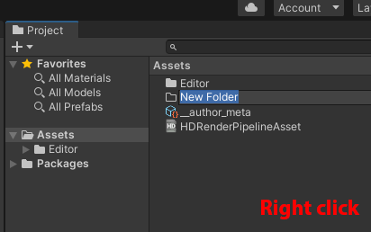

> [!NOTE]
> If you intend on creating multiple wheels packs it is recommended to create a separate folder for each one.

Then create the folder for the pack (for an example **wheels_pack1**) and open it.

Then create the bundle metadata by right clicking on an empty space and going to
> `Kino`  
> └ `Create car parts meta`

> [!WARNING]
> Metadata file absolutely must have to be named `__meta`. Otherwise it won't be recognized by the mod.

After fill out the basic pack metadata. Each fild has a tooltip that you can see by hovering a cursor over it to access a more detailed explanation.

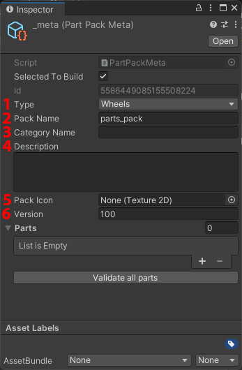

1. **`Pack type.`** In this case `Wheels`
2. **`Pack name.`** It has to be in lower case, lating letters only, you're allowed to use numbers and `_`. **No spaces allowed.**
3. **`Category name`**. Optionally you can specify the name that will be displayed in game on the pack label.
4. **`Pack description`**.
5. **`Icon`**. Optional field, however we recommend to have an icon made.
6. **`Pack version`**. Not in use at the moment. Leave as is.

Bundle preparation is ready, now you can [create](#wheel-model-creation) and [import](#unity-model-import) models.

## Wheel model creation

> [!NOTE]
> If you created wheels for the workshop before you can skip this step and get to [importing in Unity](#unity-model-import)

The guide uses `Blender` for the examples. If you're using a different 3D modelling software the steps will be roughly the same.

After creating the model you can prepare it for export.

> [!IMPORTANT]
> The wheel has to be facing `X` axis.

> [!IMPORTANT]
> The wheel has to have at least 2 pieces: `rim` and `spokes`. **The names need to be exactly as mentioned**. Also these parts should not contain textures. However the wheel can have more than two components and they can be named whatever you want. You can also put textures on them.

In the example bellow the wheel has `wheel_nuts` component.

> [!IMPORTANT]
> Also be vary of the wheel offset relatively to the absolute zero. The wheel will be attached to the car at the central point of the `spokes` component. Keep that in mind and if necessary the wheel can be moved in the needed direction of the `X` axis.


Now the wheel needs to be fitted to the game's scale. To do that import the fitment model to the scene. It's located inside:

```
📂 kino_content_sdk
 └ 📁 FitmentModels
```

Then fit your wheel to the scale of the fitment model.


Once you're done you can export the wheel. Make sure the `Transform` parameters are the same as on the picture.

Also if you have other objects in the scene you don't want to be part of the export, you can select one of the options `Limit to` (or `Export selected...` for 3Ds Max). Alternatively you'll be able to disable objects you don't need in Unity after creating the prefab.


After the model is exported you can get to importing it to Unity.

## Unity model import

To import models in Unity you can drag and drop the needed files to the `Project` window or put manually put them there using the windows explorer.

After importing select the needed model and in the `Inspector` window switch to the `Materials` tab.

If `Extract textures` and `Extract Materials` buttons are grayed out and unclickable you can just go to the next step.

If the buttons are active, first extract the textures and then the materials.

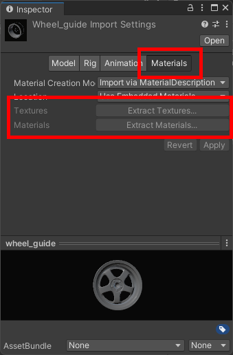

Now you need to create a `prefab` from this model.
To do so by following these steps:

1. Drag and drop the model to the scene `Hierachy`
2. Make sure the `Transform` component has the same values as in the picture bellow.

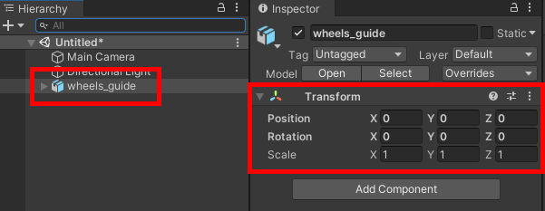

3. Now create the prefab by drag and dropping the model from the `Hierarchy` to the `Project` window where the model is and select `Original Prefab`

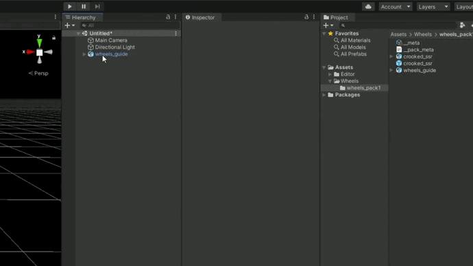

4. Now the prefab is ready to use.

## Adding wheels to the pack

> [!WARNING]
> If at this stage you still haven't created the metadata for the pack, do it now by following [the guide above](#bundle-preparation)

To make the wheels available in game all you have to do is add them to the pack.

1. In the `Project` window select the `__meta` file we created earlier.


2. Then add a slot for the wheel to the list by pressing `+`
3. Fillout the fields as shown bellow


> [!NOTE]
> Take note that in the `Replacement Id` I specified the value `111` which is an ID of **a vanilla CarX wheel** that looks the most similar to the one I've added.

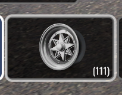

### Replacement ID

Optionally, however highly recommended field to fill out. It's needed so that the people without **Kino** or **this pack** installed would see the most similar looking **vanilla wheels** on your car.

## Building the pack

An important step is building the pack.

The building process for all bundle types is described [here](https://github.com/trbflxr/kino/blob/master/ContentCreation/CustomCarPartsCreation_EN.md).

---

## Issues with the wheels in game

If after loading the wheels in game they don't show up or facing the wrong direction you can easily fix it.

Enter the editing mode by double clicking the required prefab in the `Project` window.

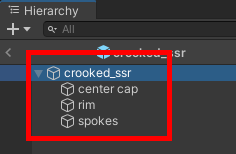

### Scaling issues (can't see the wheel)

Make sure the `Transform` component in the root object (in this case crooked_ssr) has all the values in the `Scale` field set to **1**.

Then select all the objects inside the root object and check the `Scale` fields of the `Transform` component.

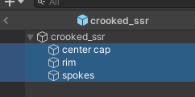

If you followed the guide the scale values would be higher or equal to **1**.
However if the value is less than one then set the values in the `Scale` fields to **1**, save the prefab and rebuild the pack. Then test it in game again.

This way you can attempt to get the scale right.

> [!NOTE]
> If you're using 3Ds Max and the source model is in .obj you might have to convert the units to **meters** on import, otherwise the model may appear too small.

### The wheel is facing the wrong direction

Open the prefab editing mode and check which direction the wheel is facing. The wheel is supposed to be facing the opposite direction of the `X` axis as shown bellow.

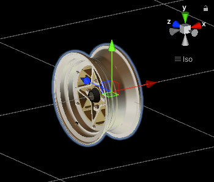

If the wheel is rotated differently then select all of the components inside of the root object and rotate them to face the correct direction.


In our case rotation the wheel by `-90` on the `Y` axis fixed the issue.


### The wheel has a wrong offset

if the wheel has a wrong offset or it is off-center on one of the axes it can be easily fixed.


Select the needed prefab and double click to enter the editing mode. Then select all the objects in side the root object and check the `Position` parameter inside of the `Transform` component.

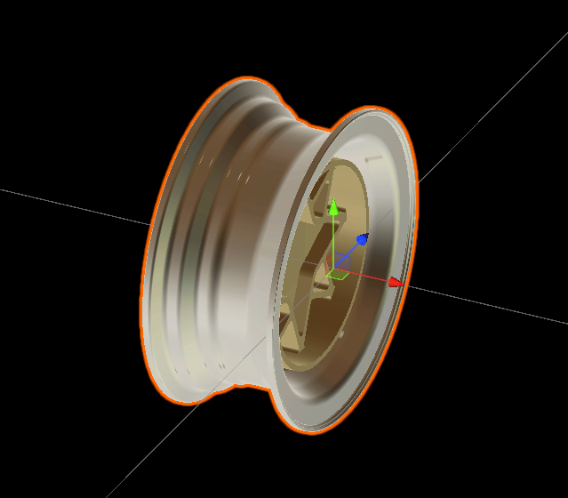

The game will attach the wheel to the wheel hub using the center point of the `spokes` object. On the screenshot above you can see how far off-center it is.

Move all the objects inside of the root object to enough to compensate for the offset.


In this case the setting the value `0.071` for the `X` axis fixed the issue.

Then save the prefab and rebuild the pack.

### Wheel is still offset or clipping though the brakes

If even after setting the offset for the wheel components its position is still off you need to fix it in your 3D software (in our case Blender).

On the screenshots provided you can see that the origin of the `spokes` component is located at the center of the object. That’s the point that wheel will be attached at.

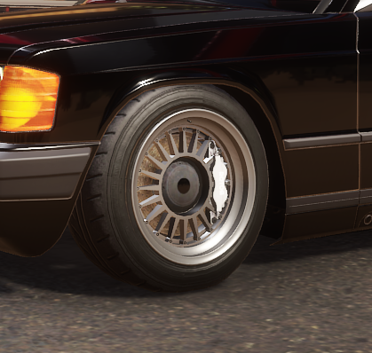

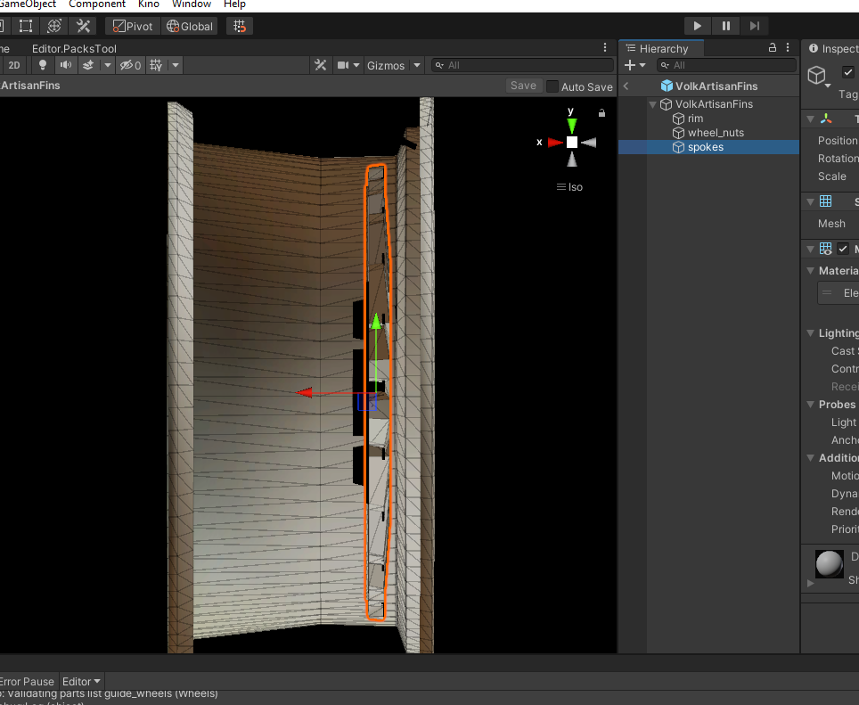

In order to fix that follow the steps provided:

1. Open the model in your 3D software of choice (in our case Blender)
2. Go to the `Object mode`
3. Put the 3D cursor at the point where the `origin` is supposed to be
4. Press `Object -> Set origin -> Origin to 3D Cursor`
5. Then export the model and [import](#unity-model-import) it in Unity

