# Создание ресурс паков

## Установка Unity и Content SDK

Если у вас всё ещё не установлен Unity, то установите его используя [этот гайд](../Tools/UnityInstallation_RU.md).

Если у вас не был установлен **Content SDK**, то [установите и настройте его](../Tools/SDKInstall_RU.md). Или же [обновите](../Tools/SDKUpdate_RU.md) **Content SDK**, если он уже был у вас установлен.

> [!NOTE]  
> В папке `Assets/Content/CustomObjects/Example` есть пример ресурс пака и вы можете с ним ознакомиться.


## Подготовка структуры проекта

Предполагается, что все ресурс паки должны находиться в папке `Assets/Content/CustomObjects`.

Каждый ресурс пак должен находится в **своей** папке. Это повысит удобство и ускорит создание.

Пример структуры:

```
📂 Assets
 └ 📁 Content
    └ 📁 CustomObjects
       └ 📁 Example
       └ 📁 MyPack1
       └ 📁 MyPack2
```

> [!IMPORTANT]  
> Создавайте новую папку в `CustomObjects` для каждого нового ресурс пака.

## Создание метаданных ресурс пака

> [!IMPORTANT]  
> В данном примере будет использовано имя пака `Example`. Вы же называйте ресурс паки как хотите.

Для каждого нового пака необходимо создать **файл метаданных**. Для этого создайте и перейдите в папку нового ресурс пака. После чего создайте файл метаданных с помощью **контекстного меню**.

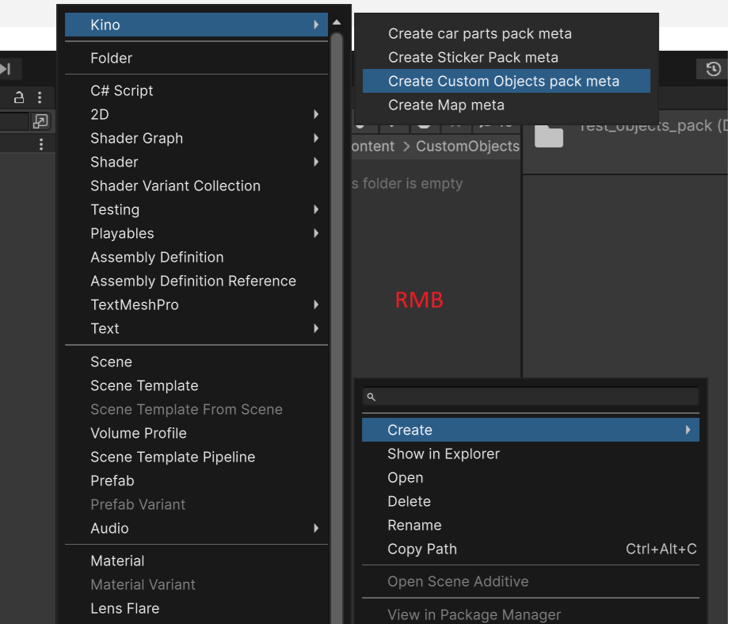

Структура должна выглядеть следующим образом:
```
📂 CustomObjects
 └ 📁 Example
    └ 📄 __objects_meta
```

## Заполнение метаданных ресурс пака

Заполните метаданные о паке. Это нужно сделать **один раз** для **каждого** ресурс пака.

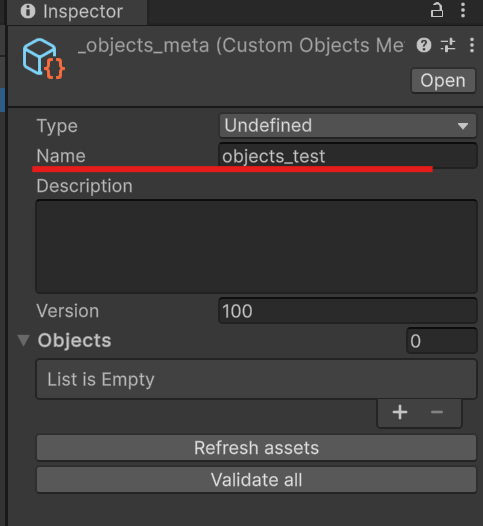

Самым важным полем является **Name**, это и есть название ресурс пака, оно должно быть уникальным.

Остальные поля **опциональные**, можете их не заполнять.

## Создание и настройка объекта в Blender

В данном примере будет рассматриваться работа с Blender, однако вы можете использовать любой другой софт.

Вы можете добавить следующие опции для объектов:
* [CarPaint](#carpaint) - возможность покраски объекта в игре
* [CarLights](#carlights) - источники света
* [Exhaust](#exhaust) - источник партиклов выхлопа
* [Bindable](#bindable) - возможность назначить кнопку переключения активности

### CarPaint
Флагом CarPaint нужно отметить те объекты, для которых подразумевается возможность покраски.

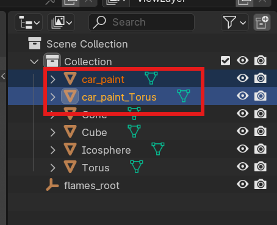

> [!IMPORTANT]  
> В примере видно, что для добавления CarPaint необходимо либо назвать объект `car_paint`, либо дописать `car_paint_` в начале его имени.

### CarLights

Для дополнительных фар и фонарей для авто создайте необходимые вам объекты, как показано на примере ниже.

Это могут быть как пустые объекты с источниками света, которые модно настроить прямо в **Blender**, так и модели. Никаких ограничений.

Видимость `head_lights` и `running_lights` будет переключиться в Kino биндами для фар. Так же при нажатии тормоза будут включены объекты `tail_lights`.


> [!IMPORTANT]  
> Для добавления CarLights необходимо либо назвать объект `head_lights, running_lights, tail_lights`, либо дописать эри префиксы в начале его имени.

Видимость `turn_left` и `turn_tight` будет работать по той же логике, что и аварийки Kino.

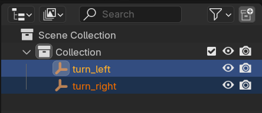

> [!IMPORTANT]  
> Для добавления поворотников / авариек используйте префиксы `turn_left` и `turn_tight` или назовите так объект.

Сигнал заднего хода `reverse_lights` будет активен если включить заднюю передачу.

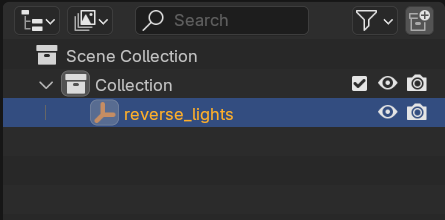

> [!IMPORTANT]  
> Для добавления сигнала заднего хода используйте префикс `reverse_lights` или назовите так объект.

### Exhaust

Опция Exhaust позволяет установить от куда будут вылетать партиклы выхлопа.

Для добавления источника выхлопа необходимо создать пустой объект и установить ему необходимую позицию и вращение.

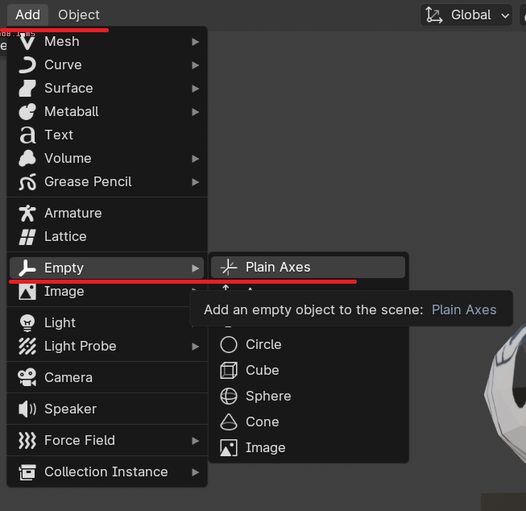

Обратите внимание, что партиклы будут вылетать по направлению оси `Z`. Поверните объект в правильном направлении.

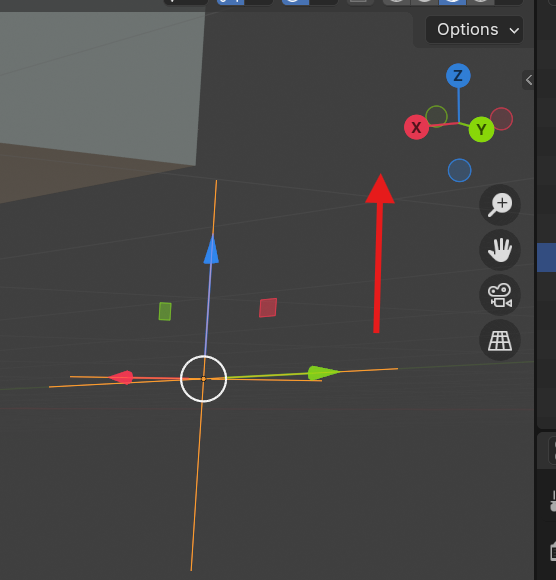

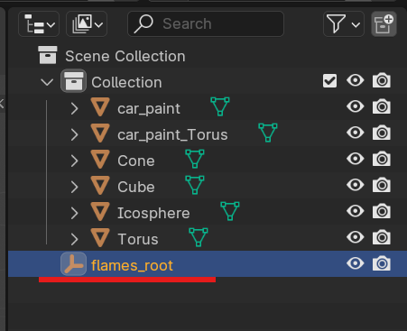

> [!IMPORTANT]  
> Назовите объект `flames_root` или допишите `flames_root_` в начале его имени, что бы отметить его как источник выхлопа.

### Bindable

С помощью опции Bindable пользователю можно дать возможность назначить кнопку переключения активности объекта.

Обратите внимание, что Bindable может быть как весь объект целиком, так и его части. Объект может содержать неограниченное количество Bindable частей.

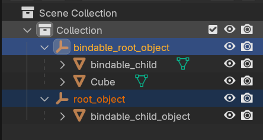

Если вы хотите что бы пользователи могли переключать на пример `CarPaint` или `Exhaust` объекты, то их нужно добавить в `Bindable` в качестве подобъектов.

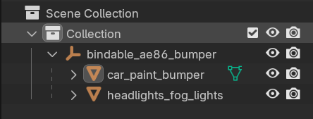

> [!IMPORTANT]  
> Допишите `bindable_` в начале имени объекта или его подобъектов, что бы позволить назначать им кнопки активности.

## Создание и настройка объекта в другом софте

Вы так же можете настраивать объекты в любом другом софте, а так же в самом **Unity**.

Процесс настройки будет аналогичен [настройке в Blender](#создание-и-настройка-объекта-в-blender).

## Настройка Blender интеграции

> [!WARNING]  
> Если вы не используете Blender, или хотите использовать `.fbx` модели, то можете пропустить этот шаг.
> Информацию об импорте моделей из выбранного вами софта нейдите в интернете.
> Процесс импорта моделей [описан ниже](#импорт-blend--fbx-файлов-в-unity).

Настройка интеграции **Blender** описана в [этом гайде](../Tools/BlenderIntegration_RU.md).

## Импорт .blend / .fbx файлов в Unity

> [!WARNING]  
> Если вы хотите добавлять модели в виде `.fbx` файлов, то убедитесь, что в настройках экспорта у вас установлены выделенные на скриншоте параметры.
> В поле `Path Mode` должно быть установлено **Copy**, а так же `Forward` и `Up` в секции `Transform` должны быть установлены как на примере.

> [!IMPORTANT]  
> Модель экспортируйте в папку ресурс пака над которым работаете, рядом с файлом метаданных `__objects_meta`. Таким образом Unity увидит текстуры и модель без каких-либо дополнительных действий.

```
📂 Assets
 └ 📁 Content
    └ 📁 CustomObjects
       └ 📁 Example
          └ 📁 your_model_name.fbm   <- эту папку создаст Blender, там лежат текстуры для модели
          └ 📄 __objects_meta
          └ 📄 your_model_name.fbx   <- вот сюда
```

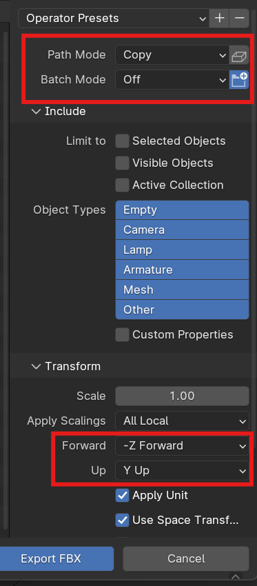

> Процесс импорта `.blend` и `.fbx` аналогичен

Если файл содержит одну модель или несколько моделей, но предполагается что это будет одним объектом, то выберите файл метаданных (в этом примере `__object_meta`) и нажмите **Refresh assets** в инспекторе. После чего можете переходить к [сборке ресурс пака](#сборка-ресурс-пака).

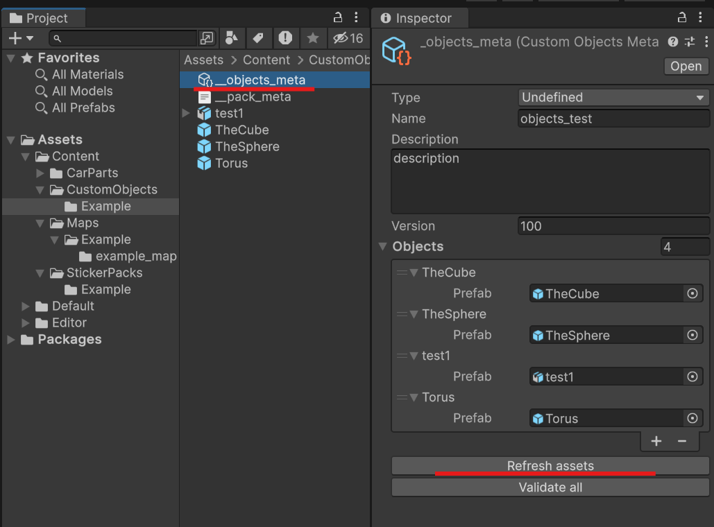

Если в вашем проекте / файле больше одной модели, или вы хотите более точно настроить её компоненты, то нужно будет выполнить следующие действия.

1. Перетащите только что сохранённый файл на сцену (вкладка **Hierarchy**), как это показано на примере ниже.  
   

2. Распакуйте префаб  
   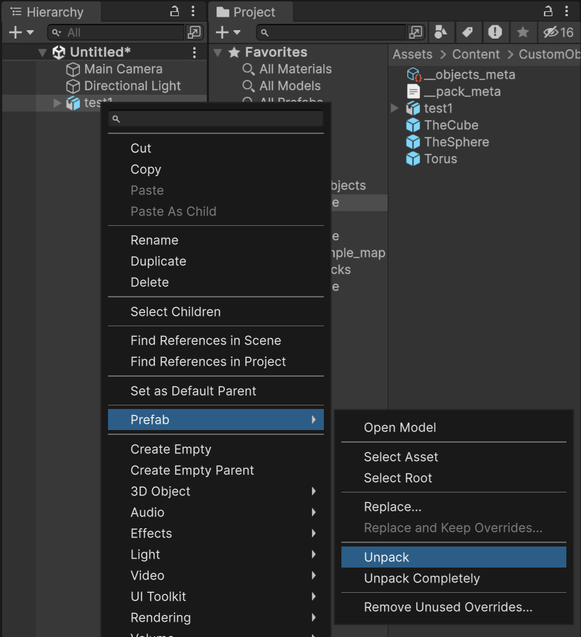

3. Выберете необходимый объект или объекты и перетащите в окно `Project`, как это показано на примере  
   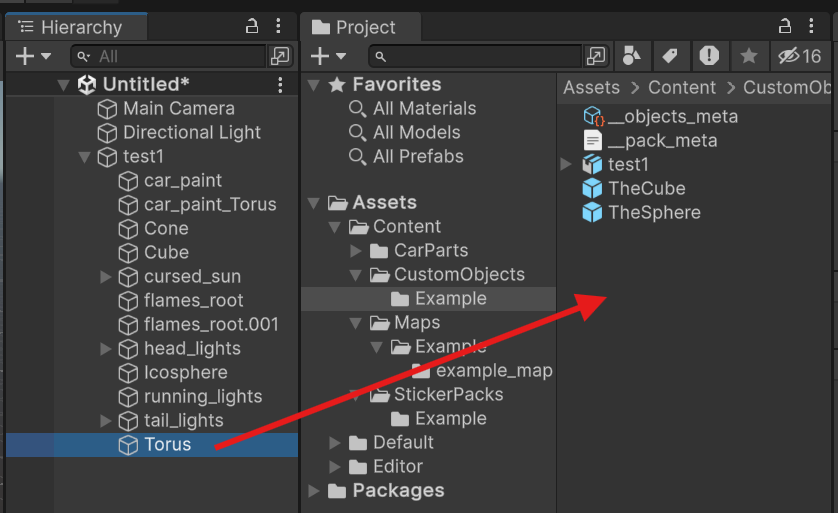

4. Дабл кликните по только что сохраненному префабу, что бы перейти в режим редактирования

5. Затем выделите файл метаданных и нажмите `Refresh assets` что бы добавить префаб в ресурс пак  
   

6. Можно приступать к [сборке](#сборка-ресурс-пака) ресурс пака

> [!WARNING]  
> Обратите внимание, что при внесении изменений в `.blend` или `.fbx` файлы они **НЕ будут** автоматически применены к распакованным префабам.
> Нужно будет удалить префаб(ы) и проделать процесс распаковки сначала.

## Сборка ресурс пака

Если у вас не открыт инструмент сборки, то сделать это можно через меню `Kino -> Custom Objects tool`.

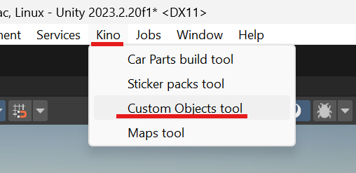

Можете перетащить **Build tool** в любую зону, для удобства работы

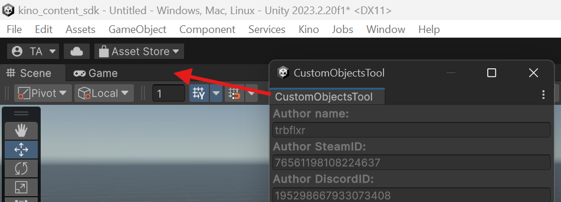

Если вы видете вот такое сообщение, то нажмите на кнопку создания меты.

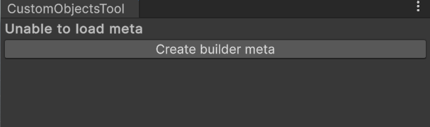

В поле **Build Folder** можете указать любую удобную папку. Я же указал путь к `KN_Base\resources` что бы готовые ресурс паки сразу устанавливались в игру.
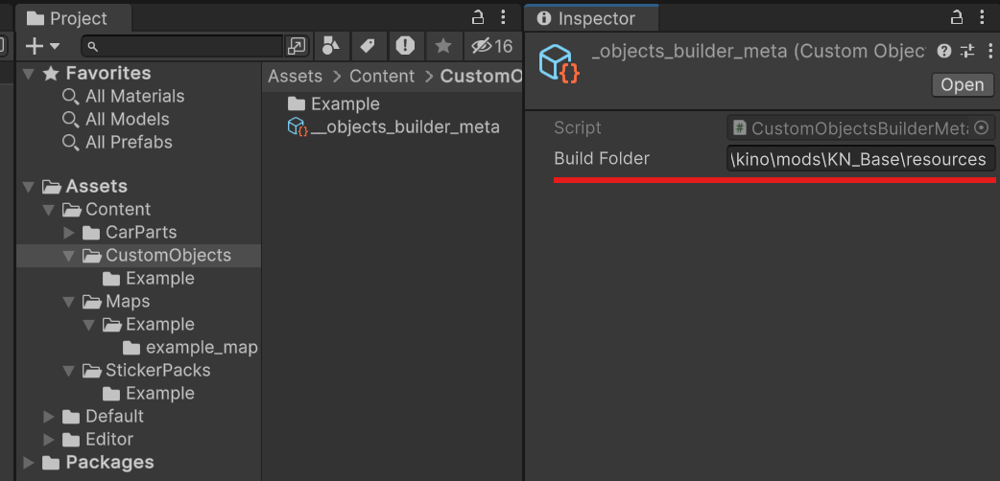

В окне инструмента сборки выберите ресурс паки, которые хотите собрать используя поле `Selected to build`. После нажмите на кнопку `Build for ...`.

Так же из этого инструмента можно настроить данные об авторе, папку билда, а так же открыть настройки для каждого ресурс пака.
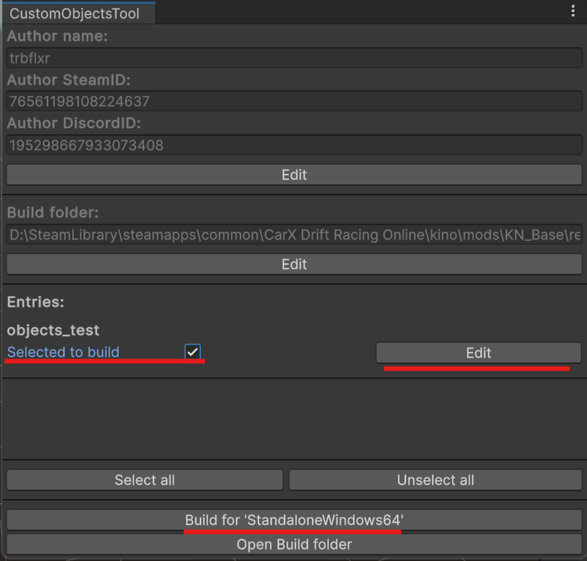

После завершения сборки готовый ресурс пак будет помещён в указанную вами папку.

# Примечание

В данном гайде показан процесс создания простого объекта из модели. Но это далеко не единственная возможность ресурс паков.
Вы можете создавать кастомные эффекты, анимированные объекты и ещё много чего, используя инструменты Unity и загружать это в CarX с помощью ресурс паков Kino.