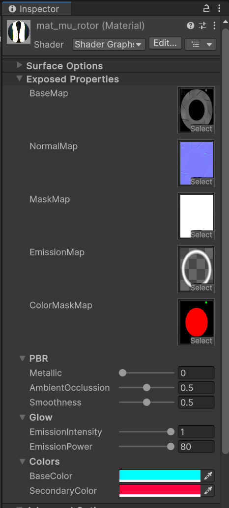
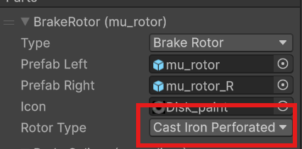

# Brakes and Rotors

## Preparing and Creating a Pack

If you already created a pack and want to add parts to it, you can skip this step.

There’s no need to create a separate pack for each part - group them by type, manufacturer, etc.

To create a pack, use [this guide](CustomParts_EN.md).

# Creating a Model

You can create the model in any 3D software you prefer. In this example, `Blender` will be used.

> [!TIP]  
> ContentSDK includes brake examples with source files in the `CarParts\Examples\Brakes` folder. We recommend reviewing them.

Models for brakes and rotors don’t require a complex hierarchy, but you do need to create separate models for the **left** and **right** sides.

> [!IMPORTANT]  
> In the `CarParts\Examples\Brakes\src` folder, there is an `.fbx` file with brake and caliper models. Use them as a **size reference** for your models.

After creating the necessary models, [import](#importing-models-into-unity) them into Unity.

## Importing Models into Unity

To import models into Unity, you can drag the required files into the `Project` window or place them manually via the file explorer.

After importing, select the model and in the `Inspector` window go to the `Materials` tab.

If the `Extract Textures` and `Extract Materials` buttons are grayed out, you don’t need to do anything.

If they are active, extract the textures first, then the materials.

You can also set up [Blender integration](../Tools/BlenderIntegration_EN.md) for more convenient importing.

> [!IMPORTANT]  
> Be sure to select the imported model and enable the `Read/Write Enabled` option in the Inspector window under the `Model` tab.

## Preparing a Prefab

After importing and preparing the model, you need to create a prefab for further configuration.

> [!IMPORTANT]  
> If the created prefab’s `Scale` is not equal to `1`, it means the model was exported incorrectly.  
> You need to fix the export settings so that the correct `Scale` is applied to the model.

You can do this in any convenient way, or follow this instruction:

> [!INFO]  
> Once the prefab(s) are ready, you can proceed with their setup. To configure the **caliper** prefab, go to [this section](#configuring-the-caliper-prefab), and for the **rotor**, go to [this section](#configuring-the-rotor-prefab).

# Configuring the Caliper Prefab

> [!IMPORTANT]  
> Note that the **root object** of the caliper must contain the main `Mesh`, which will be paintable in-game.  
> Otherwise, the caliper cannot be painted.

## Setting Up the Material

It’s assumed that you’ll use **one material** for both left and right sides. However, this is not mandatory.

First, create a material: in the `Project` window open the context menu, select `Create -> Material`, and give it a name.

Set the shader to `CarBrakeCaliper`. To do this, select the material in the `Project` window and in the `Inspector` window choose the shader.

Then assign the material to the main part of the caliper.

> [!INFO]  
> A prefab can have unlimited sub-objects. If some sub-objects are meant to be **paintable**, be sure to assign them the **same material** as the main `Mesh` of the caliper.

Now let’s configure the material. Select it in the `Project` window and go to the `Inspector` window.

The caliper material is quite simple, so you shouldn't have any difficulties setting it up.

Caliper material parameters:
* `BaseMap` – Base texture of the caliper.
* `NormalMap` – Normal map.
* `MaskMap` – Mask with PBR properties, more about it [here](https://docs.unity3d.com/Packages/com.unity.render-pipelines.high-definition@13.1/manual/Mask-Map-and-Detail-Map.html).
* `ColorMaskMap` – Paint mask. Defines which zones are paintable. Channel `R` = `BaseColor`, `G` = `LogoColor`, `B` = `AccentColor`.
* `Metallic` – Metallic multiplier.
* `AmbientOcclussion` – Ambient Occlusion multiplier.
* `Smoothness` – Smoothness multiplier.
* `BaseColor, AccentColor, LogoColor` – Caliper colors. These will be **overwritten** by Kino but can be used for testing the `ColorMaskMap`.

# Configuring the Rotor Prefab

It’s assumed that you’ll use **one material** for both left and right sides.

First, create a material: in the `Project` window open the context menu, select `Create -> Material`, and give it a name.

Set the shader to `CarBrakeRotor`. To do this, select the material in the `Project` window and in the `Inspector` window choose the shader.

Assign the created material to the rotor `Mesh`.

Now let’s configure the material. Select it in the `Project` window and go to the `Inspector` window.

Rotor material parameters:
* `BaseMap` – Base texture of the rotor.
* `NormalMap` – Normal map.
* `MaskMap` – Mask with PBR properties, more about it [here](https://docs.unity3d.com/Packages/com.unity.render-pipelines.high-definition@13.1/manual/Mask-Map-and-Detail-Map.html).
* `EmissionMap` – Emission map. The areas defined here will glow when the rotor heats up.
* `ColorMaskMap` – Paint mask. Defines which zones are paintable. Channel `R` = `BaseColor`, `G` = `SecondaryColor`.
* `Metallic` – Metallic multiplier.
* `AmbientOcclussion` – Ambient Occlusion multiplier.
* `Smoothness` – Smoothness multiplier.
* `EmissionIntensity` – Emission intensity. This will be overwritten by Kino but can be used for testing.
* `EmissionPower` – Emission power. Defines the maximum glow brightness.
* `BaseColor, SecondaryColor` – Rotor colors. These will be **overwritten** by Kino but can be used for testing the `ColorMaskMap`.

> [!INFO]  
> The `EmissionMap` texture should be fully transparent, with the areas that need to glow marked in **white**.

When filling in the **metadata**, you can also set the `Rotor Type` parameter, which defines the rotor’s _material_. This affects the heating and cooling speed in the game.

  
