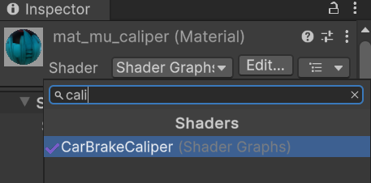
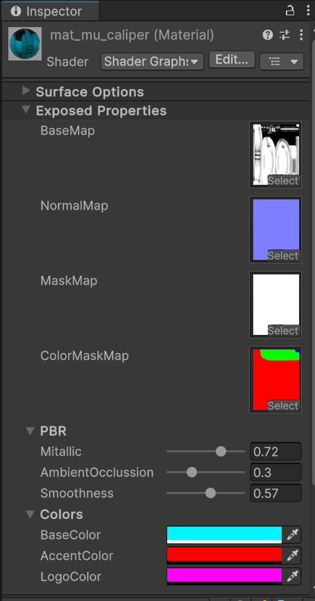
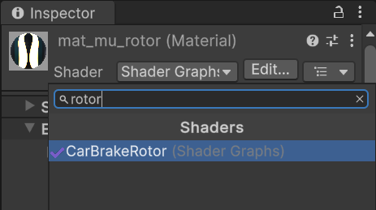
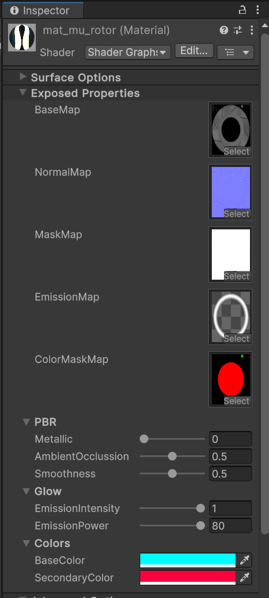
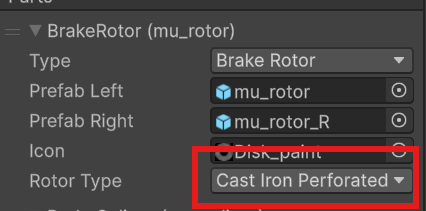

# Тормоза и ротора

## Подготовка и создание пака

Если вы уже создали пак и хотите добавить в него детали, то этот шаг можно пропустить.

Не нужно создавать для каждой детали отдельный пак, группируйте их по типам, производителям и т.д.

Для создания пака воспользуйтесь [этим гайдом](CustomParts_RU.md).

# Создание модели

Модель можно создать в любом удобном для вас 3D софте. В примере будет использован `Blender`.

> [!TIP]
> В ContentSDK есть примеры тормозов с исходниками в папке `CarParts\Examples\Brakes`. Рекомендуем ознакомится с ними.

Модели для тормозов и роторов не требуют сложной иерархии, но вам нужно будет создать отдельные модели для **левой** и правой **сторон**.

> [!IMPORTANT]
> В папке `CarParts\Examples\Brakes\src` есть `.fbx` файл с моделями тормозов и калиперов. Используйте их в качестве референса **размера** моделей.

После того как вы создали необходимые модели, [импортируйте](#импорт-моделей-в-unity) их в Unity.

## Импорт моделей в Unity

Для импорта моделей в Unity вы можете перетащить нужные файлы в окно `Project` или поместить их туда вручную, через проводник.

После импорта выберите нужную модель и в окне `Inspector` перейдите на вкладку `Materials`.

Если кнопки `Extract Textures` и `Extract Materials` серые и не кликабельные, то ничего делать не нужно.

Если же они активны, то сперва извлеките текстуры, а после материалы.

Так же вы можете настроить [интеграцию с Blender](../Tools/BlenderIntegration_RU.md), для большего удобства импорта моделей.

> [!IMPORTANT]
> Обязательно выберите импортированную модель и включите опцию `Read/Write Enabled` окне инспектора, во вкладке `Model`.

## Подготовка префаба

После того как вы импортировали и подготовили модель из неё нужно создать префаб для дальнейшей настройки.

> [!IMPORTANT]
> Если у созданного префаба `Scale` не равен `1`, то значит, что модель была экспортирована неверно. Вам нужно исправить настройки экспорта таким образом, что бы к модели применялся корректный `Scale`.

Вы можете это сделать любым удобным для вас способом, или воспользовавшись инструкцией:

> [!INFO]
> После того как вы подготовили префаб(ы) можете заняться их настройкой. Для настройки префаба **калипера** перейдите в [этот](#настройка-префаба-калипера) раздел, а для **ротора** в [этот](#настройка-префаба-ротора).

# Настройка префаба калипера

> [!IMPORTANT]
> Обратите внимание, что **корневой объект** калипера обязательно должен содержать основную `Mesh`, которая будет доступна к покраске в игре.
> В противном случае калипер будет невозможно покрасить.

## Настройка материала

Предполагается, что вы будете использовать **один материал** для левой и правой сторон. Однако это не обязательное условие.

В первую очередь нужно создать материал, для этого в окне `Project` откройте контекстное меню и выберете `Create -> Material`, после чего назовите его.

Установите шейдер `CarBrakeCaliper` для созданного материала. Для этого выберете материал в окне `Project` и в окне `Inspector` откройте выбор шейдера.

Далее установите материал для основной части калипера.

> [!INFO]
> Префаб может иметь неограниченное количество подобъектов. Если какие-то из подобъектов предполагают дополнительную **покраску**, то обязательно установите им **тот же материал**, что и для основной `Mesh` калипера.

Теперь приступим к настройке материала. Для этого выберете его в окне `Project` и перейдите в окно `Inspector`.

Материал калипера довольно простой и у вас не должно возникнуть сложностей с его настройкой. 

Параметры материала калипера:
* `BaseMap` - Базовая текстура калипера.
* `NormalMap` - Карта нормалей.
* `MaskMap` - Маска с PBR свойствами, подробнее о ней можно узнать [тут](https://docs.unity3d.com/Packages/com.unity.render-pipelines.high-definition@13.1/manual/Mask-Map-and-Detail-Map.html).
* `ColorMaskMap` - Маска покраски. Именно она отвечает за то, какие зоны будут доступны к покраске. Канал `R` отвечает за `BaseColor`, `G` за `LogoClor` и `B` за `AccentColor`.
* `Metallic` - Множитель металлика материала.
* `AmbientOcclussion` - Множитель AmbientOcclusion.
* `Smoothness` -  Множитель Smoothness.
* `BaseColor, AccentColor, LogoColor` - Это параметры цветов калипера, они будут **перезаписаны** Kino. Однако вы можете использовать их для тестов `ColorMaskMap`.

# Настройка префаба ротора

Предполагается, что вы будете использовать **один материал** для левой и правой сторон.

В первую очередь нужно создать материал, для этого в окне `Project` откройте контекстное меню и выберете `Create -> Material`, после чего назовите его.

Установите шейдер `CarBrakeRotor` для созданного материала. Для этого выберете материал в окне `Project` и в окне `Inspector` откройте выбор шейдера.

Установите созданный материал для `Mesh` ротора.

Теперь приступим к настройке материала. Для этого выберете его в окне `Project` и перейдите в окно `Inspector`.

Параметры материала ротора:
* `BaseMap` - Базовая текстура ротора.
* `NormalMap` - Карта нормалей.
* `MaskMap` - Маска с PBR свойствами, подробнее о ней можно узнать [тут](https://docs.unity3d.com/Packages/com.unity.render-pipelines.high-definition@13.1/manual/Mask-Map-and-Detail-Map.html).
* `EmissionMap` - Карта излучения. Именно эта область будет светиться при нагреве ротора. 
* `ColorMaskMap` - Маска покраски. Именно она отвечает за то, какие зоны будут доступны к покраске. Канал `R` отвечает за `BaseColor`, `G` за `SecondaryColor`.
* `Metallic` - Множитель металлика материала.
* `AmbientOcclussion` - Множитель AmbientOcclusion.
* `Smoothness` -  Множитель Smoothness.
* `EmissionIntensity` - Интенсивность излучения. Этот параметр будет перезаписан Kino, но вы можете использовать его для тестов.
* `EmissionPower` - Мощность излучения. С помощью этого параметра вы можете задать максимальную яркость свечения.
* `BaseColor, SecondaryColor` - Это параметры цветов ротора, они будут **перезаписаны** Kino. Однако вы можете использовать их для тестов `ColorMaskMap`.

> [!INFO]
> Текстура `EmissionMap` должна быть полностью прозрачной и зоны, которые должны светится должны быть **выделены белым**. 

Так же при заполнении **метаданных** вы можете задать параметр `Rotor Type` отвечающий за _материал_ ротора, который в свою очередь влияет на скорость нагрева и охлаждения в игре.

