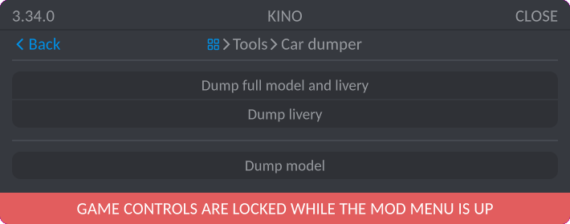
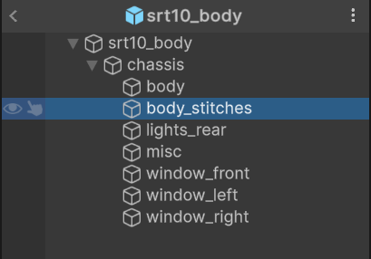
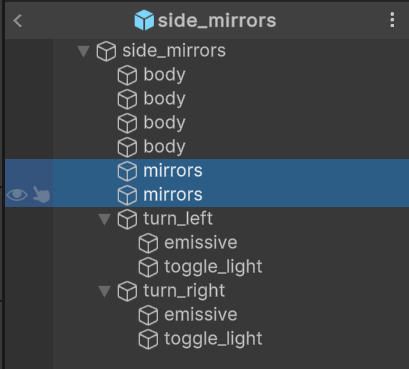
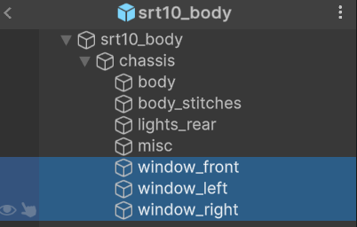
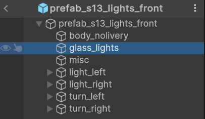
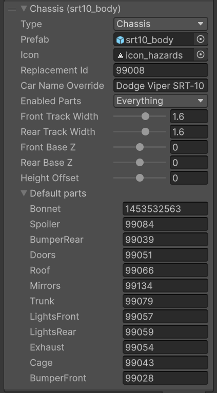

# Creating Car Body Kit Parts

## Preparing and Creating the Pack

If you have already created a pack and want to add parts to it, you can skip this step.

You don't need to create a separate pack for each part; group them by types, manufacturers, etc.

To create a pack, use [this guide](CustomParts_EN.md).

# Creating the Model

> [!NOTE]
> You can create the model in any 3D software of your choice. In this example, `Blender` will be used.

### Preparation

Before starting, it is recommended to dump the car model, excluding the part you want to create. To do this, follow these steps:

1. Go to the car dump menu: `Tools -> Car dumper`.
2. Dump the model by clicking `Dump model`.

> [!IMPORTANT]
> Be sure to dump the `PartRoots`, as it will make it much easier to position objects correctly.

### Creation

When creating the model, set its **origin** to the position of the required **root**. The example below shows the correct positioning of the lights.

### Setting Up the Part Structure

> [!INFO]  
> Configuring the part structure is a crucial step, without which the part will not work correctly.

You can review the **[part structure](#setting-up-part-structure-and-materials)** during the model creation stage.  
Parts must have a **specific hierarchy**, and some elements require correct **naming** to function properly.

### Setting up UV Mapping

If you want to add livery overlays to your part, it needs to be properly mapped. If you don't plan to add livery overlays, you can skip this step.

For convenient UV mapping setup, it's recommended to prepare a template by following these steps:

1. Create a new livery in the game.
2. Apply several stickers to the car, ensuring it is **fully** covered from all sides.
3. Dump the resulting livery using Kino: `Tools -> Car dumper -> Dump livery`.

You will get something similar to this:

Now you can proceed to configure the UV mapping.

Create a material and set the texture as `Base Color`.

Specify the path to the UV texture.

Navigate to `UV Editor` and select the newly added texture.

Switch to `Edit Mode` and select the desired geometry.

Arrange the geometry on the UV map correctly.

### Export

You can save the `.blend` project directly into the `Assets` folder of ContentSDK, and if you have Blender integration set up, you can immediately start [importing the model](#importing-models-into-unity).

If you want to export only part of the project, select the desired parts and click `File -> Export -> FBX`.

In the export window, make sure to set the following settings:

Then export the model into the **Assets** subfolder in ContentSDK. After this, you can proceed with [importing](#importing-models-into-unity).

## Importing Models into Unity

To import models into Unity, you can drag the required files into the `Project` window or place them there manually via the file explorer.

After importing, select the desired model and in the `Inspector` window, go to the `Materials` tab.

If the `Extract Textures` and `Extract Materials` buttons are greyed out and not clickable, no further action is needed.

If they are active, first extract the textures, then extract the materials.

You can also set up [Blender integration](../Tools/BlenderIntegration_EN.md) for easier model importing.

> [!IMPORTANT]
> If you want to enable livery overlays on the object, in the `Model` tab, enable the `Read/Write Enabled` option.

## Prefab Preparation

After importing and preparing the model, you need to create a prefab for further configuration.

Create the prefab according to the instructions:

## Setting Up Part Structure and Materials

All body kit parts work on the **same principle** and can consist of an unlimited number of sub-objects.

A part can have several **materials** that the game interacts with:
* `body` – Material that allows painting the part and applying vinyls.
* `body_nolivery` – Material that only allows painting the part.
* `body_stitches` – Material for seams between parts.
* `mirrors` – Material for the rear-view mirror surface.
* `window_*` – Window material. Any mesh with a name starting with `window_` will be replaced by a window, which will also be paintable in the game.
* `glass_lights` – Material for **headlight** and **taillight** glass. A mesh with this name will be replaced by transparent glass that can be painted in the lights section.

---

To make a part **paintable**, the mesh you want to allow painting in-game must be named `body` or `body_nolivery`.

---

If you want to make the model **more detailed**, you can add `Mesh` seams.  
This should be a **flat** mesh placed along the contours of the parts where seams are expected.  
By naming the mesh `body_stitches`, Kino will automatically assign it the proper material.

---

To add **rear-view mirrors**, name the reflective mesh `mirrors`.  
There can be an unlimited number of mirrors, and they can be placed on any car body part.

---

If you want to add **windows** to the part, add the prefix `window_` to the glass mesh name.  
Kino will replace the mesh with a window that will be available for **painting** in the corresponding section.

---

To add **headlight and taillight glass**, name the glass mesh `glass_lights`.  
Kino will replace the mesh with glass that will be available for **painting** in the corresponding section.

---

> [!NOTE]  
> Parts can also have **additional components** — some can be added to all types of parts, while others only to specific ones.

**Additional components:**

* `Exhaust_root` – The exhaust attachment point.

This point can be added to any part, but keep in mind there must be **only one**.  
If the car has multiple parts with _Exhaust_root_, the exhaust will attach to the first one in the list.

---

* `Flame_root_<N>` – The emission point for exhaust particles (fire, smoke).

This point can be added to any object in any location, it doesn’t have to be the muffler.  
You can create a _hood dump_, an exhaust in the _front fender_, or a bumper with a built-in muffler.

Replace `N` with a number `0–10`, naming the points in order.

---

* `Headlights, taillights, turn signals` – Additional light sources. These can be added to **any part**.

The process of creating and setting up lights is a bit more complex and is described in the [section below](#custom-headlights-taillights-turn-signals).

### Custom Headlights, Taillights, Turn Signals

These are parts with additional sub-objects and materials.  
They follow the same rules as [regular parts](#setting-up-part-structure-and-materials).

> [!NOTE]  
> For convenience, the description of creating lighting parts is provided on a **[separate page](CustomPartsLights_EN.md)**.

### Custom Chassis

Custom chassis are no different from regular parts in terms of **[structure](#setting-up-part-structure-and-materials)** and can contain the same sub-objects and materials.

However, the **metadata** setup for a custom chassis includes **additional parameters**:

* `Car Name Override` – A custom car name that will be displayed in the game. Leave this field empty if you don’t want to add a custom name.
* `Enabled Parts` – List of parts available for installation. Enabling specific parts will show slots for them in the customization menu.
* `Front Track Width` – Front wheel track width.
* `Rear Track Width` – Rear wheel track width.
* `Front Base Z` – Additional offset for the front wheels along the longitudinal axis of the car.
* `Rear Base Z` – Additional offset for the rear wheels along the longitudinal axis of the car.
* `Height Offset` – Additional height offset of the car.
* `Default Parts` – List of default parts that will be installed when selecting the chassis. Always fill this in so users can conveniently use your parts.  
