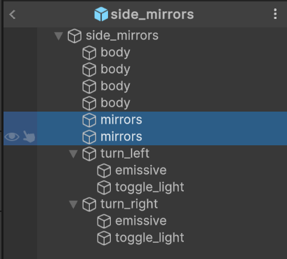
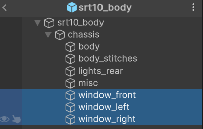

# Создание деталей обвеса авто

## Подготовка и создание пака

Если вы уже создали пак и хотите добавить в него детали, то этот шаг можно пропустить.

Не нужно создавать для каждой детали отдельный пак, группируйте их по типам, производителям и т.д.

Для создания пака воспользуйтесь [этим гайдом](CustomParts_RU.md).

# Создание модели

> [!NOTE]
> Модель можно создать в любом удобном для вас 3D софте. В примере будет использован `Blender`.

### Подготовка

Перед работой рекомендуется сдампить модель авто, исключив из неё часть, которую вы хотите создать, для этого выполните следующие действия:

1. Перейдите в меню дампа авто: `Tools -> Car dumper`
2. Сдампите модель нажав `Dump model`

> [!IMPORTANT]
> Обязательно сдампите `PartRoots`, с ними будет гораздо проще установить объекты в нужные позиции.

### Создание

При создании модели, установите её **нулевую точку** на позицию нужного **рута**. На примере ниже показано правильное позиционирование фонарей.

### Настройка структуры детали

> [!INFO]
> Настройка структуры детали является важнейшим шагом, без которого деталь будет работать неверно.

Вы можете ознакомиться со **[структурой деталей](#настройка-структуры-и-материалов-детали)** на этапе создания модели.
Детали должны иметь **определенную иерархию**, а некоторые части требуют корректного **нейминга** для корректной работы.

### Настройка UV-развертки

Если вы хотите добавить наложение ливрей для вашей детали, то её необходимо правильно замапить. Если вы не хотите добавлять наложение ливрей, то этот шаг можно пропустить.

Для удобной настройки UV-развертки рекомендуется подготовить шаблон, для этого выполните следующие действия:

1. создайте новую ливрею в игре
2. нанесите несколько стикеров на авто, так что бы **полностью** его покрыть со всех сторон
3. сдампите получившуюся ливрею с помощью Kino: `Tools -> Car dumper -> Dump livery`

После вы получите что-то похожее на это:

После чего можно приступать к настройке UV-развертки.

Создайте материал и установите ему текстуру в качестве `Base Color`.

Укажите путь к текстуре развёртки.

Перейдите в `UV Editor` и выберите только что добавленную текстуру.

Далее перейдите в `Edit Mode` и выберите нужную геометрию.

Расположите геометрию на UV-карте правильным образом.

### Экспорт

Вы можете сохранить `.blend` проект прямо в папку `Assets` ContentSDK, и если у вас настроена интеграция с Blender, то можете сразу приступать к [импорту модели](#импорт-моделей-в-unity).

Если же вы хотите экспортировать только часть проекта, то выберите желаемые части и нажмите `File -> Export -> FBX`.

Далее в окне экспорта обязательно установите такие настройки:

После чего экспортируйте модель в подпапку **Assets** в ContentSDK. Далее можно переходить к [импорту](#импорт-моделей-в-unity).

## Импорт моделей в Unity

Для импорта моделей в Unity вы можете перетащить нужные файлы в окно `Project` или поместить их туда вручную, через проводник.

После импорта выберите нужную модель и в окне `Inspector` перейдите на вкладку `Materials`.

Если кнопки `Extract Textures` и `Extract Materials` серые и не кликабельные, то ничего делать не нужно.

Если же они активны, то сперва извлеките текстуры, а после материалы.

Так же вы можете настроить [интеграцию с Blender](../Tools/BlenderIntegration_RU.md), для большего удобства импорта моделей.

> [!IMPORTANT]
> Если вы хотите добавить возможность наложения ливрей на объект, то во вкладке `Model` включите опцию `Read/Write Enabled`.

## Подготовка префаба

После того как вы импортировали и подготовили модель из неё нужно создать префаб для дальнейшей настройки.

Создайте префаб по инструкции:

## Настройка структуры и материалов детали

Все детали обвеса работают по **одному принципу** и могут состоять из неограниченного количества подобъектов.

У детали может быть несколько **материалов**, с которыми взаимодействует игра:
* `body` - Материал позволяющий красить деталь и наложение винилов.
* `body_nolivery` - Материал позволяющий только красить деталь.
* `body_stitches` - Материал стыков между деталями.
* `mirrors` - Материал поверхности зеркала заднего вида.
* `window_*` - Материал окон. Mesh с именем начинающимся с `window_` будет заменена на окно, которое так же будет доступно к покраске в игре.
* `glass_lights` - Материал стекол **фар** и **фонарей**. Mesh с таким именем будет заменена на прозрачное стекло, которое можно красить в разделе фар.

---

Для добавления возможности **покраски** детали, Mesh, который вы хотите разрешить окрашивать в игре, должен иметь имя `body` или `body_nolivery`. 

---

Если вы хотите сделать модель **более объёмной**, то можно добавить `Mesh` стыков.
Это должен быть **плоский** Mesh установленный по контурам деталей, где предполагается стык.
Назвав Mesh `body_stitches` Kino автоматически установит ей нужный материал. 

---

Для добавления **зеркал заднего вида**, назовите `Mesh` поверхности отражения `mirrors`.
Зеркал может быть неограниченное количество и находится они могут на любых деталях обвеса авто.

---

Если вы хотите добавить **окна** на для детали, то добавьте к названию `Mesh` стекла **префикс** `window_`.
Таким образом Kino подставит на место Mesh стекло, которое будет доступно к **покраске** в соответствующем разделе.

---

Для добавления **стекол фар и фонарей** назовите `Mesh` стекла `glass_lights`. Kino подставит на место Mesh стекло, которое будет доступно к **покраске** в соответствующем разделе.

---

> [!NOTE]
> Детали так же могут иметь **дополнительные компоненты**, некоторые можно добавлять ко всем типам деталей, а какие-то только к определенным.

**Дополнительные** компоненты:

* `Exhaust_root` - Точка крепления выхлопа.

Эту точку можно добавить к любой детали, но обратите внимание, что она должна быть **одна**. Если на авто будет несколько деталей с _Exhaust_root_, то выхлоп добавится в первую по списку. 

---

* `Flame_root_<N>` - Точка эмитта партиклов выхлопа, огня, дыма.

Добавлять эту точку можно к любым объектам в любых местах, это не обязательно должен быть глушитель.
Вы можете создать _Hood dump_, выхлоп в _переднем крыле_, или бампер с предустановленным глушителем.

Замените `N` на число `0-10`, называйте точки по порядку.

---

* `Фары, фонари, поворотники` - Дополнительные источники света. Их можно добавлять к **любой детали**.

Процесс создания и настройки фар немного сложнее и описан в [разделе ниже](#кастомные-фары-фонари-поворотники).

### Кастомные фары, фонари, поворотники

Это детали с дополнительными подобъектами и материалами. На них распространяются те же правила, что и на [обычные детали](#настройка-структуры-и-материалов-детали). 

> [!NOTE]
> Для удобства описание создания оптики было вынесено на **[отдельную страницу](CustomPartsLights_RU.md)**.

### Кастомные шасси

Кастомные шасси не отличаются от обычных деталей по **[структуре](#настройка-структуры-и-материалов-детали)** и могут содержать те же подобъекты и материалы.

Однако настройка **метаданных** кастомного шасси содержит **дополнительные параметры**:

* `Car Name Override` - Это кастомное наименование авто, которе будет отображено в игре. Оставьте поле пустым, если не хотите добавлять кастомное наименование.
* `Enabled Parts` - Список доступных для установки деталей. При включении тех или иных деталей в меню кастомизации появятся ячейки для их установки.
* `Front Track Width` - Ширина базы передних колес.
* `Rear Track Width` - Ширина базы задних колес.
* `Front Base Z` - Дополнительный отступ передних колес по продольной оси авто.
* `Rear Base Z` - Дополнительный отступ задних колес по продольной оси авто.
* `Height Offset` - Дополнительный отступ высоты авто.
* `Default Parts` - Список дефолтных деталей, которые будут установлены при выборе шасси. Обязательно заполняйте его, что бы пользователям было удобнее использовать ваши детали.
