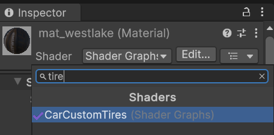
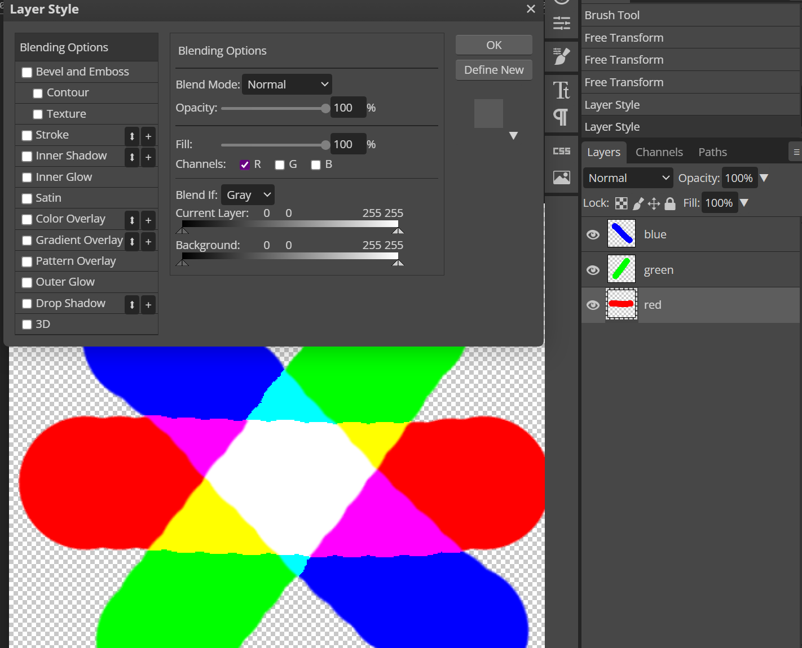

# Custom Tires

## Preparing and Creating a Pack

If you already created a pack and want to add parts to it, you can skip this step.

There’s no need to create a separate pack for each part — group them by type, manufacturer, etc.

To create a pack, use [this guide](CustomParts_EN.md).

# Creating a Model

You can create the model in any 3D software you prefer. In this example, `Blender` will be used.

> [!TIP]  
> ContentSDK includes tire examples with source files in the `CarParts\Examples\Tires` folder. We recommend reviewing them.

Tire models must be **separate** for the **left** and **right** sides. The geometry can be identical, but the `UV mapping` must be set up separately for left and right tires.

> [!IMPORTANT]  
> In the `CarParts\Examples\Tires\src` folder, there is an `.fbx` files with a tire models. Use it as a **size reference** for your models.

After creating the necessary models, [import](#importing-models-into-unity) them into Unity.

## Importing Models into Unity

To import models into Unity, you can drag the required files into the `Project` window or place them manually via the file explorer.

After importing, select the model and in the `Inspector` window go to the `Materials` tab.

If the `Extract Textures` and `Extract Materials` buttons are grayed out, you don’t need to do anything.

If they are active, extract the textures first, then the materials.

You can also set up [Blender integration](../Tools/BlenderIntegration_EN.md) for more convenient importing.

> [!IMPORTANT]  
> Be sure to select the imported model and enable the `Read/Write Enabled` option in the Inspector window under the `Model` tab.

## Preparing a Prefab

After importing and preparing the model, you need to create a prefab for further configuration.

> [!IMPORTANT]  
> If the created prefab’s `Scale` is not equal to `1`, it means the model was exported incorrectly. You need to fix the export settings so that the correct `Scale` is applied to the model.

You can do this in any convenient way, or follow this instruction:

> [!INFO]  
> Once the prefab(s) are ready, you can proceed with their setup. Tire prefab configuration is described [below](#configuring-the-tire-prefab).

# Configuring the Tire Prefab

It is assumed that the tire will consist of a single object with a material using the `CarCustomTires` shader. This material should be the same for both left and right tires.

First, create a material: in the `Project` window open the context menu, select `Create -> Material`, and give it a name.

Set the shader to `CarCustomTires`. To do this, select the material in the `Project` window and in the `Inspector` window choose the shader.

Then assign the material to the tire object.

Now let’s configure the material. Select it in the `Project` window and go to the `Inspector` window.

Tire material parameters:
* `BaseMap` – Base tire texture.
* `NormalMap` – Normal map.
* `MaskMap` – Mask with PBR properties, more about it [here](https://docs.unity3d.com/Packages/com.unity.render-pipelines.high-definition@13.1/manual/Mask-Map-and-Detail-Map.html).
* `DirtMaskMap` – [Dirt accumulation mask](#dirt-accumulation-mask). Channel `R` = **dust**, `G` = **grass and twigs**, `B` = **stones and debris**.
* `Metallic` – Metallic multiplier.
* `AmbientOcclussion` – Ambient Occlusion multiplier.
* `Smoothness` – Smoothness multiplier.
* `DirtAccumulationScale` – Controls the strength of the dirt accumulation effect.
* `GrassNormalStrength, DebrisNormalStrength` – Intensity of `normals` for stuck **grass** and **stones** (channels `G` and `B` from `DirtMaskMap`).
* `Wetness` – The _wetness_ parameter, it will be overwritten by Kino but can be used to test the tire’s appearance in the rain.
* `DustColor, GrassColor, DebrisColor` – Dirt colors. These will be **overwritten** by Kino but can be used for testing.

If you are using `UV mapping` in the same format as in CarX, you can assign test textures to the `LogoBaseMap` and `StripeBaseMap` fields.  
These textures will also be overwritten by Kino, but you can use them to test how the tire looks.

## Dirt Accumulation Mask

This section gives a more detailed description of creating the dirt accumulation mask.

> [!IMPORTANT]  
> The tire shader will read values from the **channels** in the texture. This means if channels `R` and `G` overlap, the overlapping areas should be **yellow**.

The simplest way to create the mask is to make a **separate layer** for each channel (`R, G, B`) and in the blending options keep only **one channel** active, depending on the color.

Thus, overlapping colors should look like in the image below.

  
