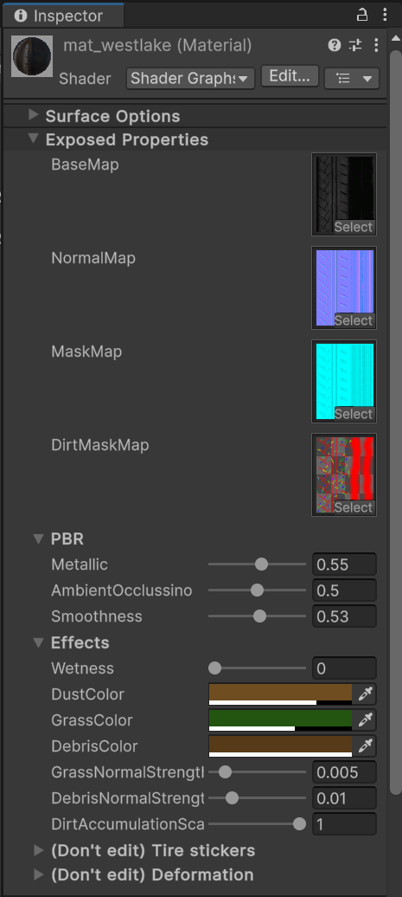

# Кастомные шины

## Подготовка и создание пака

Если вы уже создали пак и хотите добавить в него детали, то этот шаг можно пропустить.

Не нужно создавать для каждой детали отдельный пак, группируйте их по типам, производителям и т.д.

Для создания пака воспользуйтесь [этим гайдом](CustomParts_RU.md).

# Создание модели

Модель можно создать в любом удобном для вас 3D софте. В примере будет использован `Blender`.

> [!TIP]
> В ContentSDK есть примеры тормозов с исходниками в папке `CarParts\Examples\Tires`. Рекомендуем ознакомится с ними.

Модели для покрышек должны быть **раздельными** для **левой** и **правой** сторон. Геометрия моделей может быть идентичной, но `UV-маппинг` должен быть настроен для левой и правой шины отдельно. 

> [!IMPORTANT]
> В папке `CarParts\Examples\Tires\src` есть `.fbx` файл с моделью покрышки. Используйте его в качестве референса **размера** моделей.

После того как вы создали необходимые модели, [импортируйте](#импорт-моделей-в-unity) их в Unity.

## Импорт моделей в Unity

Для импорта моделей в Unity вы можете перетащить нужные файлы в окно `Project` или поместить их туда вручную, через проводник.

После импорта выберите нужную модель и в окне `Inspector` перейдите на вкладку `Materials`.

Если кнопки `Extract Textures` и `Extract Materials` серые и не кликабельные, то ничего делать не нужно.

Если же они активны, то сперва извлеките текстуры, а после материалы.

Так же вы можете настроить [интеграцию с Blender](../Tools/BlenderIntegration_RU.md), для большего удобства импорта моделей.

> [!IMPORTANT]
> Обязательно выберите импортированную модель и включите опцию `Read/Write Enabled` окне инспектора, во вкладке `Model`.

## Подготовка префаба

После того как вы импортировали и подготовили модель из неё нужно создать префаб для дальнейшей настройки.

> [!IMPORTANT]
> Если у созданного префаба `Scale` не равен `1`, то значит, что модель была экспортирована неверно. Вам нужно исправить настройки экспорта таким образом, что бы к модели применялся корректный `Scale`.

Вы можете это сделать любым удобным для вас способом, или воспользовавшись инструкцией:

> [!INFO]
> После того как вы подготовили префаб(ы) можете заняться их настройкой. Настройка префаба покрышки описана [ниже](#настройка-префаба-шины).

# Настройка префаба шины

Предполагается, что шина будет состоять из одного объекта с материалом на шейдере `CarCustomTires`. Этот материал должен быть одинаковым для левой и правой шин.

В первую очередь нужно создать материал, для этого в окне `Project` откройте контекстное меню и выберете `Create -> Material`, после чего назовите его.

Установите шейдер `CarCustomTires` для созданного материала. Для этого выберете материал в окне `Project` и в окне `Inspector` откройте выбор шейдера.

Далее установите материал для объекта шины.

Теперь приступим к настройке материала. Для этого выберете его в окне `Project` и перейдите в окно `Inspector`.

Параметры материала шины:
* `BaseMap` - Базовая текстура шины.
* `NormalMap` - Карта нормалей.
* `MaskMap` - Маска с PBR свойствами, подробнее о ней можно узнать [тут](https://docs.unity3d.com/Packages/com.unity.render-pipelines.high-definition@13.1/manual/Mask-Map-and-Detail-Map.html).
* `DirtMaskMap` - [Маска аккумуляции _грязи_](#маска-аккумуляции-грязи). Канал `R` отвечает за **пыль**, `G` за **траву и веточки** и `B` за **камешки и различный мусор**.
* `Metallic` - Множитель металлика материала.
* `AmbientOcclussion` - Множитель AmbientOcclusion.
* `Smoothness` -  Множитель Smoothness.
* `DirtAccumulationScale` - Отвечает за силу эффекта накопления грязи.
* `GrassNormalStrength, DebrisNormalStrength` - Интенсивность `нормалей` для налипшей **травы** и **камней** (каналы `G` и `B` из `DirtMaskMap`).
* `Wetness` - Параметр _"мокрости"_, он будет перезаписан Kino, но вы можете использовать его для теста внешнего вида покрышки в дождь.
* `DustColor, GrassColor, DebrisColor` - Это параметры цветов грязи, они будут **перезаписаны** Kino. Однако вы можете использовать их для тестов.

Если вы используете `UV-маппинг` в том же формате, что и в CarX, то можете подставить тестовые текстуры в поля `LogoBaseMap` и `StripeBaseMap`.
Текстуры из этих полей также будут перезаписаны Kino, но вы можете задать их для теста внешнего вида покрышки.

## Маска аккумуляции грязи

В этом разделе будет более подробное описание создания маска аккумуляции грязи. 

> [!IMPORTANT]
> Шейдер покрышке будет брать значения из **каналов** в текстуре. Таким образом, если у вас пересекаются каналы `R` и `G`, то в местах пересечения цвет должен быть **желтым**. 

При создании маска наиболее простым способом будет создать **отдельный слой** для каждого из каналов (`R, G и B`) и в параметрах наложения этих слоев оставить только **один канал**, в зависимости от цвета.

Таким образом пересекающиеся цвета должны выглядеть как на изображении ниже.

