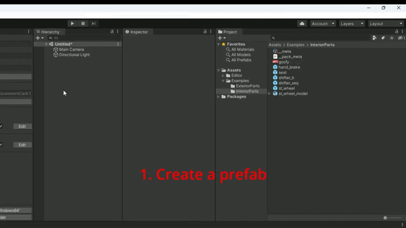
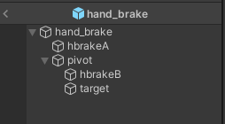
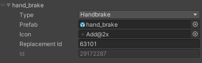
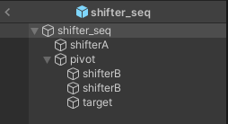
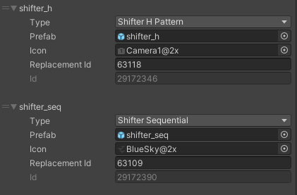
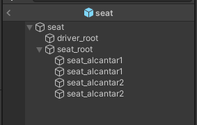
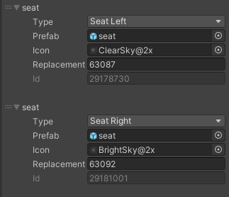

# Creating Universal Interior Parts

## Preparing and Creating a Pack

If you have already created a pack and want to add new parts to it, you can skip this step.

There's no need to create a separate pack for each part; group them by type, manufacturer, etc.

To create a pack, use [this guide](CustomParts_EN.md).

## Importing Models into Unity

To import models into Unity, you can drag the necessary files into the `Project` window or manually place them there through the file explorer.

After importing, select the desired model and navigate to the `Materials` tab in the `Inspector` window.

If the `Extract Textures` and `Extract Materials` buttons are grayed out and inactive, there's nothing further to do.

If they are active, first extract the textures and then the materials.

Next, create a prefab by following these steps:

1. Create an empty object in the scene.
2. Reset its `Transform`.
3. Add the model to the newly created object.
4. Save the prefab and remove it from the scene.
5. Select the prefab in the `Project` window and double-click to enter edit mode.

You can now proceed with creating your part.

## Creating Interior Parts

> [!NOTE]
> Kino Content SDK provides examples of all parts in the `Examples/InteriorParts` folder. Make sure to review them for a better understanding of the process.

Available parts:

* [Steering Wheels](#creating-custom-steering-wheels)
* [Handbrakes](#creating-custom-handbrakes)
* [Shifters](#creating-custom-shifters)
* [Seats](#creating-custom-seats)

### Creating Custom Steering Wheels

The steering wheel model must include the following components: `st_wheel_alcantar` and `st_wheel_parts`. There can be any number of these components (within reason).

Having these components ensures the steering wheel is correctly interpreted by the game, allowing it to be installed and painted.

Add a new entry to the pack with the type `Steering Wheel`. Also set its size in the `Steering Wheel Size` field.

> [!NOTE]
> If you are creating a steering wheel for the first time, leave the default size. Adjust the size by installing the wheel in the game and switching to first-person view. If the hands are misaligned, adjust the wheel size and rebuild the pack.

### Creating Custom Handbrakes

A custom handbrake must include the following components:

* `hbrakeA` - base of the handbrake
* `hbrakeB` - lever of the handbrake
* `pivot` - point where the lever attaches to the base
* `target` - point that the pilot will grab onto

> [!NOTE]
> There can be more components than listed above, but the ones mentioned are mandatory.

> [!WARNING]
> The hierarchy must exactly match the screenshot. The names of the mandatory components must also be identical.

If the pilot's hand is incorrectly positioned on the lever, you can rotate the `target` along the necessary axis to correct this.

Add a new entry to the pack, select the type `Handbrake`, and fill in the fields.

### Creating Custom Shifters

A custom shifter must include the following components:

* `shifterA` - base of the shifter
* `shifterB` - lever of the shifter
* `pivot` - point where the lever attaches to the base
* `target` - point that the pilot will grab onto

> [!NOTE]
> There can be more components than listed above, but the ones mentioned are mandatory.

> [!WARNING]
> The hierarchy must exactly match the screenshot. The names of the mandatory components must also be identical.

If the pilot's hand is incorrectly positioned on the lever, you can rotate the `target` along the necessary axis to correct this.

To add a shifter to the pack, you need to add a new entry with type `Shifter H Pattern` or `Shifter Sequential` and fill in the fields. The animation of gear shifting will depend on the chosen type.

### Creating Custom Seats

Custom seats must include the following components:

* `seat_alcantar1` - material for seat #1
* `seat_alcantar2` - material for seat #2
* `driver_root` - pilot seating point

> [!NOTE]
> There can be more components than listed above, but the ones mentioned are mandatory.

> [!WARNING]
> The hierarchy must exactly match the screenshot. The names of the mandatory components must also be identical.

To add a seat to the pack, you need to add a new entry with type `Seat Left` or `Seat Right` and fill in the fields.

