# Creating Custom Wheels

## Preparing and Creating a Pack

If you have already created a pack and want to add new wheels to it, you can skip this step.

There's no need to create a separate pack for each wheel; group them by type, manufacturer, etc.

To create a pack, use [this guide](CustomParts_EN.md).

## Creating the Wheel Model

> [!NOTE]
> If you have experience creating wheels for the workshop, you can skip this step and proceed to [importing into Unity](#importing-models-into-unity).

The guide will show an example for `Blender`. If you use other modeling software, the steps will be similar.

After creating the wheel model, it needs to be prepared for export.

> [!IMPORTANT]
> The wheel should be oriented with its front side facing the `X` axis.

> [!IMPORTANT]
> The wheel should consist of at least two parts: `rim` and `spokes`, with these exact names. These parts should not have textures.

However, the wheel can have more than two components, and they can be named as desired. These components can also be textured.

In the example below, the wheel has a `wheel_nuts` component.

> [!IMPORTANT]
> Note the offset of the wheel relative to the zero coordinates. The wheel will be mounted on the hub by the central point of the `spokes` part. Keep this in mind and adjust the wheel as needed along the `X` axis.

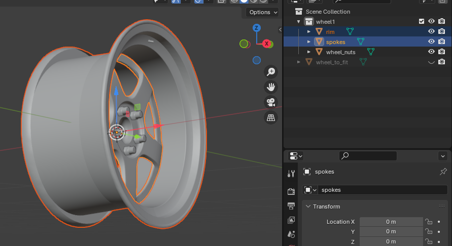

Now the wheel needs to be adjusted to the game's dimensions. To do this, import the fitment model from the `kino_content_sdk/FitmentModels` folder and adjust the size of your wheel to match the fitment model.

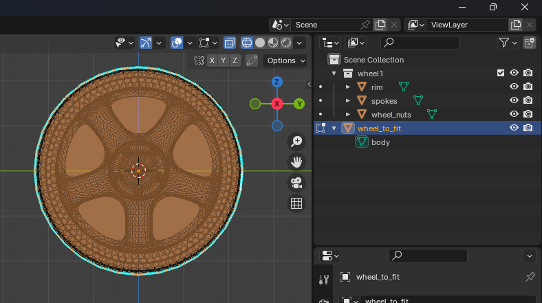

Afterward, you can export the wheel. Ensure the `Transform` section parameters match those in the image.

Additionally, if there are other objects in the scene that you don't want included in the model, you can select one of the `Limit to` options. However, any unnecessary components can also be removed in Unity after creating the prefab.

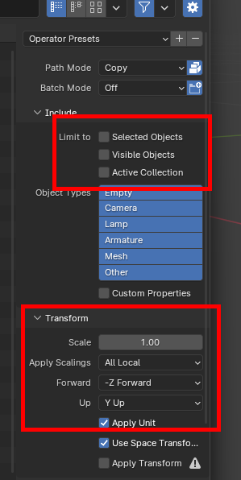

Upon completing the export, you can proceed to import the model into Unity.

## Importing Models into Unity

To import models into Unity, you can drag the necessary files into the `Project` window or manually place them there via the file explorer.

After importing, select the desired model and in the `Inspector` window, go to the `Materials` tab.

If the `Extract Textures` and `Extract Materials` buttons are greyed out and unclickable, there's nothing more to do.

If they are active, extract the textures first, followed by the materials.

## Adding Wheels to the Pack

> [!WARNING]
> If you haven't created metadata for the pack yet, please do so using the [instructions above](#preparing-and-creating-a-pack).

To make the wheels available in the game, you need to add them to the pack. This is very simple.

1. In the `Project` window, select the previously created `__meta` file.  
   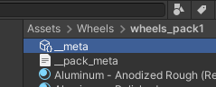

2. Then, add a slot for the wheel to the list by clicking `+`.
3. Fill in the fields as shown in the example below.

> [!NOTE]
> Note that in the `Replacement Id` field, I specified the value `111` because this wheel **from the standard set** in the game is the closest match to the one I added.

### Replacement Id

This field is optional but highly recommended. It ensures that if someone doesn't have **Kino** or **this pack**, the car will still have a similar standard part installed.

## Building the Pack

The final step is to build the pack.

The process of building is described for all types of packs [here](CustomParts_EN.md#building-packs).

---

## Display Issues in the Game

If the wheels are not visible or are incorrectly oriented in the game, this can be easily fixed.

First, create a prefab for the wheel. Right-click on the wheel model in the **Project** window, then select `Create -> Prefab Variant`.

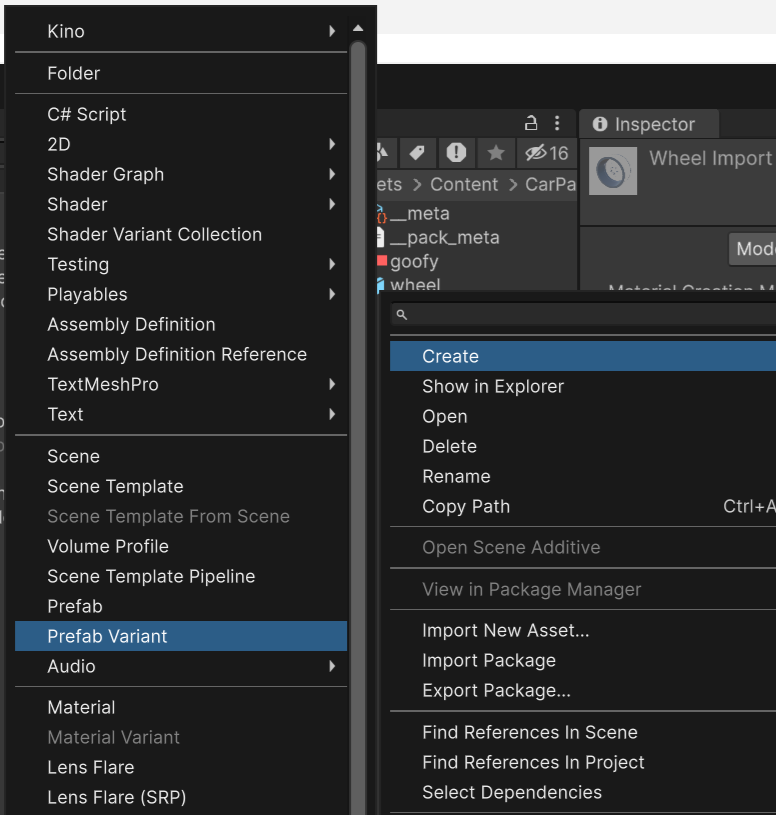

Then, in the metadata file, replace the wheel prefab with the one just created.

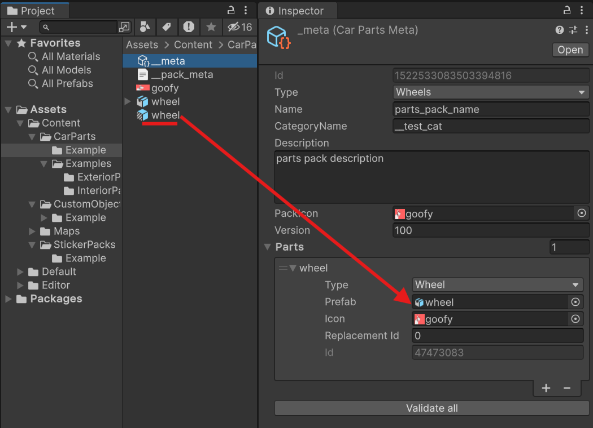

Go into edit mode by double-clicking on the new prefab in the `Project` window.

### Scale Issues (Wheel Not Visible)

Ensure that the root object's (in this case `crooked_ssr`) `Transform` component has `Scale` fields set to **1**.

Then, select all objects inside the root and check the `Scale` parameter in the `Transform` component.

If you followed the guide, the `Scale` field should have a value greater than or equal to one (1). However, if you see values below one, set the `Scale` fields to **1**, save the prefab, rebuild the pack, and check it in the game.

This way, you can adjust the scale correctly.

### Incorrect Wheel Orientation

Go into the prefab edit mode and check the wheel's orientation. The correct wheel orientation should look like this. The wheel should face the opposite direction along the `X` axis, as shown below.

If the wheel is oriented differently, select all objects inside the root and rotate them correctly.

In this case, setting `-90` on the `Y` axis fixed the issue.

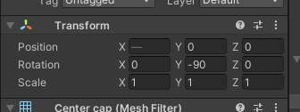

### Wheel Offset Issues

If the wheel's offset is incorrect or it is shifted along any axis in the game, this can be easily fixed.

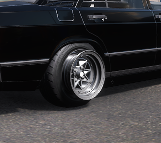

Select the desired prefab and double-click to enter edit mode. Then, select all objects inside the root and check the `Position` parameter in the `Transform` component.

The game will attach the wheel to the hub at the point set in the `spokes` object. The image above shows how this point is offset, causing incorrect wheel placement in the game.

Move all objects inside the root to compensate for the offset as needed.

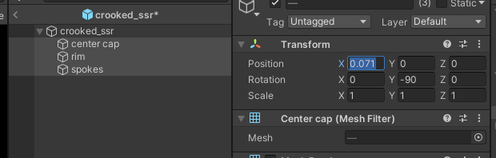

In this case, setting `0.071` on the `X` axis fixed the issue.

Save the prefab and rebuild the pack.

### Wheel Still Offset or Stuck in Brakes

If the wheel is still offset after setting offsets for its parts, you need to fix its model in Blender.

The images show that the origin of the `spokes` component is at the center of the object. This point is where the wheel will attach to the hub.

To fix this, follow these steps:

1. Open the model in Blender.
2. Switch to `Object mode`.
3. Set the 3D cursor to the point where the origin should be.
4. Click `Object -> Set Origin -> Origin to 3D Cursor`.
5. Export the model and [import](#importing-models-into-unity) it into Unity.

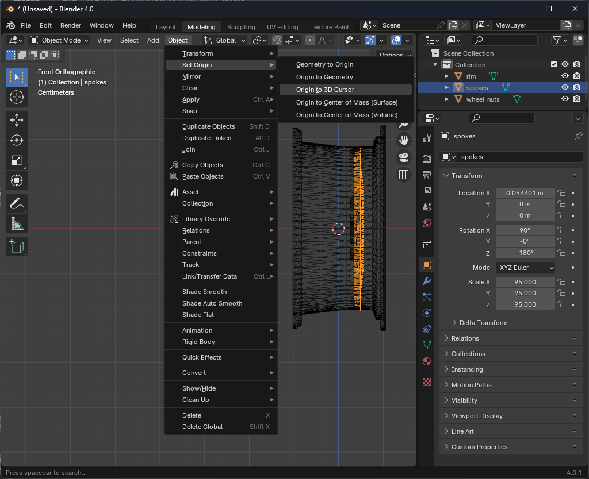

### Incorrect Shading or Black Wheel

This issue is related to incorrect UV mapping of the wheel and can be easily fixed.

The solution is provided by @Jeefrect (Discord: @jeefrect).

The UV map of the wheel should strictly follow the example. The front side of the spokes and rim must be in the **right half** of the UV map.

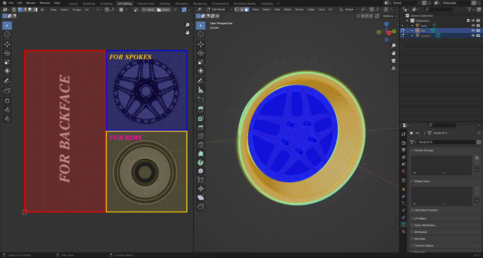

* In the **blue zone** (for spokes), place the UV map of the wheel spokes.
* In the **yellow zone** (for rims), place the UV map of the wheel rim.
* [Optional] In the **red zone** (for backface), place the UV map of the back sides of the wheel if you have them. These areas will be shaded in the game.

* **Green zone** (for backface spoke), place the UV map of the back side of the spokes.
* **Blue zone** (for backface spoke), place the UV map of the back side of the wheel rim.

> [!NOTE]
> To quickly unwrap the UV map of a selected object in Blender, press `U -> Unwrap`.

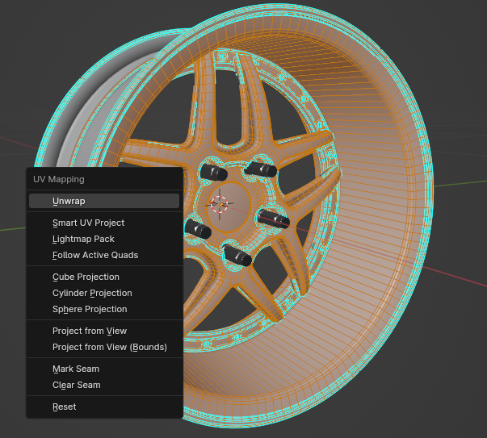

The correct UV map should look like this:

Or like this if you only did it for the **front part** of the wheel:

