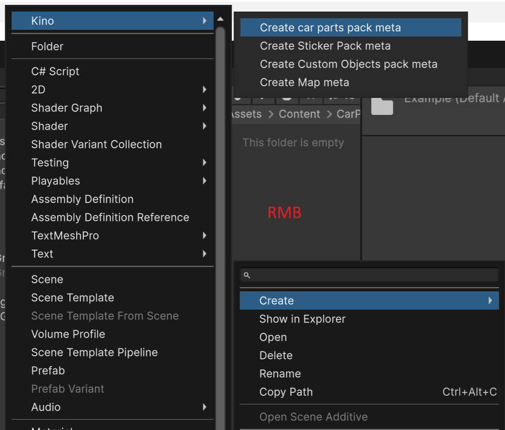
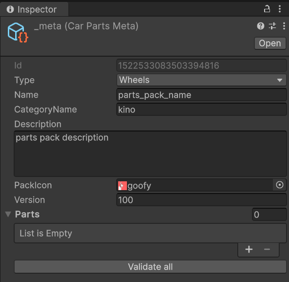

# Создание кастомных деталей

## Установка Unity и Content SDK

Если у вас всё ещё не установлен Unity, то установите его используя [этот гайд](../Tools/UnityInstallation_RU.md).

Если у вас не был установлен **Content SDK**, то [установите и настройте его](../Tools/SDKInstall_RU.md). Или же [обновите](../Tools/SDKUpdate_RU.md) **Content SDK**, если он уже был у вас установлен.


> [!NOTE]  
> В папке `Assets/Content/CarParts/Examples` есть примеры паков кастомных деталей, с которыми вы можете ознакомиться.

## Создание пака

Предполагается, что все паки деталей должны находиться в папке `Assets/Content/CarParts`.

Каждый пак должен находится в **своей** папке. Это повысит удобство и ускорит создание.

Пример структуры:

```
📂 Assets
 └ 📁 Content
    └ 📁 CarParts
       └ 📁 Examples
       └ 📁 MyWheelPack1
       └ 📁 MyExteriorPack1
       └ 📁 MyInteriorPack1
```

> [!IMPORTANT]  
> Создавайте новую папку в `CarParts` для каждого нового пака деталей.

### Создание метаданных пака

> [!IMPORTANT]  
> В данном примере будет использовано имя пака `Example`. Вы же называйте паки как хотите.

Для каждого нового пака необходимо создать **файл метаданных**. Для этого создайте и перейдите в папку нового пака. После чего создайте файл метаданных с помощью **контекстного меню**.



Структура должна выглядеть следующим образом:

```
📂 CarParts
 └ 📁 Example
    └ 📄 __meta
```

### Заполнение метаданных пака

Заполните метаданные о паке. Это нужно сделать **один раз** для **каждого** пака.



В поле **Type** укажите тип пака.

В поле **Name** укажите имя, оно должно быть уникальным и не должно содержать пробелов.

Укажите категорию в поле **CategoryName** имя категории, которое будет отображаться в интерфейсе игры, на карточке пака.

Добавьте описание пака в поле **Description**.

В поле **PackIcon** укажите иконку пака, которая будет отображаться на карточке в интерфейсе игры.

Поле **Version** отвечает за версию пака, пока что оставьте его как есть, со значением `100`.

> [!IMPORTANT]
> Для создания пака с деталями обвеса нужно выбрать тип `Car Parts`. **Обязательно** укажите ID авто, для которого предназначен этот пак, в поле `Target car ID`.
>
> Узнать ID текущего авто можно в меню Kino: `Tools -> Developer tools`

## Создание контента

Можно приступать к созданию кастомных деталей.

> [Диски](CustomPartsWheels_RU.md)

> [Детали обвеса, фары, фонари](CustomPartsExterior_RU.md)

> [Тормоза](CustomPartsBrakes_RU.md)

> [Шины](CustomPartsTires_RU.md)

> [Интерьер](CustomPartsInterior_RU.md)

> [Универсальные детали интерьера](CustomPartsUniversalInterior_RU.md)


## Сборка паков

После того как вы закончили создание пака и заполнили его метаданные, можно приступать к сборке.

Если у вас не открыт инструмент сборки, то сделать это можно через меню `Kino -> Car Parts build tool`.


Можете перетащить **Build tool** в любую зону, для удобства работы


Если вы видите вот такое сообщение, то нажмите на кнопку создания меты.


В поле **Build Folder** можете указать любую удобную папку. Я же указал путь к `KN_Base\car_parts` что бы готовые паки сразу устанавливались.


В окне инструмента сборки выберите ресурс паки, которые хотите собрать используя поле `Selected to build`. После нажмите на кнопку `Build for ...`.

Так же из этого инструмента можно настроить данные об авторе, папку билда, а так же открыть настройки для каждого пака деталей.


После завершения сборки готовые паки будут помещены в указанную вами папку.