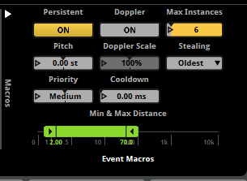
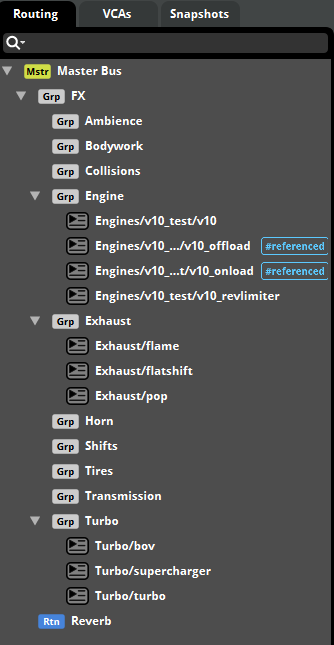
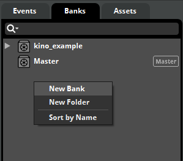
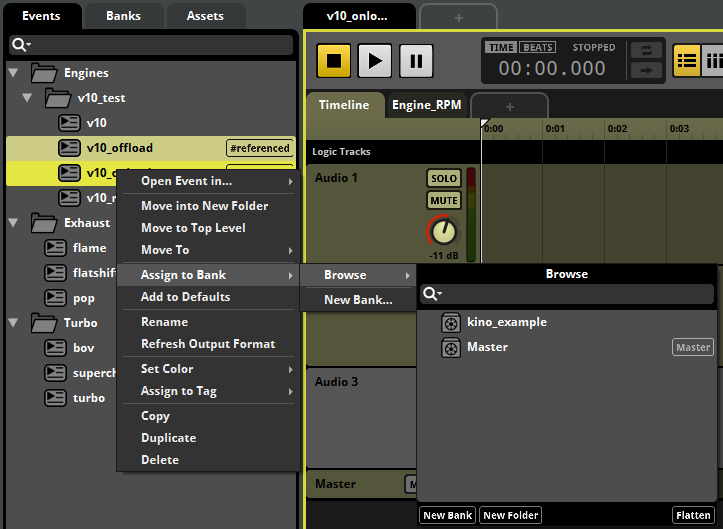

# Создание FMOD банков

> [!NOTE]
> Этот гайд не является гайдом по работе с FMOD Studio, скорее это инструкция по тому, как сделать совместимые с Kino звуки.

## Установка FMOD Studio

Перед работой с саунд банками вам необходимо установить FMOD Studio определенной версии.

Воспользуйтесь [этой инструкцией](../Tools/FMODInstallation_RU.md) по установке FMOD Studio.

Если у вас уже установлена FMOD Studio, то убедитесь что её версия `2.02.00`, если у вас другая версия, то установите именно это.

## Проект FMOD Studio

Вам обязательно нужно использовать проект из [Content SDK](../Tools/SDKInstall_RU.md). Он находится в папке `Fmod`.

> [!WARNING]
> Любые другие проекты FMOD Studio работать не будут. Вам **обязательно** нужно использовать предоставленный проект.

В проекте `kino_sounds.fspro` есть примеры звуков, которые в данный момент поддерживает Kino. Рекомендуем ознакомится с ними.

## Типы звуков

В Kino есть следующие типы звуков:
* **Engine**
  * EngineRPM - звук оборотов двигателя
  * EngineLimiter - _опциональный_ звук отсечки
* **Turbo**
  * TurboBoost - (Spool) - отвечает за звук турбины, за её свист, или же за звук суперчарджера
  * TurboBOV - _опциональный_ звук клапана Blow-Off и помпажа турбины
* **Exhaust**
  * ExhaustPop - звук "отстрела" выхлопа
  * ExhaustFlatshift - _опциональный_ звук при флатшифте (переключении передачи вверх без сброса газа)
  * ExhaustAfterburn - _опциональный_ звук догорания топлива в выхлопной системе

Как вы могли заметить - каждый звук состоит из своих ивентов. Какие-то из этих ивентов опциональные и звук можно использовать и без них. 

Каждый из этих ивентов имеет свои [параметры](#параметры-ивентов), которые описаны ниже.

## Параметры ивентов

Вот ряд параметров, которые в настоящее время доступны и поддерживаются в Kino:
* **Event Orientation** - Ориентация ивента **[-180 — 180]** ориентация ивента относительно камеры. С помощью этого параметра можно сделать так, что бы турбину было сильнее слышно у капота, а выхлоп у заднего бампера.
* **Distance** - Расстояние до камеры **[0 — 420]**
* **Engine_RPM** - Текущие обороты двигателя **[0 — 10k]**
* **Engine_Load** - Текущая "нагрузка" на двигатель **[0 — 1]**
* **Engine_HP** - Текущая мощность выдаваемая двигателем **[0 — 1.5k]**
* **Turbo_Boost** - Давление во впускном коллекторе **[0 — 1]**
* **Turbo_RPM** - Обороты турбины **[0 — 1]**
* **Turbo_BOV** - Положение клапана Blow-Off **[0 — 1]**
* **Turbo_BOVPower** - Сила клапана Blow-Off **[0 — 1]**. При значении 0 клапана BOV не будет, соответственно у турбины будет помпаж. В примере `turbo` показано как работать с этим параметром.
* **Turbo_Wastegate** - Текущее положение калитки вестгейта **[0 — 1]**
* **Throttle** - Положение педали газа **[0 — 1]**
* **SpeedMPH** - Текущая скорость авто **[0 — 200]**

Ниже представлен список ивентов и параметров, который они поддерживают:
* **EngineRPM**: Engine_RPM, Engine_Load, Engine_HP, Turbo_Boost, Turbo_Wastegate, Throttle
* **EngineLimiter**: Engine_RPM, Engine_Load
* **TurboBoost**: Turbo_Boost, Turbo_RPM, Turbo_Wastegate, Engine_RPM, Throttle
* **TurboBOV**: Turbo_Boost, Turbo_BOV, Turbo_BOVPower
* **ExhaustPop**: Engine_RPM, Throttle
* **ExhaustFlatshift**: Engine_RPM, Throttle
* **ExhaustAfterburn**: Engine_RPM, Throttle

## Нюансы при создании ивентов

У каждого ивента обратите внимание на эту секцию (в правом нижнем углу, при выборе Master).

В особенности обратите внимание на `Min & Max Distance`, этот параметр отвечает за то, на каком расстоянии будет слышно ваш звук.

Так же важным полем является `Max Instances`, устанавливайте его для Exhaust, TurboBOV ивентов, что бы не занимать лишние каналы. Обычно 6-7 инстансов достаточно.

Вы можете применять любые эффекты к любым дорожкам в рамках созданного вами ивента. Но ни в коем случае не удаляйте и не добавляйте никакие группы в Routing, так как FMOD очень капризный и ваши звуки может быть просто не слышно.

## Роутинг ивентов

> [!IMPORTANT]
> Это обязательный шаг и без него ваши звуки может быть не слышно, или на них не будут работать никакие настройки громкости.

Перед тем как приступить к сборке саунд банков вам необходимо установить созданным ивентам правильные группы.

Сделать это можно в окне **Mixer**, которое доступно по хоткею `Секд + 2` или `Window -> Mixer`.

Справа, на вкладке роутинг у вас будет список групп и именно в них вам нужно асайнить созданные ивенты.

Тут всё просто, ивенты с определенным типом асайнятся в свою группу, тип звука соответствует группе, в которую его нужно заасайнить.
[Выше уже было описано](#типы-звуков) какие типы имеют ивенты. Но думаю вы и по названию поймете куда нужно асайнить какой ивент.
На пример всё, что связано с `Engine` (EngineRPM, EngineLimiter) асайнится в группу `Engine`, выхлоп в `Exhaust` и т.д. 

## Создание саунд банка

Вы можете асайнить в саунд банк сколько угодно ивентов. Можете добавить туда 10 разных звуков двигателя и 10 разных турбин, а можете добавить по одному звуку каждого типа.

Тут никаких ограничений, делайте как вам удобнее, но и плодить кучу саунд банков с 1 звуком или создавать один санд банк с 100 звуков тоже не стоит.

Саунд банк создается в окне `Event Editor`, это основное окно, но если вы его закрыли, то вызвать его можно по `Ctrl + 1` или `Window -> Event Editor`.
На вкладке `Banks` нажмите `ПКМ` и выберите `New Bank`, после назовите его.

Для добавления в него ивентов перейдите во вкладку `Events`, выделите нужные ивенты и нажмите `ПКМ`, за тем `Assign to Bank -> Browse -> <bank name>`. После чего банк можно [собирать](#сборка-саунд-банков).

## Сборка саунд банков

Для сборки нажмите `F7` или `File -> Build`. После чего готовый саунд банк вы сможете найти в папке `Fmod/Build/Desktop`.

> [!IMPORTANT]
> Так же перед импортом саунд банка в Unity обязательно экспортируйте GUIDs. Это нужно делать только если вы добавляли новые ивенты.

Для экспорта GUIDs нажмите `File -> Export GUIDs...`, после чего готовый файл **GUIDs.txt** вы сможете нейти в папке `Fmod/Build`.

Вам обязательно нужен **GUIDs.txt** и **саунд банк (.bank)** для того что бы собрать саунд пак для Kino. Скопируйте эти файлы в папку в **Content SDK** рядом с `__meta`.

## Сборка звуков для Kino

После того как вы создали ивенты, зароутили их в правильные группы, добавили в саунд банк и собрали его, вместе с GUIDs.txt можно приступать к **[созданию саунд пака для Kino](CustomSounds_RU.md#создание-пака)**.