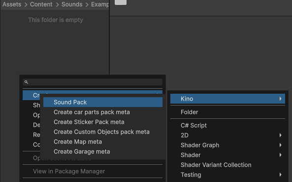
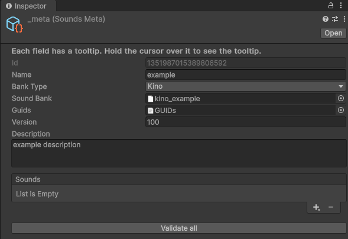
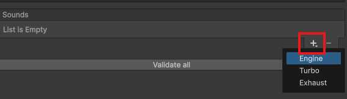
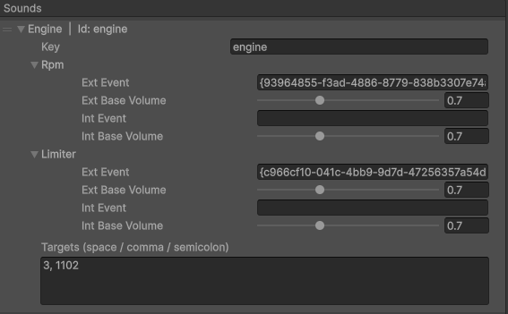
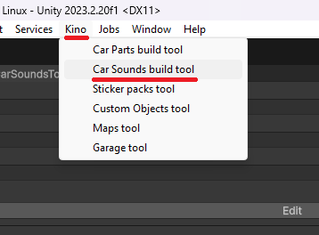
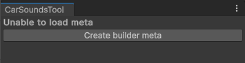
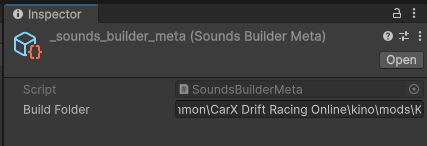
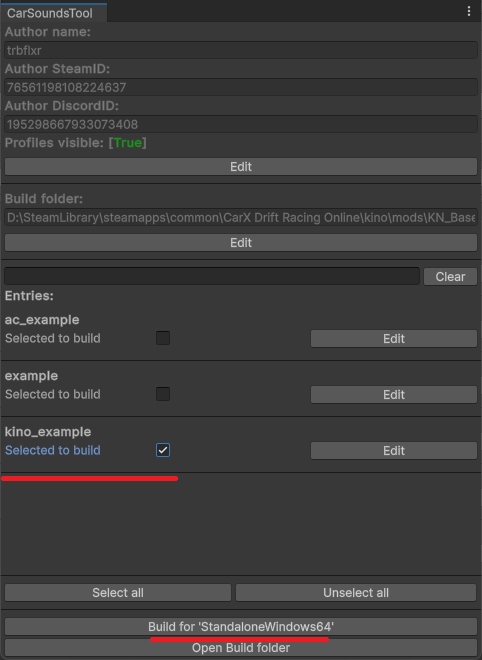

# Создание саунд паков

## Установка Unity и Content SDK

Если у вас всё ещё не установлен Unity, то установите его используя [этот гайд](../Tools/UnityInstallation_RU.md).

Если у вас не был установлен **Content SDK**, то [установите и настройте его](../Tools/SDKInstall_RU.md). Или же [обновите](../Tools/SDKUpdate_RU.md) **Content SDK**, если он уже был у вас установлен.

## Саунд банки (.bank)

Именно в саунд банках хранятся звуки и их параметры.

Если вы хотите портировать звуки из других игр или у вас уже есть собранный саунд банк, то переходите к [созданию пака](#создание-пака).

Если же вы хотите создать полностью свой звук, то перейдите к гайду по [созданию саунд банков](CustomSoundsFmod_RU.md).

## Создание пака

Предполагается, что все паки деталей должны находиться в папке `Assets/Content/Sounds`.

Каждый пак должен находится в **своей** папке. Это повысит удобство и ускорит создание.

Пример структуры:

```
📂 Assets
 └ 📁 Content
    └ 📁 Sounds
       └ 📁 Examples
       └ 📁 My2JZ_Sound
       └ 📁 SR20_Sound
```

### Поиск целевых авто и свпаов

Некоторые звуки привязываются к определенным авто или Kino свапам. Для того что бы включить отображение ID Kino свапов в меню `Kino -> Звуки -> Инструменты FMOD`, активируйте опцию **Отображать ID двигателей**.

После чего в списке свапов Kino вы увидите ID рядом с названием двигателя. ID авто можно посмотреть в меню `Звуки` или `Инструменты`. 

### Создание метаданных пака

Для каждого нового пака необходимо создать **файл метаданных**. Для этого создайте и перейдите в папку нового пака. После чего создайте файл метаданных с помощью **контекстного меню**.



Структура на данном этапе должна выглядеть как-то так:

```
📂 Sounds
 └ 📁 Example
    └ 📄 __meta
```

### Заполнение метаданных пака

Заполните метаданные о паке. Это нужно сделать **один раз** для **каждого** пака.



В поле `Name` укажите имя пака, оно должно быть уникальным и не должно содержать пробелов и специальных символов.

В поле `Bank Type` укажите тип саунд банка, который вы используете.

> [!IMPORTANT]
> Если вы не слышите звуки из созданного пака, то скорее всего вы указали неверный `Bank Type`.

В поле `Sound Bank` укажите ссылку на **.bank** файл.

В поле `Guids` укажите ссылку на файл **GUIDs.txt** от вашего саунд банка.

Укажите версию в поле `Version` и дайте описание паку в поле `Description`.

### Добавление звуков

Для добавления звуков нажмите на иконку `+` снизу справа, после чего выберите нужный тип.



Все звуки имеют схожую логику. У них есть поле `Key`, которое отвечает за ключ\название звука, а так же его части (ивенты).

В примере будет использован звук двигателя.



Введите в поле `Key` ID звука, которым можно его описать, на пример `engine` для звука двигателя.

Именно это имя пользователи увидят при просмотре списка доступных звуков.

Так же у звука двигателя есть **два** ивента: `Rpm` и `Limiter`. У них, как и у других ивентов идентичная структура.

Ивенты состоят из следующих полей:
* `ExtEvent` - ID ивента, который будет слышен **с камерой "снаружи"**, а именно с любой, кроме кокпита.
* `ExtBaseVolume` - Базовая громкость внешнего звука. Именно эта громкость будет использоваться при синхронизации звуков.
* `IntEvent` - ID ивента, который будет слышен **только** в кокпите.
* `IntBaseVolume` - Базовая громкость звука для кокпита, так же используется при синхронизации.

В поля `ExtEvent` и `IntEvent` вы должны ввести GUID нужного ивента из файла **GUIDs.txt**.
Если вы сами создавали саунд банк, то вы знаете какой звук тут указывать. В случае если вы портируете звук из другой игры, то обратите внимание на название ивентов в файле **GUIDs.txt**, обычно по ним всё понятно куда какой GUID указывать.

Так же стоит отметить то, что поля `Int*` опциональные. Вам не обязательно их указывать, главное заполните поля `Ext*`. 

> [!IMPORTANT]
> Перед релизом ваших паков **ОБЯЗАТЕЛЬНО** настройте `ExtBaseVolume` и `IntBaseVolume` у каждого звука так, что бы они были по громкости примерно как стандартные звуки игры.
> 
> Это очень важно и сильно влияет на качество звуков других игроков.

Если у звука есть поле `Targets`, то укажите в нём **ID авто** или же **ID Kino свапов**, для которых предназначается звук.

Как получить ID таргетов было описано выше в разделе [поиск целевых авто и свпаов](#поиск-целевых-авто-и-свпаов).

Вы можете указывать сколько угодно таргетов для звука. На пример указать все авто с двигателем **2jz**, а так же Kino свап, для кастомного звука 2jz. Это поле **обязательное**.

## Сборка паков

После того как вы закончили создание пака и заполнили его метаданные, можно приступать к сборке.

Если у вас не открыт инструмент сборки, то сделать это можно через меню `Kino -> Car Sounds build tool`.



Если вы видите вот такое сообщение, то нажмите на кнопку создания меты.



В поле **Build Folder** можете указать любую удобную папку. Я же указал путь к `KN_Base\sounds` что бы готовые паки сразу устанавливались.



В окне инструмента сборки выберите паки, которые хотите собрать используя поле `Selected to build`. После нажмите на кнопку `Build for ...`.

Так же из этого инструмента можно настроить данные об авторе, папку билда, а так же открыть настройки для каждого пака деталей.



После завершения сборки готовые паки будут помещены в указанную вами папку.

