# Custom garages

## Unity and Content SDK Installation

Install the Unity editor using [this guide](../UnityInstallation/UnityInstallation_EN.md).

Then, install and configure the [Content SDK](../ContentSDK/ContentSDKInstallation_EN.md).

> [!NOTE]  
> There's an example garage located in the `Assets/Content/Garage/Example` folder, and you can review it.

## Preparing the project structure

It is expected that all garages are located in the `Assets/Content/Garage` folder.

Each garage must be placed in its **own** folder. This improves organization and speeds up the creation process.

Example structure:
```
📂 Assets
 └ 📁 Content
    └ 📁 Garage
       └ 📁 Example
       └ 📁 DRO1_Garage
       └ 📁 MyGarage
```

> [!IMPORTANT]  
> Create a new folder inside `Garage` for every new garage.

## Creating Garage Metadata

> [!IMPORTANT]  
> In this example, the garage name will be `Example`. You can name your garages however you like.

Each new garage requires a **metadata file**. To create it, go to the folder of your new garage. Then create the metadata file using the **context menu**.

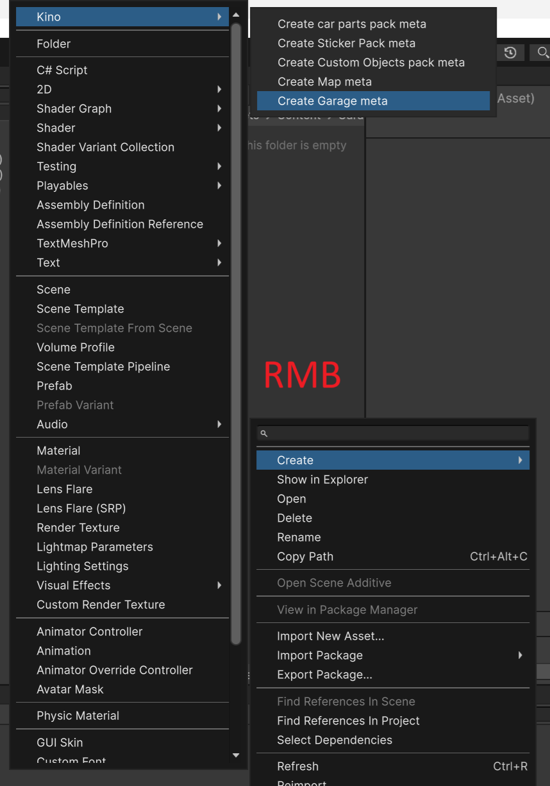

The structure should look like this:
```
📂 Garage
 └ 📁 Example
    └ 📄 __garage_meta
```

## Filling out garage metadata

Fill in the metadata for the garage. This only needs to be done **once** for **each** garage.

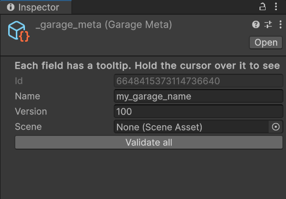

Fill in the metadata fields.

Leave the `Scene` field empty for now, we will return to it later.

## Creating a Scene

Click `File -> New Scene` or press `Ctrl + N`, then select the `Empty` template.

Next, click `File -> Save` or press `Ctrl + S` to save the newly created empty scene.

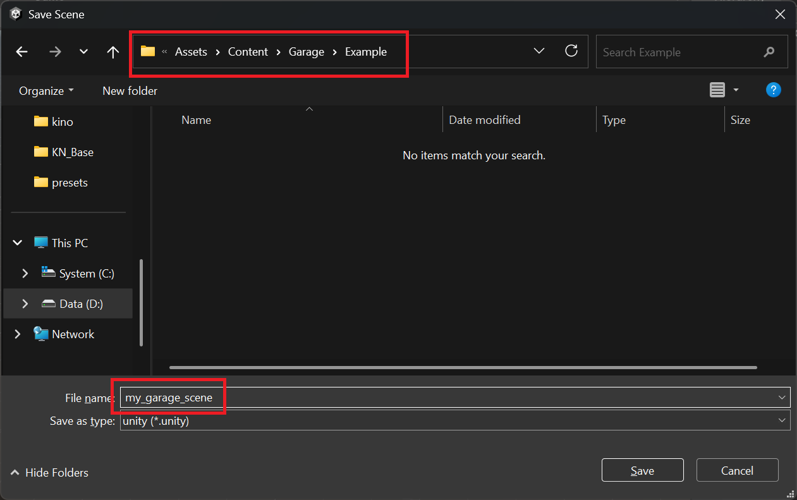

Now select the garage metadata file `__garage_meta` and assign the scene you just saved to the `Scene` field.

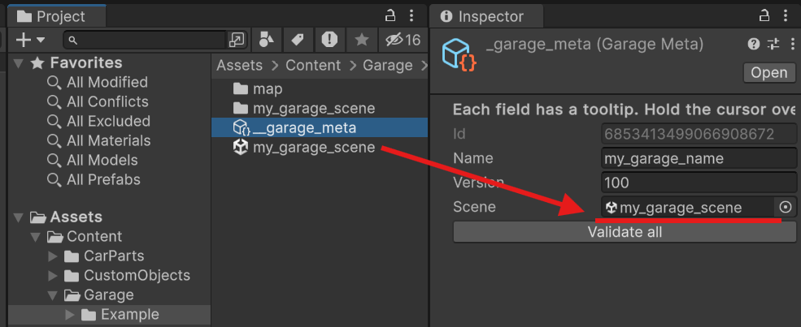

### Adding Models

Create and import models using any method you're comfortable with. Then drag them into the scene and place them as desired.

At this point, your scene should look something like this:

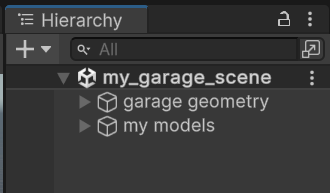

### Adding System Objects

In the root of the scene, create an empty GameObject named `Kino.System`. To do this, right-click in the empty space of the `Hierarchy` window and select `Create Empty`, then rename the created object to `Kino.System`.

At this stage, your scene should look something like this:

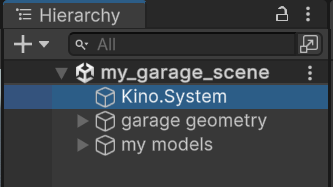

The Kino garage system expects the following system objects to be present:
* [Waypoints](#spawn-points-waypoints) – A required object containing spawn points.
* [Sun](#sun-or-moon-sun) – _Optional_ object representing the sun or moon, responsible for lighting.
* [Volume](#graphics-settings-volume) – A required object responsible for graphics and post-processing.
* [ToggleGroups](#object-groups-togglegroups) – _Optional_ object containing groups of objects that the user can toggle in-game.
* [LightGroups](#light-groups-lightgroups) – _Optional_ object with groups of light sources that can be configured in-game.
* [PodiumCars](#podium-cars-podiumcars) – _Optional_ object with spawn points for "podium" cars.

### Spawn points (Waypoints)

Add a new empty object to the `Kino.System` object by right-clicking on it and selecting `Create Empty`, then name the new object `Waypoints`. All available spawn points must be placed inside this object.

Create the desired spawn points according to the [naming convention](#spawn-point-names) and position them as needed.

#### Spawn point names

You can name the points however you like, but the Kino system recognizes the following specific names:
* `Spawn` – Required main spawn point where the player will be positioned in the main garage context.
* `Dyno` – _Optional_ dyno spawn point.
* `BodyShop` – _Optional_ body kit customization point.
* `PaintShop` – _Optional_ point for paint and livery editing.

> [!INFO]  
> Note that if the player has the auto-teleport option enabled, they will be moved to one of the _additional_ spawn points based on the current context, such as `Dyno`, `BodyShop`, or `PaintShop`.
> However, these points are optional, and if you don't need them, add the `Spawn` point only.

#### Spawn point colliders

To prevent the player’s car from falling through the ground, you need to create a collider.

To do this, add a `Plane` object to the root of the scene. Right-click on empty space in the `Hierarchy` window and select `3D Object -> Plane`.

> [!IMPORTANT]  
> Name the created object however you prefer, but **make sure** to add the prefix `road_` so Kino will assign it a collider.

Place the newly created `Plane` where the player’s car is supposed to spawn. Also, remove the `Mesh Renderer` component so it is invisible in the scene.

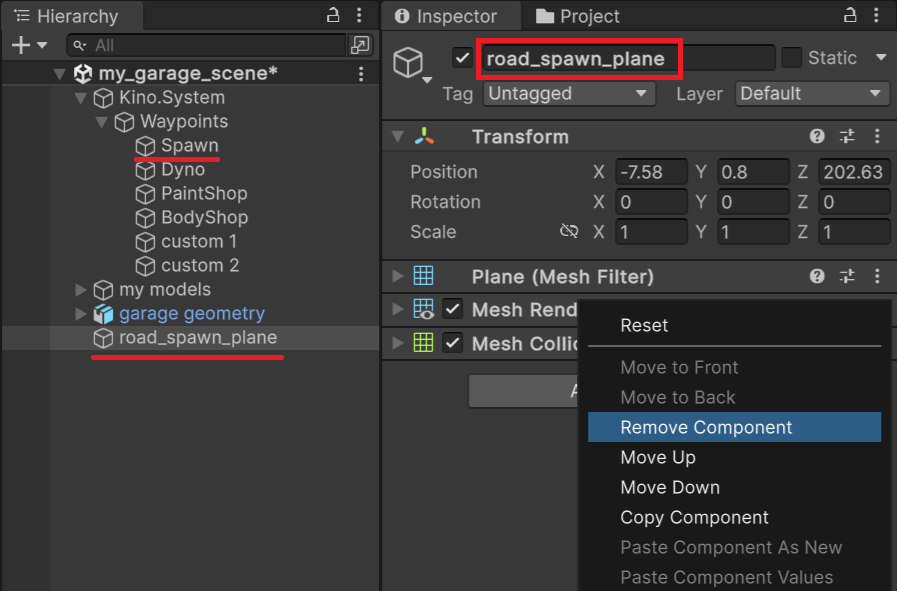

Create the other spawn points (if needed) in the same way, add them to the `Waypoints` group, name them according to the [spawn point naming](#spawn-point-names), and add colliders.

### Sun or moon (Sun)

This object is optional. If your garage has no windows and is a fully enclosed box, you can skip this step. Otherwise, it's recommended to add a `Sun`.

To add it, right-click on `Kino.System`, choose `Light -> Directional Light`, and name the new object `Sun`.

Adjust the sun’s rotation, color, and temperature. For proper game functionality, make sure to set its brightness to **no more than** 150 lux.

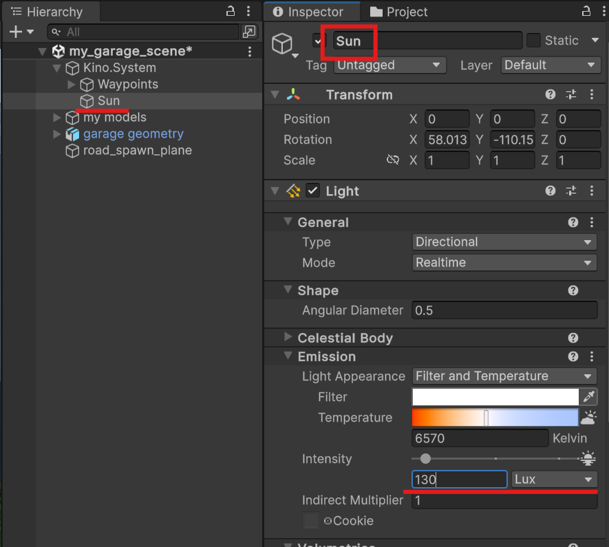

### Graphics settings (Volume)

Graphics are controlled by the `Volume` object. Create it under `Kino.System` by right-clicking on it and choosing `Volume -> Sky and Fog Global Volume`. Name the new object `Volume`.

Configure the existing effects (disable them if not needed), or add new ones by clicking `Add Override`.

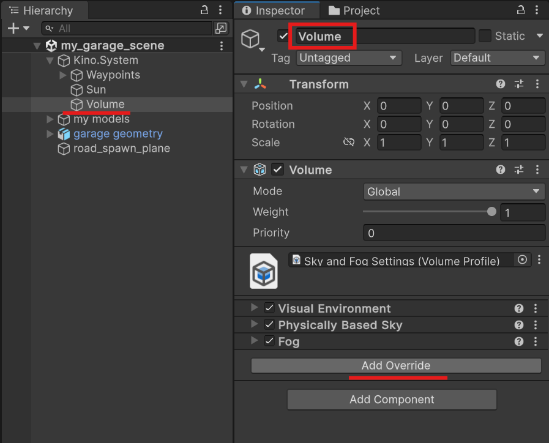

> [!INFO]  
> Keep in mind the garage will appear in-game exactly as it's configured in the editor, including all post-processing effects.
>
> Additionally, having `Sun` and `Volume` components allows players to customize the garage's graphics using Kino.

### Object groups (ToggleGroups)

The `ToggleGroups` object is optional and allows you to add groups to the garage that the player can toggle in-game. You can include anything in these groups: reflections, extra objects, or light sources.

To add `ToggleGroups`, select the `Kino.System` object, right-click on it, choose `Create Empty`, and name the new object `ToggleGroups`.

Add groups as empty child objects inside `ToggleGroups`. Group names can be anything, and there's no limit to the number of groups.

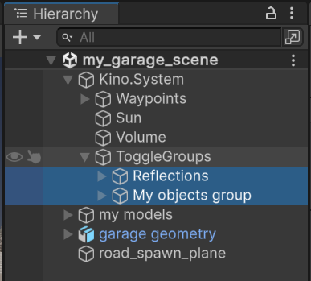

You can disable (hide) groups by unchecking them in the Inspector. This way, they will be inactive by default, and the user will need to manually enable them.

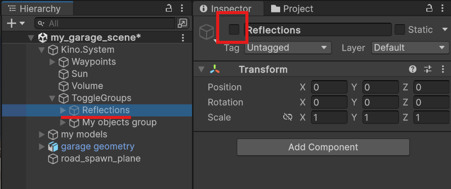

### Light groups (LightGroups)

The `LightGroups` object is optional and allows you to assign light sources to customizable groups that the user can toggle and customize in-game. You can add any light sources to the groups **except** `Directional` lights.

To add `LightGroups`, select the `Kino.System` object, right-click on it, choose `Create Empty`, and name the new object `LightGroups`.

Groups must be added directly inside the `LightGroups` object by creating empty GameObjects. Group names can be anything, and there's no limit on the number of groups.

> [!INFO]  
> Note that players will be able to adjust the intensity, color temperature, and color of lights in each group.  
> These settings will apply to the entire group.

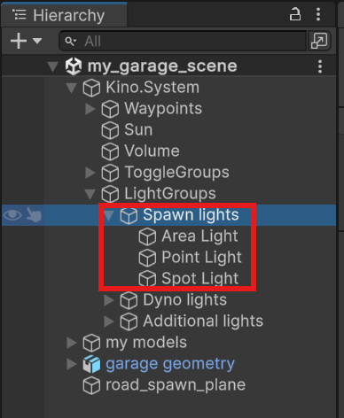

You can disable (hide) groups by unchecking them in the Inspector. This way, the group will be inactive by default, and the user will need to manually enable it.

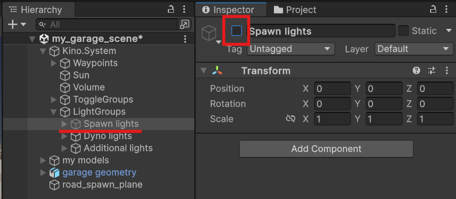

### Podium cars (PodiumCars)

The `PodiumCars` object is optional and allows you to set spawn points for podium cars. “Podium cars” refers to the player’s cars that will load with the garage. The user will be able to assign any cars with any preset to the podium.

To add `PodiumCars`, select the `Kino.System` object, right-click on it, choose `Create Empty`, and name the new object `PodiumCars`.

Spawn points must be added directly into the `PodiumCars` object by creating empty GameObjects. The names of the spawn points can be anything, and there's no limit on the number of points. However, keep in mind that additional vehicles consume more resources, which can lead to lower FPS and longer garage load times.


> [!IMPORTANT]  
> Make sure there is a collider under each spawn point, otherwise the car will fall through the ground. You can create this collider similarly to how it's done for [spawn point colliders](#коллайдеры-точек-спавна).
>
> If all your points are on the same level, you can create one large `Plane` instead of adding an individual collider for each point.

## Garage Build

Open the garage build tool window by selecting `Kino -> Garage tool`.

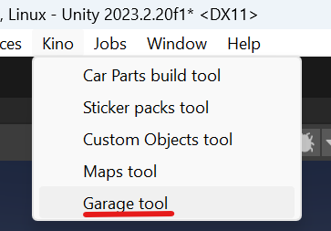

In the window that appears, select the garage you want to build and click the `Build for <platform name>` button.

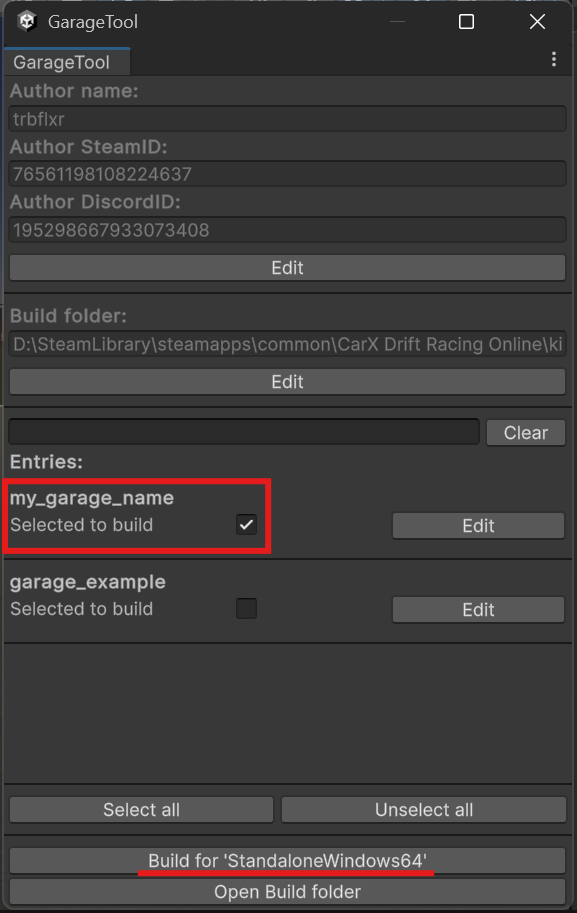
