# Creating Maps for Kino

## Installing Unity and Content SDK

Install the Unity editor using [this guide](../UnityInstallation/UnityInstallation.md).

Then install and configure the [Content SDK](../ContentSDK/ContentSDKInstallation.md).

> [!NOTE]  
> In the `Assets/Content/Maps/Example` folder, there is a sample map that you can review.

## Preparing the Project Structure

It is assumed that all maps should be located in the `Assets/Content/Maps` folder.

Each map should be in its **own** folder. This will improve convenience and speed up creation.

Example structure:

```
📂 Assets
 └ 📁 Content
    └ 📁 Maps
       └ 📁 Example
       └ 📁 MyMap1
       └ 📁 MyMap2
```

> [!IMPORTANT]  
> Create a new folder in `Maps` for each new map.

## Creating Map Metadata

> [!IMPORTANT]  
> In this example, we will use the `Example` map. You can name your map as you wish.

For each new map, you need to create a **metadata file**. To do this, create and navigate to the folder of the new map. Then create the metadata file using the **context menu**.

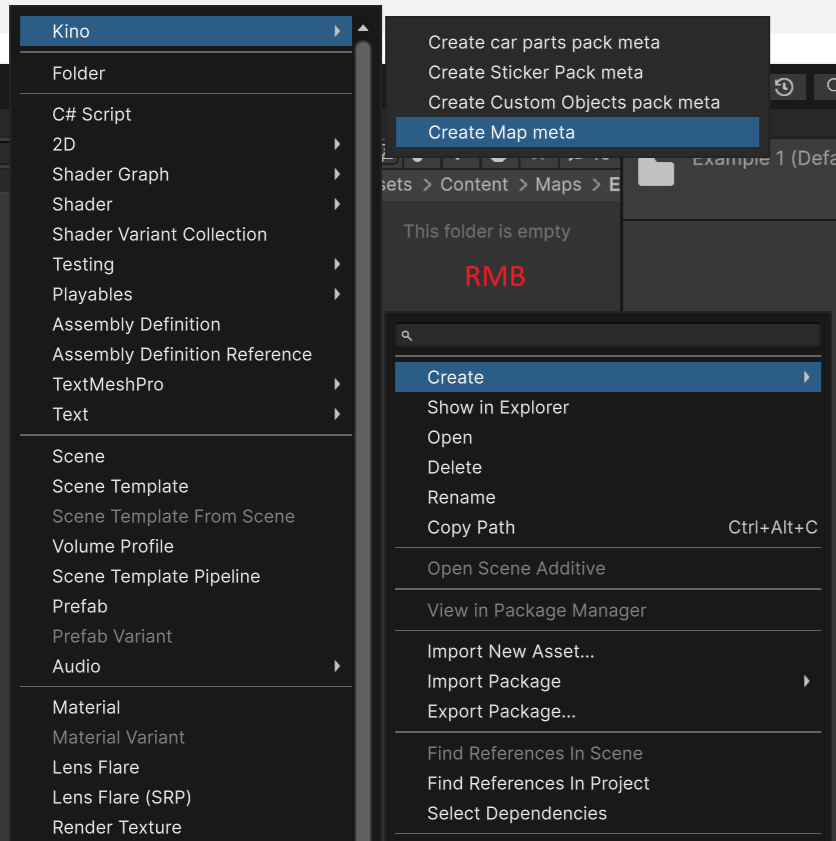

The structure should look like this:

```
📂 Maps
 └ 📁 Example
    └ 📄 __map_meta
```

## Setup the Map Metadata

Fill in the metadata for the map. This needs to be done **once** for **each** new map.

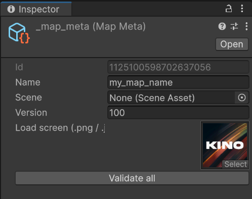

The most important field is **Name**, which is the name of the map and must be unique.

The **Version** field indicates the version of the map, for now, leave it as is, with the value `100`.

In the **Load Screen** field, specify the loading screen in `.png` or `.jpg` format. The image should be located in the map folder.

Leave the **Scene** field empty for now, it will need to be filled in after [creating the scene](#creating-the-scene).

## Creating the Scene

Each map represents a scene where any objects, light sources, etc. can be placed.

To create a scene, right-click in the **Project** window, then select **Create** and **Scene**. You can name the scene whatever you like, but only in **English** and **without spaces**.

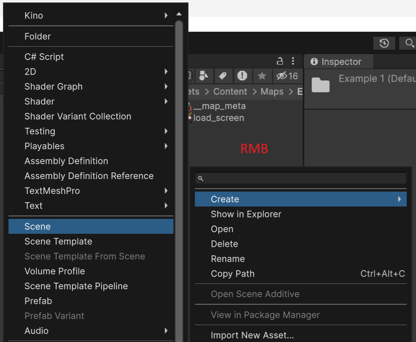

After creating the scene, you need to complete the map metadata. Specify the newly created scene in the **Scene** field, then click **Validate all** to ensure the metadata is correct.

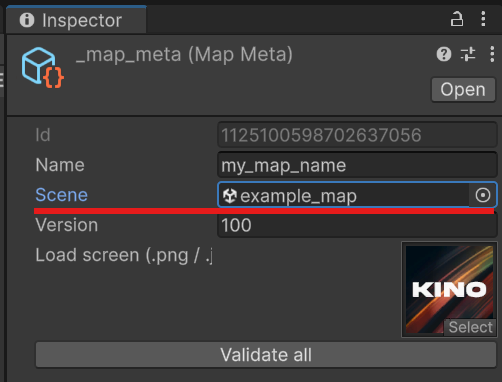

## Setting up Blender Integration

> [!WARNING]  
> If you do not use Blender, or want to use `.fbx` models, you can skip this step.
> Find information on importing models from your chosen software online.
> The model import process is [described below](#importing-blend--fbx-files-into-unity).

The Blender integration setup is described in [this guide](../Blender/BlenderIntegration_RU.md).

## Importing .blend / .fbx Files into Unity

> [!WARNING]  
> If you want to add models as `.fbx` files, make sure that the export settings match the parameters highlighted in the screenshot.
> The `Path Mode` field should be set to **Copy**, and `Forward` and `Up` in the `Transform` section should be set as shown in the example.

> [!IMPORTANT]  
> Export the model to the map folder you are working on, next to the `__map_meta` metadata file. This way, Unity will detect the textures and model without any additional actions.

```
📂 Assets
 └ 📁 Content
    └ 📁 Maps
       └ 📁 Example
          └ 📁 your_model_name.fbm   <- Blender will create this folder, where the model's textures are stored
          └ 📄 __map_meta
          └ 📄 your_model_name.fbx   <- here
```


## Adding Models to the Scene

Open the map scene you created earlier. To do this, double-click on it in the **file list** in the **Project** window.

Drag your `.blend`, `.fbx`, or any other model onto the scene.

If the model looks incorrect, or if you want to fine-tune it, you need to unpack the prefab.

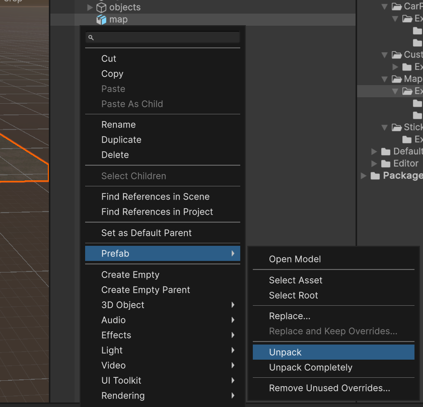

If you want to further customize or correct the materials, you need to extract them.

To do this, select the model file in the **Project** window, then in its properties select **Materials** -> **Extract Materials**, as shown in the example.

Then specify the folder where you want to extract them. After that, you can adjust the materials.

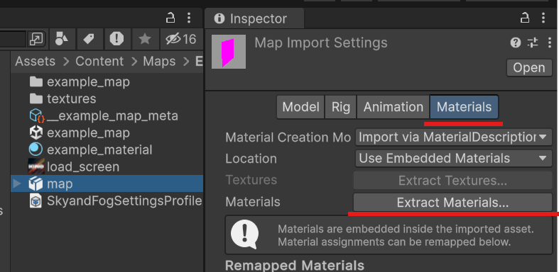

## Setting up Lighting and Post-Processing

### Sun

If there is no `Directional Light` in the scene, you need to add it using the context menu.

To do this, right-click on an empty spot in the `Hierarchy` window and select `Light` -> `Directional Light`, then you can adjust the light source.

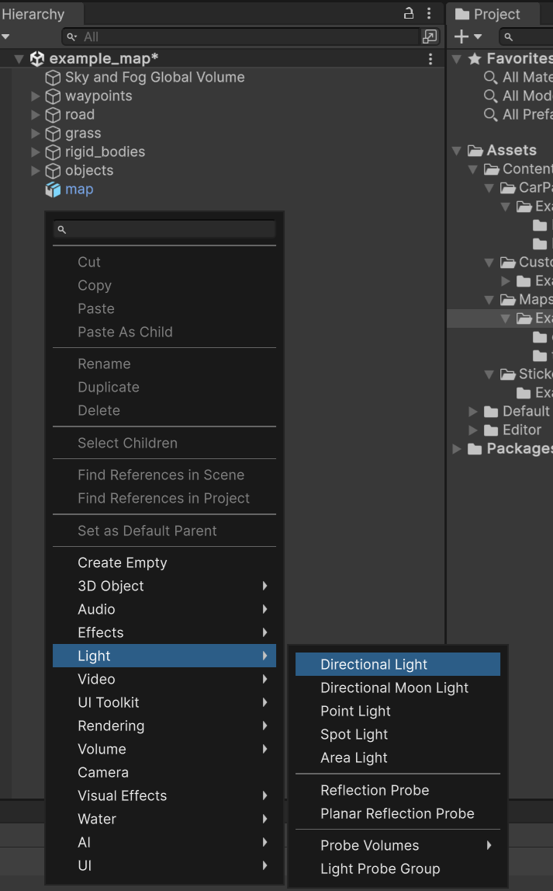

### Post-Processing and Effects

To fine-tune the graphics on the map, add a `Sky and Fog Global Volume`.

To do this, right-click on an empty spot in the `Hierarchy` window and select `Volume` -> `Sky and Fog Global Volume`, then save the scene.

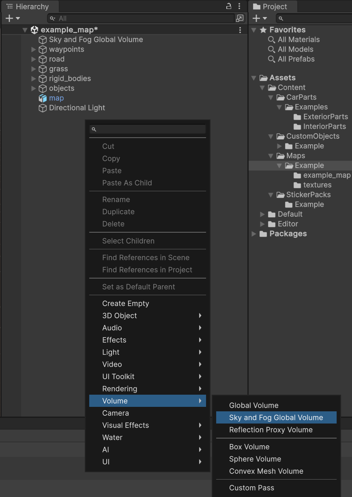

To add post-processing and effects, select the `Sky and Fog Global Volume` object, then click `Add Override` and select the necessary components.


## Configuring the Map

### Setting Colliders

> [!IMPORTANT]  
> This is the most crucial step in creating the map, without it the surfaces will have no collisions.

To set a collider, you need to select the object that should have the collision and add one of the colliders to it.

You can select all objects that should have collisions and add the `Mesh Collider` component to them.

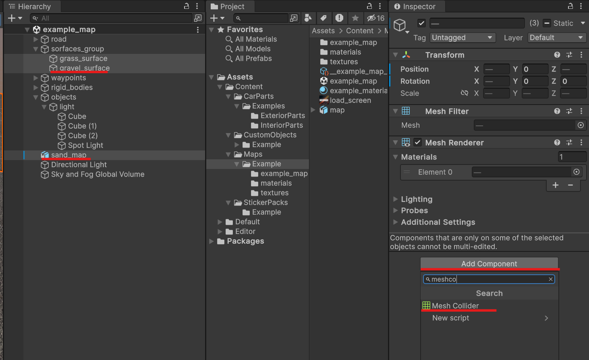

However, note that this is not the best method, as `Mesh Collider` processing requires more computational resources.

You can optimize colliders on the map by setting `Box Collider` to **rectangular** and **square** objects.

You can set `Capsule Collider` for **poles** and **trees**.

For more complex surfaces, such as **roads with height variations** or **landscapes**, use `Mesh Collider`.

### Setting Surfaces

The following surface types are available for setting:
* road
* grass
* dirt
* gravel
* sand
* ice
* snow
* kerb

They have different levels of grip and roughness.

You can use two methods to set surface types:
* Create a root object with the surface name and place the necessary objects in it  
  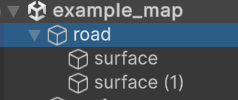

* Specify the surface type for each object individually  
  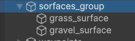

> [!INFO]  
> You can specify the surface type both during model creation (e.g., in Blender) and in Unity itself.

### Setting Waypoints (Teleport Points)

You can set teleport points by creating an object named `waypoints` at the root of the scene.

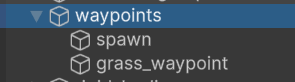

Add **empty objects** to the `waypoints` object and set their necessary position and rotation.

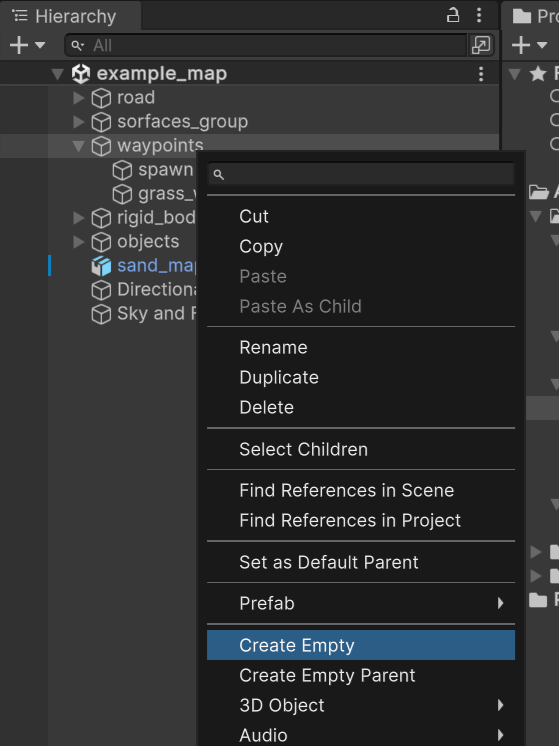

You can name these objects however you like; their name will be displayed in the list of teleport points.

### [Optional] Setting Physical Bodies

Optionally, you can add physical objects that can be interacted with.

Physical objects should be placed in the `rigid_bodies` object, which in turn should be at the root of the scene.

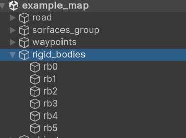

Select the necessary objects, make sure they have **any collider**, and add the `Rigid Body` component to them.

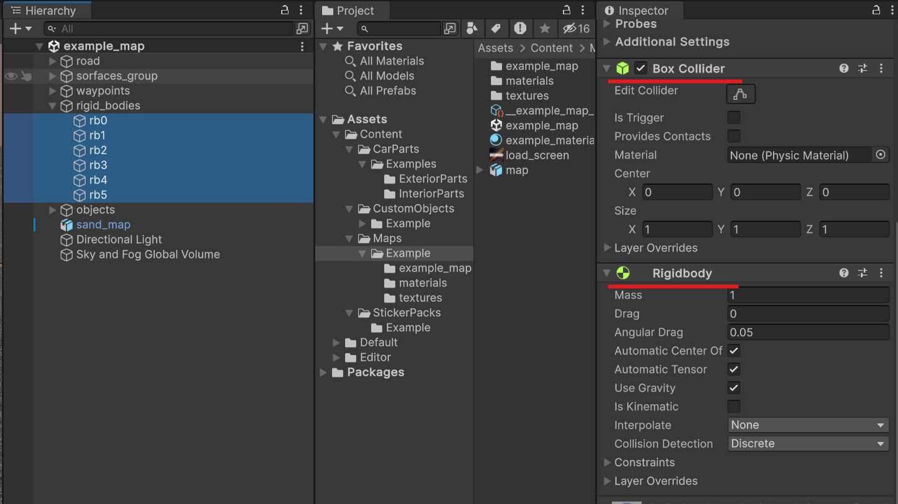

### [Optional] Day-Night Cycle Controller

If you want to add day and night support to the map, you can do this using the following objects:
* [Kino.Lights](#lights)
* [Kino.ToggleGroup.Day](#togglegroupday)
* [Kino.ToggleGroup.Night](#togglegroupnight)

#### Lights

Add light sources to this object that should be on at night and off during the day.

#### ToggleGroup.Day

Objects in this group will be active during the day and inactive at night.

#### ToggleGroup.Night

Objects in this group will be active at night and inactive during the day.

> [!IMPORTANT]  
> Leave only one object active, either `Kino.ToggleGroup.Day` or `Kino.ToggleGroup.Night`, depending on the default time of day on the map.

## Optimizing the Map

You can significantly improve performance on the map using `LOD Group` components.

Detailed information about this component can be found [here](https://docs.unity3d.com/Manual/class-LODGroup.html).

It is also recommended to select all static objects and set their flag to `Static` to improve performance.

Select roads, landscapes, buildings, and other static objects.

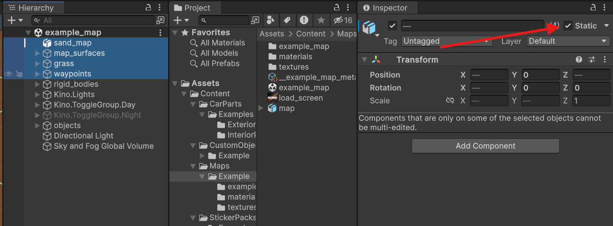

In the dialog box, select `Yes, change children`.

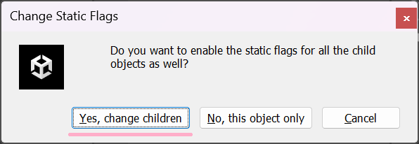

# Building the Map

If you do not have the build tool open, you can do so through the menu `Kino -> Maps tool`.

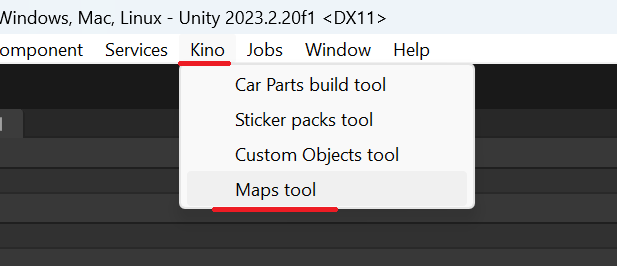

You can drag the **Maps tool** to any area for convenience.

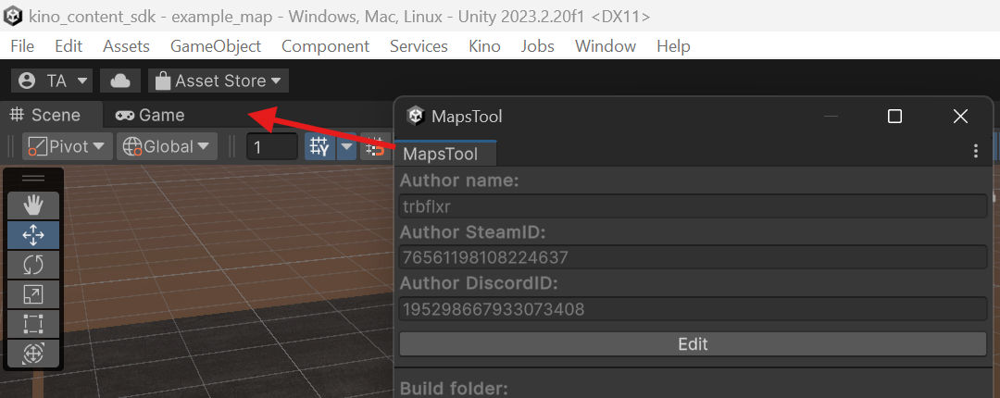

If you see a message like this, click the create meta button.

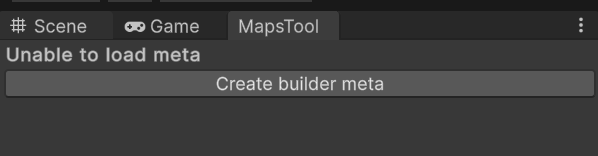

In the **Build Folder** field, you can specify any convenient folder. I specified the path to `KN_Base\maps` so that the finished maps are immediately installed in the game.
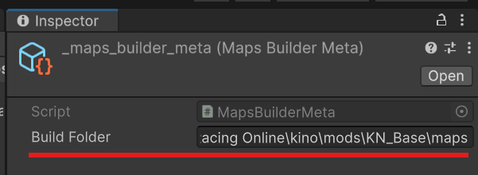

In the build tool window, select the maps you want to build using the `Selected to build` field. Then click the `Build for ...` button.

You can also configure author information, the build folder, and open settings for each map from this tool.
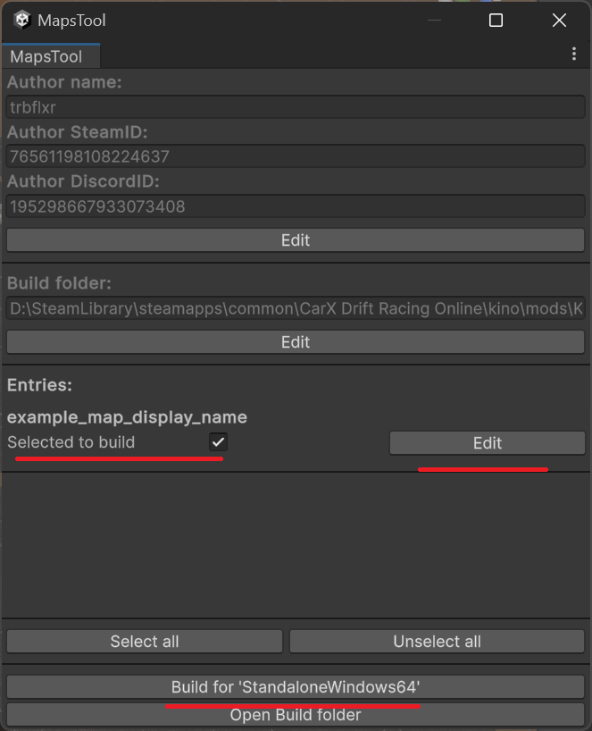

After the build is complete, the map will be placed in the folder you specified.