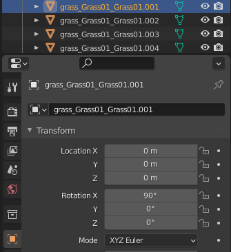
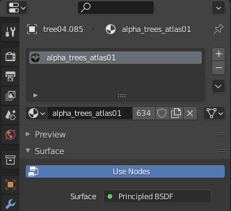

# OBJ Map Creation

> [!INFO]  
> Check out [Kino (Unity)](MapsKinoInfo.md) maps, as they are more customizable and much more performant.

This is a basic guide for map creation.  
It is intended for people who already have experience working with 3D software such as 3Ds Max and Blender.

The guide will use Blender as an example software since it is free and is most popular for creating maps in CarX.

## Physical Materials

Physical materials are assigned by adding a "tag" in the object's name like in example bellow:  

### Available materials and their tags:
* Asphalt - **road_**  
* Grass - **grass_**  
* Kerbs - **kerb_**  
* Sand - **sand_**  
* Snow - **snow_**  
* Gravel - **gravel_**  
* Dirt - **dirt_**  
* Ice - **icyroad_**

## Object types
There are 2 tags for the object types:  
* Object with no collision - **nocol_**
* Riggid body - **rb_**

## Extras
You can add spawnpoints, and light sources to your maps. To do so you will have to create an **Arrow** object and name it accordingly.  
  
To create a spawnpoint simply name it `Spawnpoint`

For light sources:  
* Spotlight - **Spot**  
* Pointlight - **Point**

Object names have to be in english.

## Alpha (transparency)
For objects that have a transparent texture you will have to add one of the following tags:  
* Transparent without collision - **alpha_**  
* Transparent with collision - **alphaCol_**  
* Transparent with normalmap - **alphaLit_**

## Material properties
In the material settings you can change specularity and roughness parameters.  
* **Specularity** is responsible for the sort of "glare" effect.   
* **Roughness** makes the surface more rough or smooth (smoother surface will be more reflective).

## Afterword
Spawnpoints and light sources are saved to **Extra Data** file.
