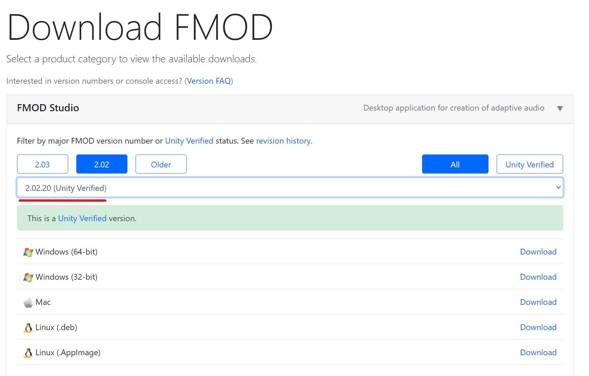

# Установка FMOD Studio

В настоящее время в CarX используется версия FMOD Studio `2.02.00`. Именно эту версию и нужно будет установить.

## Загрузка FMOD Studio

Перейдите на страницу загрузки [FMOD Studio](https://www.fmod.com/download#fmodstudio) и скачайте версию `2.02.00` для вашей платформы, после чего установите её.

Процесс установки ничем особым не отличается, установите как обычную программу.
