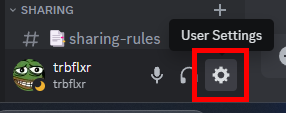
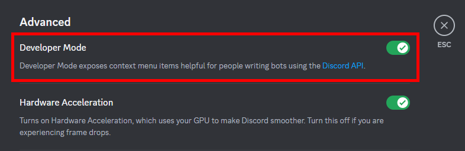
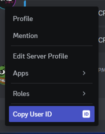

# How to get DiscordID

1. Click **the gear icon** in the bottom-left corner

2. Select **Advanced** from the left sidebar

3. Enable **Developer Mode**

4. Click on **your profile** and select **Copy User ID**

