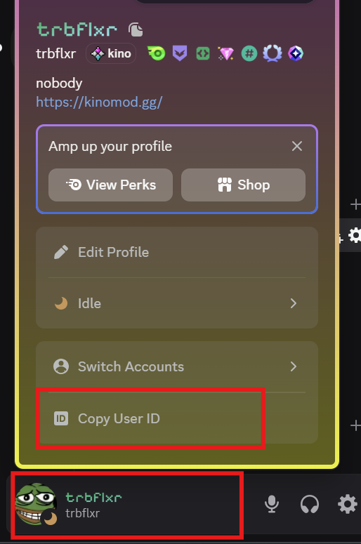

# Получение DiscordID

1. Нажмите на иконку **шестеренки** в левом нижнем углу Discord

2. Перейдите в пункт **Advanced** в сайдбаре слева

3. Активируйте **Developer Mode**

4. Нажмите на **свой профиль** выберите **Copy User ID**

