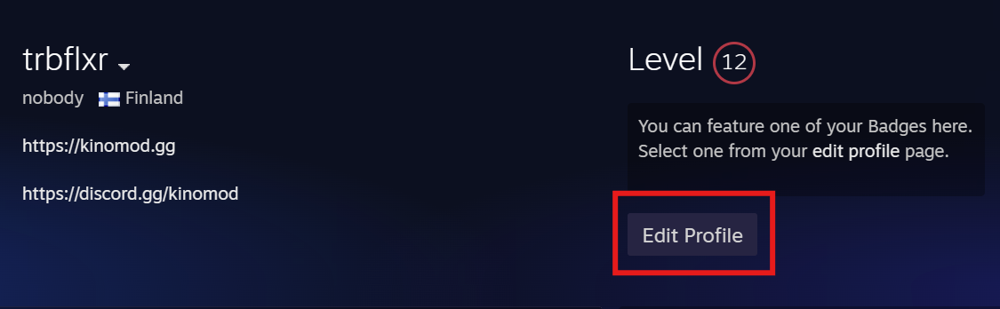

# How to get SteamID

1. Open your Steam **Community Profile**

2. Click **Edit Profile**

3. If you've never set a custom Steam Community URL for your account, your 64 bit ID will will be shown in the URL under the **CUSTOM URL** box
4. If you have set a custom URL for your account, you can delete the text in the **CUSTOM URL** box to see your account's 64 bit ID in the URL listed below

