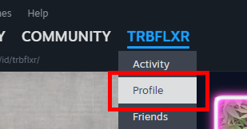
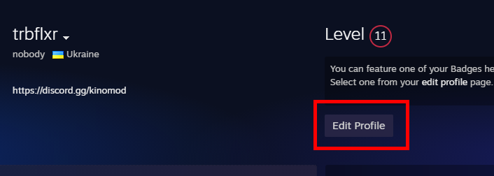
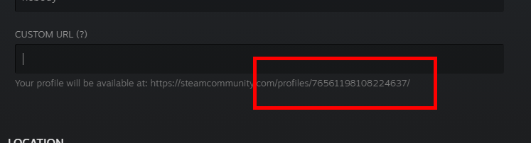

# Как получить SteamID

1. Откройте **ваш профиль** в приложении Steam

2. Нажмите **Edit Profile**

3. Если у вас не установлен _Steam Community URL_, то ваш 64 битный ID будет виден в URL под полем **CUSTOM URL**
4. Если же у вас был установлен кастомный URL, то удалите текст из поля **CUSTOM URL**, после чего ваш 64 битный ID будет виден ниже

