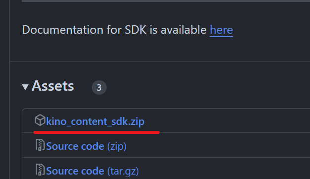
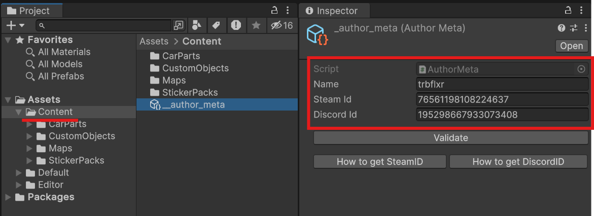

# Установка и настройка Content SDK

Для создания контента для Kino необходимо установить **Content SDK**.

> [!IMPORTANT]
> Для работы с Content SDK необходимо установить [Unity](UnityInstallation_RU.md).

## Загрузка Content SDK

Загрузите последний релиз [Content SDK](https://github.com/trbflxr/kino_content_sdk/releases/latest).

После чего распакуйте архив в удобное для вас место.

## Настройка Content SDK

Укажите информацию об авторе. Эта информация служит своего рода подписью и будет добавлена ко всем ресурсам.

> [!NOTE]
> Информацию об авторе нужно заполнить только один раз

Отредактируйте файл `__author_meta` после чего нажмите **Validate** что бы удостоверится в правильности данных.

Воспользуйтесь гайдами для получения своих [SteamID](GetSteamId_RU.md) и [DiscordID](GetDiscordId_RU.md), если вы не знаете как это сделать.

