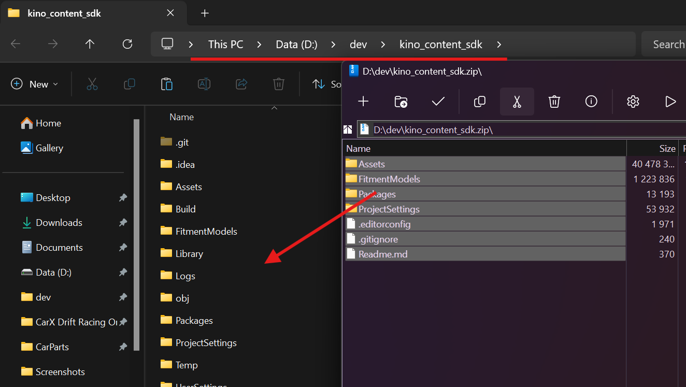
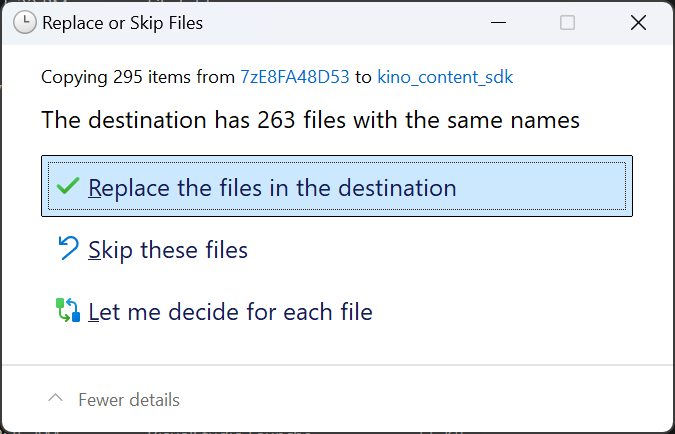

# Обновление Content SDK

Если у вас **не установлен** ContentSDK, то воспользуйтесь [этой инструкцией](SDKInstall_RU.md).

## Загрузка Content SDK

Загрузите последний релиз [Content SDK](https://github.com/trbflxr/kino_content_sdk/releases/latest).

**Закройте** проект Unity, если он у вас открыт.

После чего распакуйте архив в **ту же папку**, где у вас установлена более старая версия Content SDK.

> [!IMPORTANT]
> **Замените** файлы **все** файлы, которые предложит система

