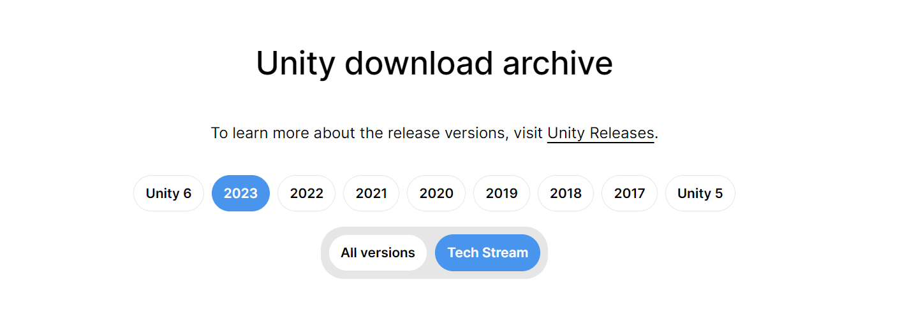
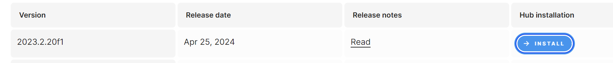
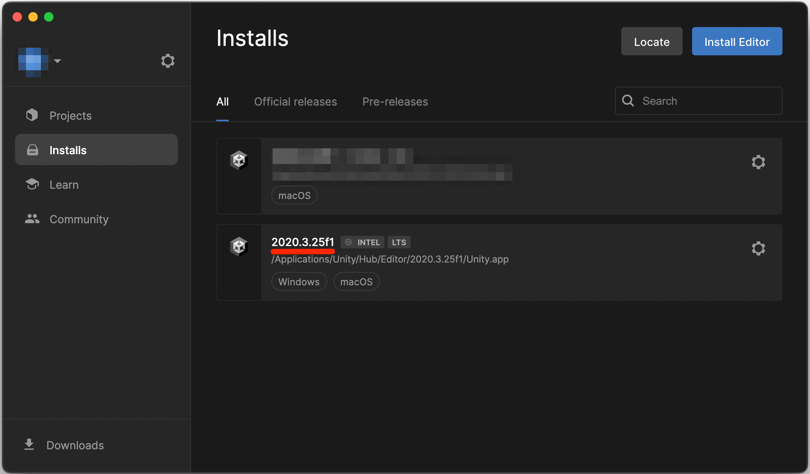

# Установка Unity

В настоящее время CarX работает на версии Unity `2023.2.20f1`. Именно эту версию и нужно будет установить.

## Установка Unity Hub

В первую очередь необходимо установить Unity Hub, скачать его можно по ссылке:  
https://unity.com/download  
Далее нажмите на кнопку **Download**, скачайте и установите его.

## Установка Unity Editor

Теперь приступим к установке Unity. В данный момент используется версия `2023.2.20f1`. Скачать редактор можно по ссылке:  
https://unity.com/releases/editor/archive

Тут нужно выбрать нужную нам версию в данный момент это `2023`
  
После найди в списке `Unity 2023.2.20f1` и нажми на кнопку **Install**

После загрузки и установки в списке появится нужный редактор

Установка Unity завершена!
