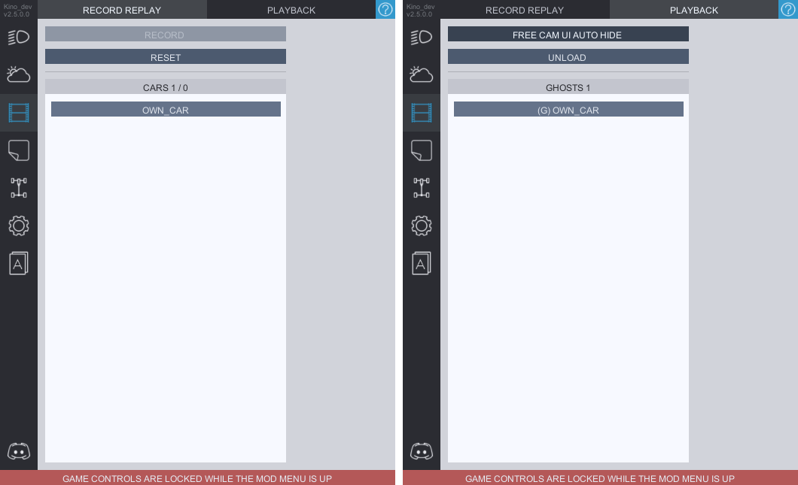
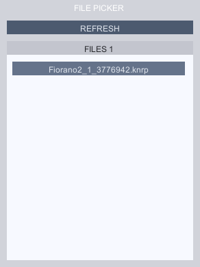

# Cinematic
The module which was a defining feature on the mod back on it's release.  
The `Cinematic` tab consists of two additional tabs: 

### **`RECORD REPLAY`**
In this tab you record replays by choosing which players you want to record from the list of cars and pressing the **`RECORD`** button. Once done you're done recording press the **`STOP`** button to save your replay (replay files are saved in *`CarX Drift Racing/BepInEx/plugins/KN_Base/replays`*).

### **`PLAYBACK`**  
Press **`LOAD REPLAY`** to open the file picker from which you can choose the replay file you need.  
  
After the replay is loaded, you're gonna have a list of ghosts saved in replay in the list you will find in the **PLAYBACK** tab.

## **Timeline**
  
*shortened for the ease of viewing*  
The timeline acts as a way to control the replay playback. You can **fast forward** and **rewind** your replay. You also have the options to increase or decrease the speed of the playback as well as loop the replay. **Blue arrows** on the sides are used to define the ***start*** and ***end*** points of your replay.

## **Filming the played back replay**
*Okay, so now we can record and play the recorded replay. But what now? What do you do with it?*  
To record a video you can use the CarX free camera adapted for our needs. To activate it press **F3**, if you're currently spectating someone - the camera will follow their car, if you have choosen a **ghost** from the **PLAYBACK** menu, the car is gonna follow the chosen **ghost** car. You can press **`FREE CAM UI AUTOHIDE`** so whenever you activate the camera it will already appeared with a hidden UI.  
In the future this module is probably gonna also have an option to animate the camera via keyframes as it used to work back in the first versions of KINO mod.
