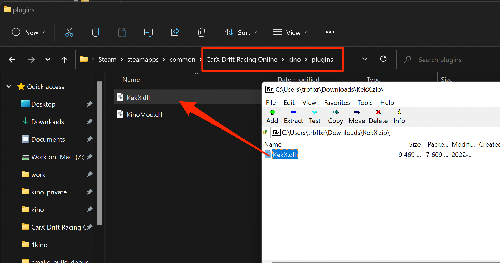

# Mods / plugins installation guide

### Kino loader is fully compatible with BepInEx plugins.

To install a new mod simply **drag / unzip** it inside of the **kino/plugins** folder.  

The loader will search for mods in the **kino/plugins** folder and step one directory in.  
So you can have it like this:

```yaml
kino/plugins:
    Mod1.dll - Ok
    Mod2Folder:
        Mod2.dll - Ok
    Mod3Folder:
        Mod3Subfolder:
            Mod3.dll - Will be skipped
```  

**Mod1.dll** and **Mod2.dll** will be loaded, but **Mod3.dll** will be skipped.

# Make your own kino plugin

The mod making **[guide](MakeAMod.md)**.