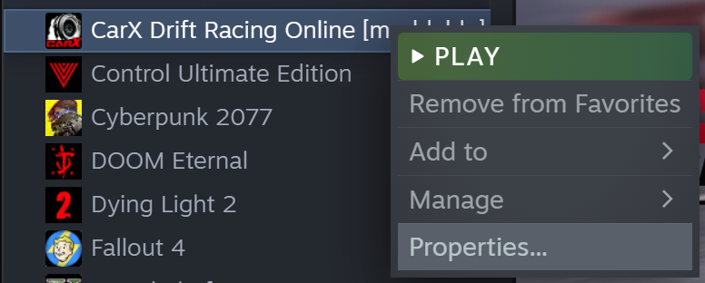
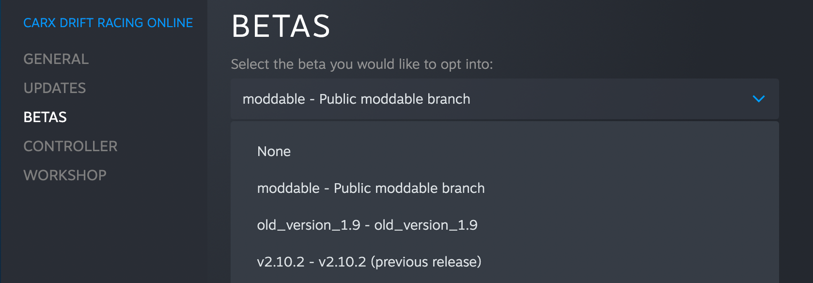
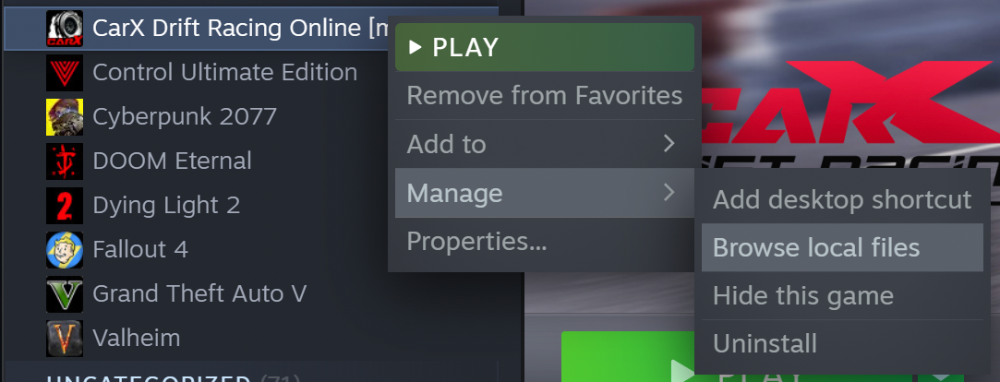
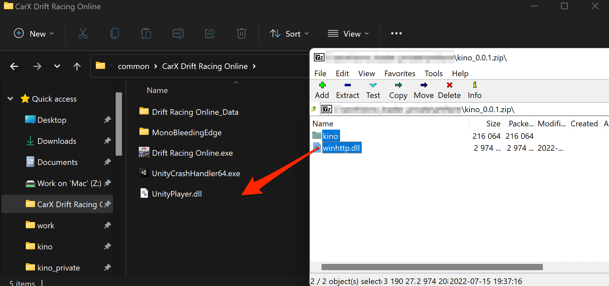

# Installation guide

### The mod does not work on win7

### Required components

1. You might have to download and install the [Visual C++ Redistributable for Visual Studio 2015, 2017 and 2019](https://support.microsoft.com/en-us/help/2977003/the-latest-supported-visual-c-downloads). You will need the [vcredist_x64.exe](https://aka.ms/vs/16/release/vc_redist.x64.exe).

#### If you are on ZML, then download latest **Kino.ZML.zm** from [releases](https://github.com/trbflxr/kino/releases) page and put it to **ZML/mods**. That's it, now you can start the game.

## Standalone installation:

1. First you need to switch the game to the **[moddable]** version.  
     
   
2. Download the latest release from the **[releases](https://github.com/trbflxr/kino/releases)** page. You only need to download the `kino_%version%_win.zip`.
3. Open the game folder.  
   
4. Unzip all the file from the archive to the game's directory.  
   
5. Launch the game.
