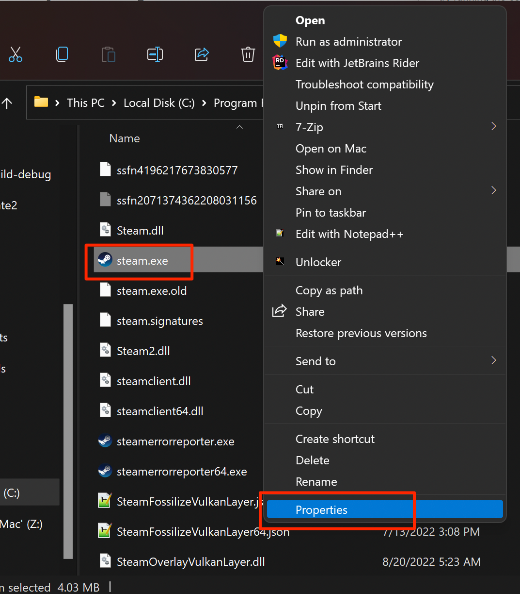

# Run steam as administrator

In case you have KinoMod Steam initialization error you can try run Steam as administrator.

1. Exist Steam
2. Navigate to steam.exe, by default it's installed in the `C:\Program Files (x86)\Steam`
3. Open steam.exe properties window

4. Select **Compatibility** tab
5. Check **Run this probram as administrator** option

6. Click **Apply**
7. Start Steam and launch the game
