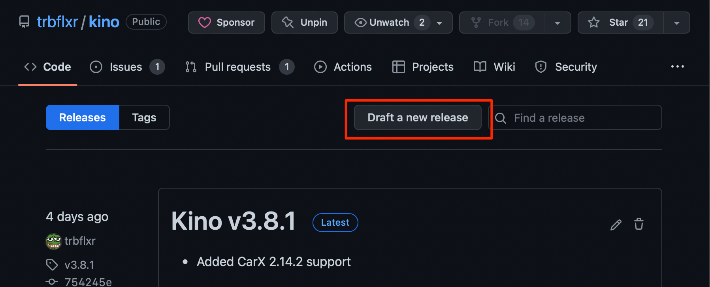
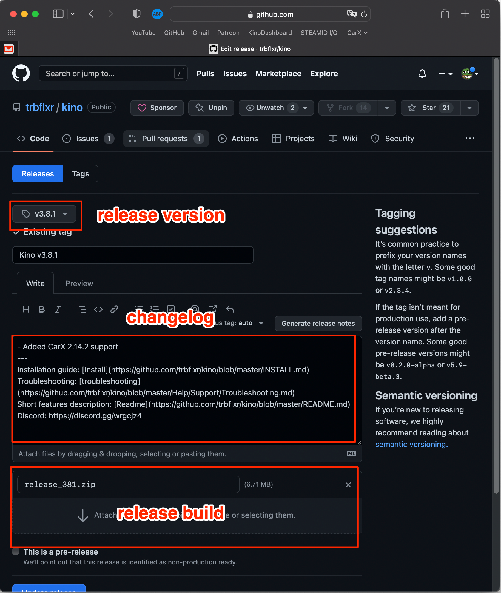

# Make your Kino plugin

**If you come here you probably know how to program.**

## Mod development tips

For easier debugging you can enable the console window in the **kino.ini** file.

All Kino loader crash reports will be created inside of the **kino** folder.

## Basics

So first step is to make a new project and reference Kino core **assemblies** which can be found in **kino/core** directory.

```
Kino.API.dll - The actuall Kino API
0Harmony.dll - For runtime patches
```

Now let's make an entry point.

```c#
using Kino.API;

namespace ExampleKinoMod {
  [KinoPlugin("ExampleKinoMod", "1.0.0", "username")]
  public class ExampleKinoMod : BaseMod {
    private void Awake() {
      Logger.Log("ExampleKinoMod:Awake");
    }
  }
}
```

You have to add **KinoPlugin** attribute and drive your class from **BaseMod** so Kino loader can recognize and load it.

**KinoPlugin** attribute parameters:

- Mod name
- Mod version
- Mod author

Since **BaseMod** is drived from **MonoBehaviour** you can use any **Unity event** methods such as Awake, Update, FixedUpdate, etc.

## Logger

```c#
using Kino.API;

namespace ExampleKinoMod {
  [KinoPlugin("ExampleKinoMod", "1.0.0", "username")]
  public class ExampleKinoMod : BaseMod {
    private void Start() {
      Logger.Log("Log debug message");      // [Info   :ExampleKinoMod] Log debug message
      Logger.LogWarning("Log warning");     // [Warning:ExampleKinoMod] Log warning
      Logger.LogError("Log error");         // [Error  :ExampleKinoMod] Log error
      Logger.LogFatal("Log fatal error");   // [Fatal  :ExampleKinoMod] Log fatal error
    }
  }
}
```

## Config

**BaseMod** contains an IConfig interface example below.

```c#
using Kino.API;

namespace ExampleKinoMod {
  [KinoPlugin("ExampleKinoMod", "1.0.0", "username")]
  public class ExampleKinoMod : BaseMod {
    private StringParam configString_;

    private StringParam cs1_;
    private StringParam cs2_;
    private IntParam ci_;

    private void Awake() {
      // binding new (or existing) param with name 'dummy_string' and initial value 'str0'
      configString_ = Config.Bind(new StringParam("dummy_string", "str0"));

      // if config file for ExampleKinoMod does not exist yet, then initial value of configString_ will be 'str0'
      // if config already exists then value for configString_ will be read from the config, if it doesn't then 'str0' will be set
      Logger.Log($"Config entry value: {configString_.GetValue()}");

      // after setting the value Kino performs an auto save for the config
      configString_.SetValue("new value for string");

      Logger.Log($"Config entry new value: {configString_.GetValue()}");

      // but if you really want to call Save, you can do it like this
      Config.Save();
      
      // important note about config usage:
      cs1_ = Config.Bind(new StringParam("cfg_key", "str0"));  // Ok - the IConfig will return StringParam for that key
      cs2_ = Config.Bind(new StringParam("cfg_key", "str0"));  // Also ok - key is the same along with the type (StringParam)
      ci_ = Config.Bind(new IntParam("cfg_key", 10));          // Not ok - null will be returned, because key was registered added for type StringParam 
    }
  }
}
```

List of available config parameters:

```c#
FloatParam
ClampedFloatParam
BoolParam
IntParam
UintParam
StringParam
Vec2Param
Vec3Param
```

## KinoLoader interface

```c#
using Kino.API;

namespace ExampleKinoMod {
  [KinoPlugin("ExampleKinoMod", "1.0.0", "username")]
  public class ExampleKinoMod : BaseMod {
    private void Start() {
      bool kinoLoaded = KinoLoader.IsModLoadedWithName("KN_loader");                // Check if mod with name 'KN_loader' loaded
      bool someModLoaded = KinoLoader.IsModLoadedWithName("creator_name.mod_name"); // Check if mod with Guid '"creator_name.mod_name"' loaded
      KinoLoader.RequestUnloadSelf();                                               // Request to unload current mod (ExampleKinoMod)
    }
  }
}
```

## Metadata

```c#
using Kino.API;

namespace ExampleKinoMod {
  [KinoPlugin("ExampleKinoMod", "1.0.0", "username")]
  public class ExampleKinoMod : BaseMod {
    private void Start() {
      string modName = Metadata.Name;     // Mod name
      var modVersion = Metadata.Version;  // Mod version
      string modAuthor = Metadata.Author; // Mod author
      string modGuid = Metadata.Guid;     // Mod GUID
    }
  }
}
```

## Harmony patches

If you are not familiar with Harmony you can read more about it [here](https://harmony.pardeike.net/articles/intro.html).

## Updater

### Mod setup

```c#
using Kino.API;

namespace ExampleKinoMod {
  [KinoUpdater(Upd.Less | Upd.Required | Upd.CheckForUpdate, "https://github.com/trbflxr/kino")]
  [KinoPlugin("ExampleKinoMod", "1.0.0", "username")]
  public class ExampleKinoMod : BaseMod {
    private void Awake() {
        Logger.Log("Hello!");
    }
  }
}
```

To add the updater functionality to your mod you have to add the **KinoUpdater** attribute to it. The attribute takes two parameters: **updater flags** and **github repository** link.

**Important:**  The repository you want to mention in the KinoUpdater have to be public. If your mod is not open-sourced then create an empty **public** repo for releases.

Version to compare will be taken from **KinoPlugin** attribute. Make sure you have it in a right format: **major.minor.patch** otherwise the mod will not be loaded.

**Updater flags (Upd enum)**

For enabling certain updater features you have to combine flags using **logical OR (|)** operator.

```c#
  [Flags]
  public enum Upd {
    Disabled = 1 << 0,       // Disable updater

    Less = 1 << 1,           // Update if version LESS then live version
    NotEqual = 1 << 2,       // Update if version NOT EQUAL to live version

    Required = 1 << 3,       // Update required
    CheckForUpdate = 1 << 4  // Check for updates during the game 
  }
 
```

**Example:**

```c#
Upd.Less | Upd.Required | Upd.CheckForUpdate
```

With this set of flags an update will be **required** if the current version is **LESS** than live version. The mod will not work until updated to **live** or **higher** version. Also Kino will **check for updates** during gameplay, so users can be notified about it ASAP.

This way when a new version is released all older versions will stop working. Greater than live versions would still work for **testing** or similar purposes.
**[Kino mod](https://github.com/trbflxr/kino)** works based on the same concept.

```c++
Less_Required example

Installed:    1.0.0    - will no longer work, because version is LESS then live
Live version: 1.1.0    - Ok
Beta-build:   1.2.0    - will work fine, because version is GREATER then live
```

**Note:** Feel free to combine those flags, but beware about adding the **Disabled** flag, in that case any other flags will be ignored. In case you combined **Less** with **NotEqual**, the **NotEqual** will be preferred.

### GitHub setup

We'll use **[Kino mod](https://github.com/trbflxr/kino)** as an example.



First go to repository that you added in the **KinoUpdater** header, navigate to **Releases** and draft a new one. Then setup the new release.



The **Release version** (tag on GitHub) is the actual **live version**. So when you published a new release the live version is changed to it's version (tag). Version has to be in the **v1.2.3** or **1.2.3** format, only letter accepted is **v** in front of the version. It's not required and you can have it without the **v** (1.2.3).

The **Changelog**. Here you can add the actual release changelog. All lines below **---** will be ignored, there you can post links to the installation guide, discord etc. Only lines above **---** will be displayed in the mod as a **changelog**.

And finally **Release build**. Attach your build there so that loader can locate and download it. The name of it is not restricted, but you must have **only one build** for release. Release build has to be in a **.zip** format only. **rar**, **7z** etc. are not supported so beware of it.

**Note: the updater feature is't yet finsihed so it won't work until it's done. However this is the final version of the API, and if you add this to your mod it will work as soon as it's completed.**

## Questions and suggestions

If you have any questions or suggestions about the API, please contact **trbflxr#8814** at discord.