# Создание ресурс паков

## Установка Unity

Установите редактор Unity используя [этот гайд](https://github.com/trbflxr/kino/blob/master/Help/UnityInstallation.md).

## Создание проекта в Unity

Сперва нужно создать новый **HDRP** проект. Сделать это можно через Unity Hub.

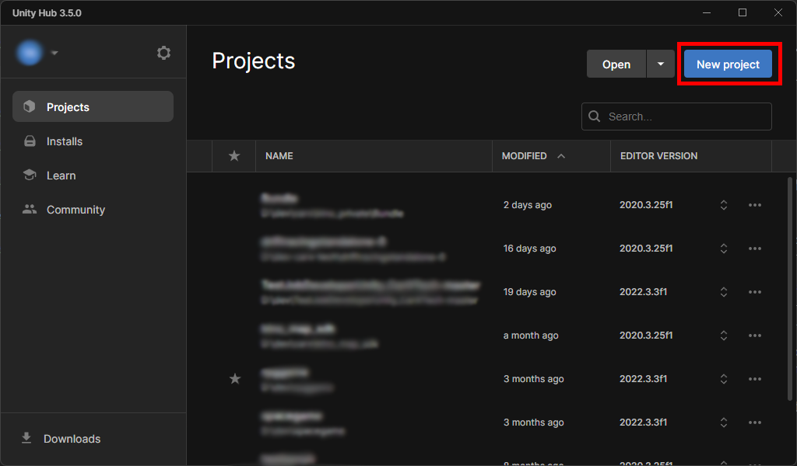

Далее нужно выбрать любой **HDRP** шаблон. Желательно выбрать **Core (HDRP)**, если он доступен, иначе можно выбрать стандартный шаблон HDRP проекта Unity.

> [!NOTE]  
> Обязательно укажите версию Unity Editor `2020.3.25f1`, после чего можно создавать проект.


## Установка инструментов для создания паков

В данный момент Kino поддерживает загрузку любых ассет бандлов, без какого-либо кастомного формата.

Вы можете создавать ассет бандлы любым удобным для вас способом. Если у вас есть какие-то любимые инструменты для работы с бандлами - смело используйте их.

Мы рекомендуем использовать [AssetBundles Browser](https://github.com/Unity-Technologies/AssetBundles-Browser#installation). В примерах ресурспаков будет использован именно этот инструмент.

### Установка AssetBundles Browser

1. Откройте Package Manager в проекте

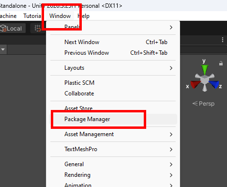

2. После чего нажмите на **+** и выберите **_Add package from git URL_**


3. Введите https://github.com/Unity-Technologies/AssetBundles-Browser.git и нажмите **Add**

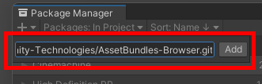

4. Дождитесь окончания установки

Документация для **AssetBundles Browser** доступна [по ссылке](https://github.com/Unity-Technologies/AssetBundles-Browser/blob/master/Documentation/com.unity.assetbundlebrowser.md).

## [Опционально] Подготовка сцены и проекта в Unity

Для более удобной работы мы рекомендуем создать пустую **HDRP** сцену.

1. Нажмите File -> New scene или `Ctrl + N`


2. Затем выберете **Basic Outdoors (HDRP)** и нажмите **Create**


3. После чего сохраните сцену в удобное для вас место

### [Опционально] Удаление лишнего из проекта

В случае если в созданом проекте есть примеры, из можно спокойно удалить, для ускорения загрузки проекта.

В примере был создан проект **3D Sample Scene (HDRP)**, сцена и ассеты которого нам не нужны. Можно удалить следующие папки в проекте.


## Экспорт моделей из Blender

В примере будет показан экспорт моделей из **Blender**, однако вы можете использовать любой софт для 3D моделирования, или взять уже готовые модели.

1. Нажмите File -> Export -> FBX


2. После чего в графе **Path Mode** выберите **Copy** и убедитесь, что кнопка **Embed textures** активна
3. Затем в разделе **Transform** укажите корректные значения **Forward** и **Up** как показано на скриншоте

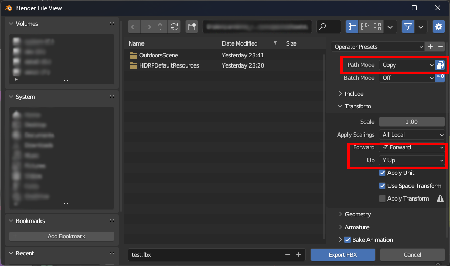

4. Укажите путь и нажмите **Export FBX**

## Подготовка объекта

Объекты можно создавать как из моделей, который вы [экспортировали](#экспорт-моделей-из-blender) из Blender, или же взять любые другие модели. Также их можно создать прямо в Unity.

Процедура создания будет немного отличатся, несколько вариантов будут описаны ниже.

### Подготовка экспортированной модели из Blender

1. После экспорта модели поместите **.fbx** файл в папку **Assets** вашего Unity проекта
2. Далее выберите модель в списке ассетов, затем в инспекторе перейдети на вкладку **Materials** и нажмите **Extract textures**, после чего укажите папку, куда будут распакованы текстуры

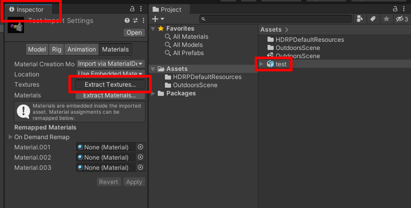

3. На этом этап подготовки закончен и модель должна отображатся в превью с корректными текстурами, можно приступать к [созданию объекта](#создание-объекта)

### Подготовка любых других моделей

В некторотых случаях вам нужно будет распаковать материалы и установить текстуры и их свойства вручную. Для этого выберите модель в списке ассетов и нажмите **Extract materials** в **инспекторе**. Затем укажите папку, куда вы хотите распаковать материалы.

После чего настройте материалы и установите текстуры, если это необходимо. Всё это можно сделать в инспекторе выбранного материала.

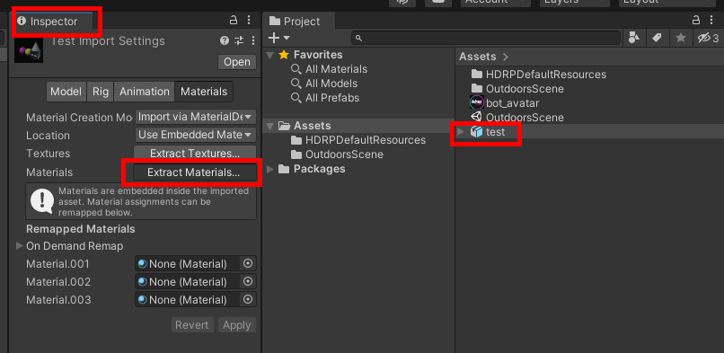

## Создание объекта

1. После того, как модель была [подготовлена](#подготовка-объекта), загрузите её на сцену, сделать это можно перетащив её в иерархию сцены
2. Тут вы можете настроить **Transform** объекта, его иерарию и многое другое


> [!NOTE]  
> **[Опционально]** Если вы хотите добавить возможность покраски, то допишите ```car_paint_``` в начале имени объектов, которые можно будет красить 

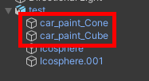

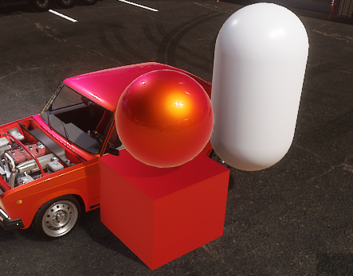

> [!NOTE]  
> **[Опционально]** Также вы можете создать кастомный **выхлоп \ вестгейт**. Для этого создайте и поместите пустые объекты в места, из которых должен выстреливать огонь, и обязательно допишите ```flames_root``` в начале имени каждого.

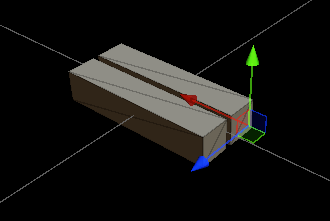


> [!IMPORTANT]  
> Обратите внимание, что от вращения объекта ```flames_root``` будет зависить в какую сторону будут направлены отстрелы. Обязательно протестируйте это перед публикацией.  

3. Далее перетащите объект со сцены обратно во вкладку **Assets** и выберите **Original Prefab** в диалоге сохранения

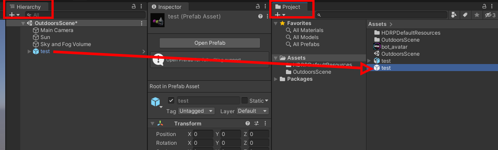


Как вы можете заметить иконка поменялась на иконку префаба.

Объект создан, теперь его можно [добавить в бандл](#добавление-объекта-в-бандл).

## Создание бандла (ресурспака)

Ранее вы уже установили [AssetBundles Browser](#установка-инструментов-для-создания-паков).

> [!NOTE]  
> Можно создавать сколько угодно бандлов и добавлять в них сколько угодно объектов. Ниже пример создания нового бандла.

1. Нажмите Window -> AssetBundle Browser


2. В появившемся окне кликните правой кнопкой мышки и нажмите **Add new bundle**

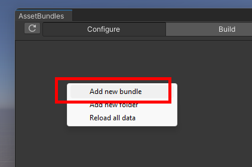

3. Далее укажите имя бандла

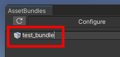

4. Бандл создан, теперь можно [добавлять](#добавление-объекта-в-бандл) в него объекты

## Добавление объекта в бандл

Для добавления объекта в бандл необходимо выбрать желаемый бандл и перетащить в него объект со вкладки **Project**.


> [!NOTE]  
> В бандл (ресурспак) можно добавлять сколько угодно объектов. Однако не рекомендуется делать слишком большие бандлы, так как они будут долго загружатся.

## Сборка бандла (ресурспака)

Для сборки бандла перейдите на вкладку **Build** и нажмите на кнопку **Build**.

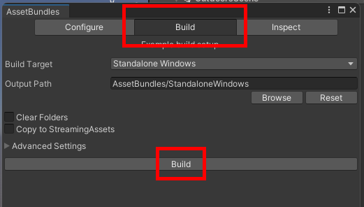

По окончанию сборки ресурспак можно [устанавливать](#установка-ресурспаков).

## Установка ресурспаков

Скопируйте собранный бандл в папку `KN_Base/resources`, после чего ресурспак будет доступен к использованию.

# Примечание

В данном гайде показан процесс создания простого объекта из модели. Но это далеко не единственная возможность ресурспаков.
Вы можете создавать кастомные эффекты, анимированные объекты и ещё много чего, используя инструменты Unity и загружать это в CarX с помошью ресурспаков Kino. 