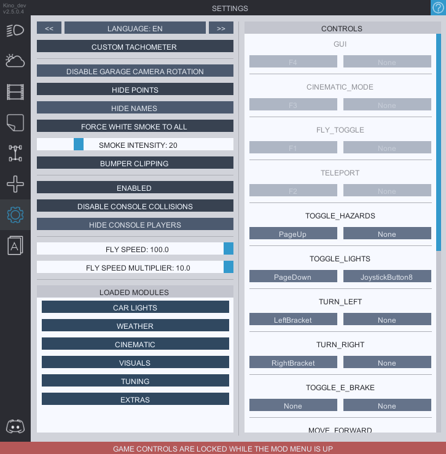

# Settings
You can change the mod language here. Currently avaliable languages are ***eng, fr, jp, ru, nl, ita, pl, zn, tr, de, fi***. If you wish to help us by translating the mod to your language - feel free to contact us on the discord.

**`CUSTOM TACHOMETER`** enables the custom tach that works only when you disable the UI with F11. Appears at the bottom right of the screen.

**`HIDE POINTS`** hides the points counter.

**`HIDE NAMES`** hides the nicknames of other players (a bit buggy).

**`FORCE WHITE SMOKE TO ALL`** makes the smoke of all players white if you're getting annoyed by the colored smoke.

**`BUMPER CLIPPING`** makes the collision of your car smaller allowing your bumpers to slighly clip though the object so you wouldn't crash just from a small wall scratch.

**`DISABLE CONSOLE COLLISIONS`** will disable collisions with console players.

**`HIDE CONSOLE PLAYERS`** will hide them completely.

**`FLY SPEED`** and **`FLY SPEED MULTIPLIER`** are the sliders used to control the speed of the noclip/flymod feature. You can only use it in modded (corrupted lobbies). This feature exists only for modded maps.

**`LOADED MODULES`** is a list of mod modules that are curently being used by the mod. You can disable certain modules if you believe that they affect your game's performance or have conflicts with other mods.

<b>FOR THE RAIN AND SKYBOX FEATURES TO WORK YOU NEED TO DOWNLOAD THE ASSET BUNDLE. TO DOWNLOAD IT CLICK THE <i>UPDATE AVAILABLE</i> AT THE TOP. YOU WILL ALSO UPDATE THE BUNDLE FROM THIS TAB WHENEVER IS NEEDED.
</b>

**`CONTROLS`** tab to the right allows you to change your keybinds withing the mod menu. Supports controller/wheel keybindings (some buttons don't work).
`TURN_LEFT` and `TURN_RIGHT` toggles turn indicators.
`MOVE_*` are the keybinds for the noclip and camera controlls.