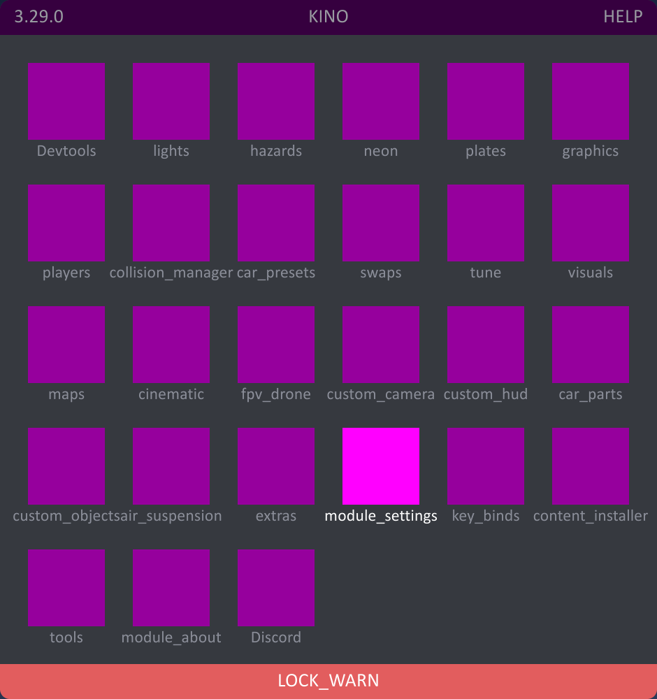

# Issues after updating

## Mod UI display issues

If the mod menu looks like this after update:

It means there was an error during the resource update.

This error occurs because the mod cannot download resources from **github.com**. This may be due to Kino being blocked by your firewall or antivirus. Some users in Russia may also have issues accessing **raw.githubusercontent.com**.

### Simple solution

If you don't want to deal with the causes of the problem, update the resource packs manually. To do this, download all the files from the [Bundles](https://github.com/trbflxr/kino/tree/master/Data/Bundles) folder and then place them (replacing if necessary) in the `KN_Base/kino_resources` folder.

To avoid problems with future updates, we recommend trying to [fix the issue](#proper-solution).

## Missing access to sticker packs and swaps

This error also occurs because the mod cannot download the necessary resources from **github.com**.

### Simple Solution

Download the **data.kn** file from the [Data](https://github.com/trbflxr/kino/tree/master/Data) folder and then place it (replacing if necessary) in the `KN_Base/kino_resources` folder.

To avoid problems with future updates, we recommend trying to [fix the issue](#proper-solution).

## Proper solution

We highly recommend investigating the cause of the problem. Check your firewall and/or antivirus settings to ensure that nothing is blocking Kino.

In some cases, [running Steam as an administrator](../Installation/SteamAdmin.md) may also help.
