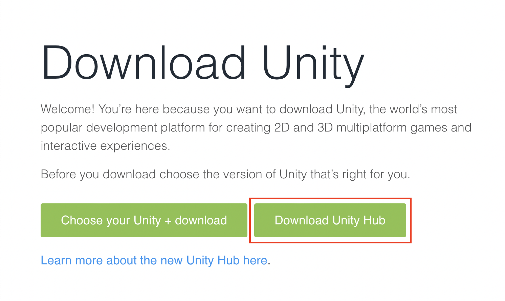
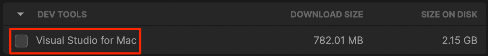
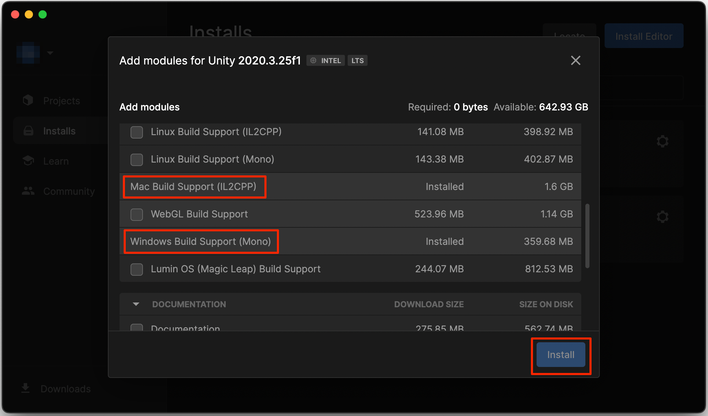

# Установка Unity

В настоящее время CarX работает на версии Unity `2020.3.25f1`. Именно эту версию и нужно будет установить. 

## Установка Unity Hub

В первую очередь необходимо установить Unity Hub, скачать его можно по ссылке:  
https://unity3d.com/get-unity/download
Далее нажмите на кнопку **Download Unity Hub**, скачайте и установите его.

## Установка Unity Editor

Теперь приступим к установке Unity. В данный момент используется версия `2020.3.25f1`. Скачать редактор можно по ссылке:  
https://unity3d.com/get-unity/download/archive

Тут нужно выбрать нужную нам версию в данный момент это `2020.x`
  
После найди в списке `Unity 2020.3.25f1` и нажми на кнопку **Unity Hub**

После загрузки и установки в списке появится нужный редактор

## [Опционально] можно установить модули для поддержки OSX

В случае если Вы хотите создавать карты и ресурс паки не только для **Windows**, но и для **OSX** необходимо установить дополнительные модули.

Для этого выберите нужный редактор, нажмите на **шестеренку**, а затем на **Add modules**

В окне можно снять флажок с **Visual Studio**, если она не нужна.

Далее добавьте компонент **Mac Build Support**, после чего нажмите **Install**

Установка Unity завершена!
