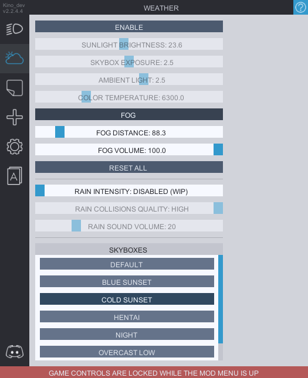

# Weather
In this tab you can **enable** the sliders to change the lighting settings such as the brightness of sunligh, skybox and ambient light as well the color temperature.

**`FOG`** has the options to configre the ***fog distance*** which is how far from the camera the fog will be, and the ***fog volume*** which is basically the thickness of the fog (doesn't really work on current carx version)

**`RAIN INTESITY`** slider has 3 options for the instensity of the rain, which would affect how "thick" the rain effect is.

**`RAIN COLLISIONS`** allows the rain to collide with objects to prevent it from falling through them. Might not work as intended under the tall bridges and on high speeds. Can cause lags in places with a lot of collidable object, mostly noticable on custom maps. Lowering the quality of collisions could reduce the lag, but also negatively affects the look of the effect. 

**`SKYBOXES`** features an option to choose from a few custom skyboxes. Currently is broken on night maps.

<b>ON THE FIRST START YOU WILL HAVE TO DOWNLOAD THE ASSET BUNDLE FROM THE SETTINGS TAB
</b>