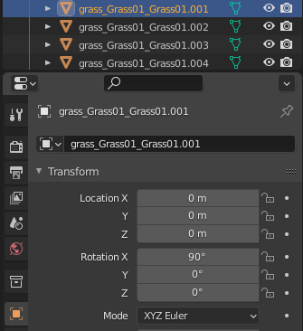
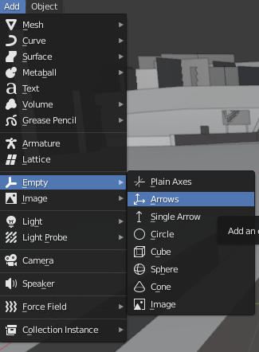
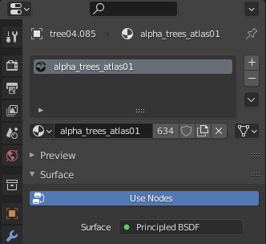
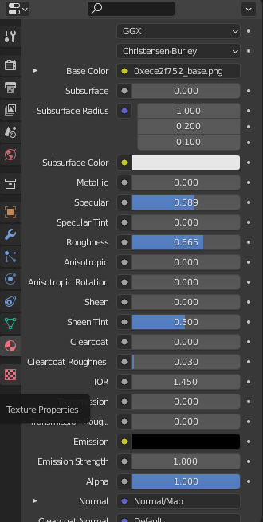
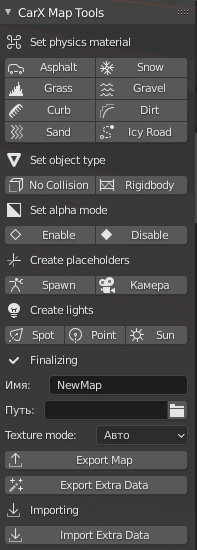

# Map Conversion

!!! important "Intendet Audience"
    This document is intended for people who have experience working with 3D software such as 3Ds Max or Blender.

    If you have no expertise in 3D technologies, this document might not be helpful for you

This guide will lead you through the steps to convert/port a map from another game or model into CarX.

We will use Blender as an example software since it is free and is most popular for converting maps in CarX.

## Physical Materials

Physical materials are assigned by adding a "tag" in the object's name like in example bellow:

### Available materials and their tags:

| Material | Tag        |
| -------: | ---------- |
| Asphalt  | `road_`    |
| Grass    | `grass_`   |
| Kerbs    | `kerb_`    |
| Sand     | `sand_`    |
| Snow     | `snow_`    |
| Gravel   | `gravel_`  |
| Dirt     | `dirt_`    |
| Ice      | `icyroad_` |

## Object types

There are 2 tags for the object types:

- Object with no collision - `nocol*`
- Riggid body - `rb*`

## Extras

You can add spawnpoints, and light sources to your maps. To do so you will have to create an "Arrow" object and name it accordingly.  
  
To create a spawnpoint simply name it `Spawnpoint`

For light sources:  
Spotlight - **Spot**  
Pointlight - **Point**  
Sun - **Sun**  
Object names have to be in english.

## Alpha (transparency)

For objects that have a transparent texture you will have to add one of the following tags:  
Transparent without collision - **alpha\_**  
Transparent with collision - **alphaCol\_**  
Transparent with normalmap - **alphaLit\_**  

## Material properties

In the material settings you can change specularity and roughness parameters.  
**Specularity** is responsible for the sort of "glare" effect.  
**Roughness** makes the surface more rough or smooth (smoother surface will be more reflective).  

## Afterword

**CarX Map Tools** plugin for **Blender** made by **Zi9** is also supported.  
  
Select the object that you want to apply the needed material and press the button. You can only assign one material to a single object.

Spawnpoints and light sources are saved to **Extra Data** file.
