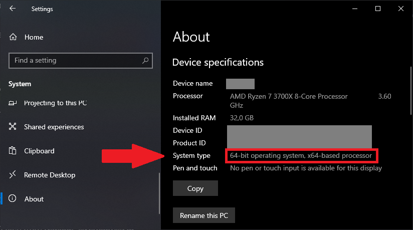
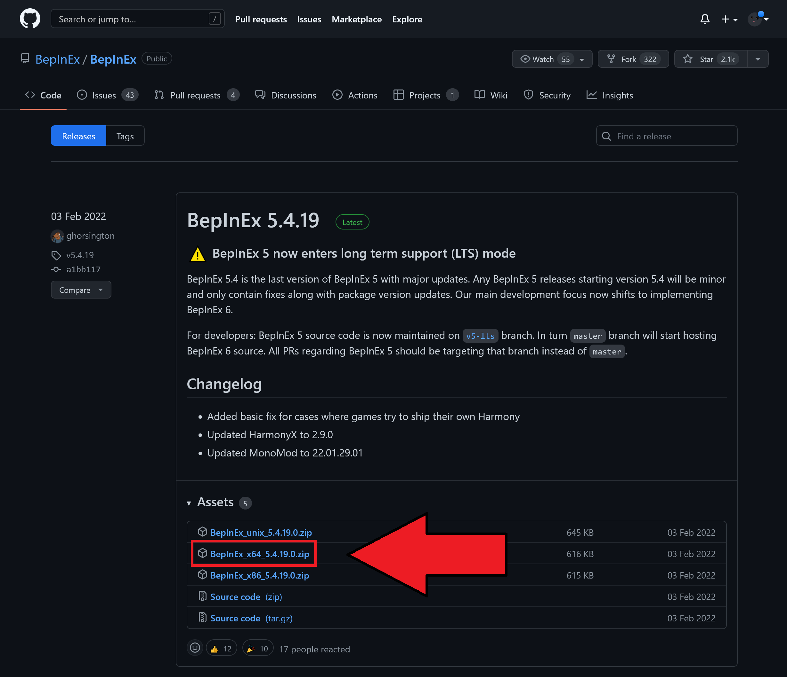
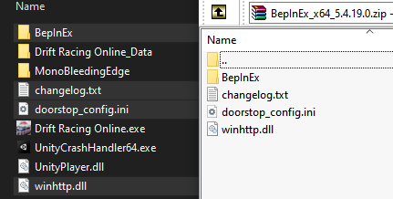
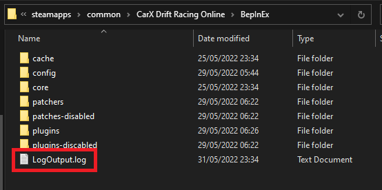
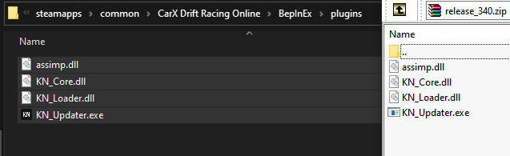

# Installation

**This mod does not work on Windows 7**

Please refer to the installation instructions in your preferred language in the table of contents on the right.

## English

### Step 1: Make sure to enable the moddable version of CarX

You are required to enable the moddable version of CarX in steam to be able to load mods!

- Go to Steam, open your library and right click on **CarX Drift Racing Online**
- Select `Properties`
- Select `BETAS`
- Select the version of the game that says `moddable`

!!! info "Once you have selected the moddable beta, your game should start downloading the moddable build which you should see in your Steam downloads. Once that's complete, you are ready to continue"

  <iframe width="560" height="560" src="https://www.youtube-nocookie.com/embed/h7rgvBkVgHw" title="YouTube video player" frameborder="0" allow="accelerometer; autoplay; clipboard-write; encrypted-media; gyroscope; picture-in-picture" allowfullscreen></iframe>

### Step 2: Install BepInEx Mod Loader

BepInEx is a mod loader that we require to be able to load the mod in the game.

Go to the [BepInEx Releases Page](https://github.com/BepInEx/BepInEx/releases) and download the latest stable release.

Make sure **NOT** to download the _Source Code_. What we require is the `BepInEx_x64_[version].zip` whereas `version` is the version you are installing at the moment.

If you're running Windows in 32bit, you need the `x86` file instead of `x64` as chosen in our example.

??? faq "Do I need 64 or 32 bit?"
    You can easily check if your system is running 32 or 64 bit by going into  
    `Windows Settings` :material-chevron-right: `System` :material-chevron-right: `About`

    <small>More Info: <https://support.microsoft.com/en-us/windows/32-bit-and-64-bit-windows-frequently-asked-questions-c6ca9541-8dce-4d48-0415-94a3faa2e13d></small>

    

???+ info "Example for 64bit"
    

Once downloaded, extract the contents of the `.zip` archieve into your CarX Drift Racing Online folder.

#### Verify BepInEx Installation

To verify that you have successfully installed BepInEx, start your game and check if a Log file gets created in your BepInEx folder inside the CarX game folder

!!! warning "I do ^^not^^ have that file"
    If the `LogOutput.txt` does ^^**not**^^ generate, it's very likely that you have missed a point, or perhaps the BepInEx installation has changed.

    Please refer to the official BepInEx documentation on how to install it here:  
    <https://docs.bepinex.dev/articles/user_guide/installation/index.html>

### Step 3: Install KiNO

!!! warning inline end "Do ^^**NOT**^^ download the source code"

Once you have installed BepInEx and verified that the Log file gets created to ensure BepInEx works properly, continue by downloading the latest release of KiNO in the [release page](https://github.com/trbflxr/kino/releases).

Once you have downloaded the release file, you need to extract the contents of it into your BepInEx `plugins` folder.

!!! info "If you don't have the `plugins` folder, you can create it yourself"

!!! warning "I'm getting `VCRUNTIME140.dll Is Missing` error"
    Please install the [Visual C++ Redistributable for Visual Studio 2015, 2017 and 2019](https://support.microsoft.com/en-us/help/2977003/the-latest-supported-visual-c-downloads).  
    You will need the [vcredist_x64.exe](https://aka.ms/vs/16/release/vc_redist.x64.exe).

That's it, when you start up CarX now it should be ready. Please take a look at our [usage guide](usage.md) to get started!

If you have any more issues, take a glance at our [Troubleshooting Page](troubleshooting.md) before creating a Github Ticket or asking on Discord as we have covered the most commonly asked questions there :)

---

## German/Deutsch

### Schritt 1: Wechsel auf die modifizierbare CarX Version

Du musst die modifizierbare Version von CarX in Steam einstellen damit du Mods laden kannst!

- Öffne Steam, gehe in deine Bibliothek und Rechts-Klicke auf **CarX Drift Racing Online**
- Gehe in die `Eigenschaften`
- Wähle `BETAS`
- Wähle die Version des Spiels welche `moddable` im Namen hat

!!! info "Sobald du die modifizierbare Version ausgewählt hast, sollte der Download in Steam starten. Sobald dies fertig ist kannst du mit den nächsten Schritten weiter machen."

  <iframe width="560" height="560" src="https://www.youtube-nocookie.com/embed/h7rgvBkVgHw" title="YouTube video player" frameborder="0" allow="accelerometer; autoplay; clipboard-write; encrypted-media; gyroscope; picture-in-picture" allowfullscreen></iframe>

### Schritt 2: Installiere BepInEx Mod Loader

BepInEx ist ein mod loader welches wir für KiNO benötigen um es in unserem Spiel zu nutzen.

Gehe in die [BepInEx Releases Seite auf Github](https://github.com/BepInEx/BepInEx/releases) und lade dir die neuste stabile Version runter.

Lade auf **keinen Fall** den _Source Code_ (Quelltext) runter. Wir benötigen die `BepInEx_x64_[version].zip` worin `version` die gerade zu installierende Version ist.

Wenn du Windows in 32bit hast, dann brauchst du die `x86` Datei anstatt der `x64` welches wir im Beispiel genutzt haben.

??? faq "Brauche ich 64 oder 32 bit?"
    Du kannst ganz einfach überprüfen ob dein System 32 oder 64 bit nutzt indem du in den Windows Einstellungen hierhin gehst:
    `Windows Einstellungen` :material-chevron-right: `System` :material-chevron-right: `Info`

    <small>Mehr Infos: <https://support.microsoft.com/de-de/windows/32-bit-und-64-bit-windows-h%C3%A4ufig-gestellte-fragen-c6ca9541-8dce-4d48-0415-94a3faa2e13d></small>

    

???+ info "Beispiel für 64bit"
    

Sobald der Download abgeschlossen hat, extrahiere den Inhalt der `.zip` in deinen CarX Drift Racing Online Ordner.

#### Verifiziere die BepInEx Installation

Um die Installation von BepInEx zu verifizieren, starte einfache das Spiel und überprüfe ob eine Log Datei im BepInEx Order erstellt wurde

!!! warning "Ich habe diese Datei ^^nicht^^"
    Wenn die `LogOutput.txt` Datei ^^**nicht**^^ erstellt wurde, hast du wahrscheinlich einen Schritt verpasst, oder vielleicht hat sich die Installtion von BepInEx geändert.

    Bitte greife auf die offiziellen BepInEx Installationsdokumentation zurück. Diese findest du hier:  
    <https://docs.bepinex.dev/articles/user_guide/installation/index.html>

### Step 3: Installiere KiNO

!!! warning inline end "Lade ^^**nicht**^^ den _Source Code_ (Quelltext) runter"

Sobald du BepInEx erfolgreich installiert und auf funktion verifiziert hast, kannst du mit dem Download der KiNO Mod fortfahren. Diesen findest du auf der [Releases Seite auf Github](https://github.com/trbflxr/kino/releases).

Sobald du die Datei heruntergeladen hast, extrahiere dessen Inhalt in den BepInEx `plugins` Ordner.

!!! info "Wenn du den `plugins` Ordner nicht hast, dann kannst du diesen selber erstellen"

!!! warning "Ich bekomme den `VCRUNTIME140.dll Is Missing` Fehler"
    Bitte installiere die [Visual C++ Redistributable für Visual Studio 2015, 2017 and 2019](https://support.microsoft.com/en-us/help/2977003/the-latest-supported-visual-c-downloads).  
    Du benötigst die [vcredist_x64.exe](https://aka.ms/vs/16/release/vc_redist.x64.exe).

Das war's, du kannst nun CarX starten und es sollte funktionieren. Schau die unseren [Usage Guide (Nutzungsanleitung, Englisch)](usage.md) an um dich mit den Funktionen vertraut zu machen.

Wenn du noch Probleme hast, schaue dir unsere [Troubleshooting Seite](troubleshooting.md) an bevor du ein Github Ticket erstellst oder im Discord fragst, weil wir dort die häufig gestellten Fragen beantworten :)

---

## Russian/Русский:

!!! TODO "Needs contribution by someone speaking the language to be reworked similar to the English version!"

1.  Убедитесь что вы находитесь на модовой версии игры. Для этого откройте стим, правый клик по **CarX Drift Racing Online**, затем **`Свойства...`**, перейдите во вкладку **`БЕТА-ВЕРСИИ`** и из списка выбирете версию игры с припиской **(moddable)**.
1.  Установите [BepInEx mod loader](https://github.com/BepInEx/BepInEx/releases), если ещё не установлен.  
    Для этого скачайте **x64** версию BepInEx. Не скачивайте **Unix** версию.  
    Распакуйте следующие файлы из **BepInEx*x64*%version%.zip** в папку игры `CarX Drift Racing Online`:  
     > BepInEx  
     doorstep_config.ini  
     winhttp.dll
1.  Скачайте последний релиз **KiNO** со [вкладки с релизами](https://github.com/trbflxr/kino/releases) (**НЕ НУЖНО СКАЧИВАТЬ SOURCE CODE**).  
    Распакуйте следущие файлы из архива **release\_%version%.zip**:  
     > assimp.dll  
     KN_Core.dll  
     KN_Loader.dll  
     KN_Updater.exe

        в папку `CarX Drift Racing Online\BepInEx\plugins`.

    Если в папке `BepInEx` нет папки `plugins`, то создайте её вручную, либо она должна создаться автоматически после первого запуска игры.

1.  Если мод не работает или у вас вылезает ошибка `VCRUNTIME140.dll Is Missing`, вам может потребоваться скачать и установить [Visual C++ Redistributable for Visual Studio 2015, 2017 and 2019](https://support.microsoft.com/en-us/help/2977003/the-latest-supported-visual-c-downloads). Вам потребуется файл [vcredist_x64.exe](https://aka.ms/vs/16/release/vc_redist.x64.exe).

1.  Краткое описание функций мода можно посмотреть [здесь](README.md).

## Portuguese/Português:

!!! TODO "Needs contribution by someone speaking the language to be reworked similar to the English version!"

1.  Instale o [BepInEx mod loader](https://github.com/BepInEx/BepInEx/releases) caso você ainda não o tenha.  
    Baixe a versão **x64** do BepInEx. Não baixe a versão **Unix**.  
    Extraia os seguintes arquivos de **BepInEx*x64*%version%.zip** dentro da sua pasta do `CarX Drift Racing Online`:  
     > BepInEx  
     doorstep_config.ini  
     winhttp.dll
1.  Baixe a última versão do **KiNO** da [aba de releases](https://github.com/trbflxr/kino/releases) **(NÃO BAIXE O CÓDIGO FONTE)**.  
    Extraia os seguintes arquivos de **release\_%version%.zip**:  
     > assimp.dll  
     KN_Core.dll  
     KN_Loader.dll  
     KN_Updater.exe

        dentro da pasta `CarX Drift Racing Online\BepInEx\plugins`.

    Caso você não tenha a pasta `plugins` dentro da pasta `BepInEx`, então crie você mesmo ou inicie o jogo para que a pasta seja criada automaticamente.

1.  Caso o mod não funcione ou você esteja com o erro `VCRUNTIME140.dll Is Missing`, talvez seja necessário baixar e instalar o [Visual C++ Redistributable for Visual Studio 2015, 2017 and 2019](https://support.microsoft.com/en-us/help/2977003/the-latest-supported-visual-c-downloads). Você irá precisar executar o arquivo [vcredist_x64.exe](https://aka.ms/vs/16/release/vc_redist.x64.exe).

1.  Uma descrição resumida das funcionalidades pode ser encontrada [aqui](README.md).
