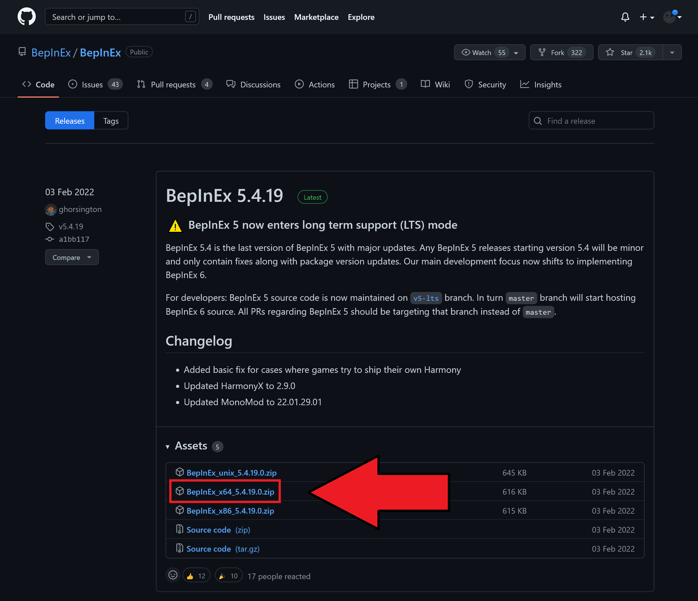

# Installation

**This mod does not work on Windows 7**

Please refer to the installation instructions in your preferred language in the table of contents on the right.

## English

### Step 1: Make sure to enabled the moddable version of CarX

You are required to enable the moddable version of CarX in steam to be able to load mods!

- Go to Steam, open your library and right click on **CarX Drift Racing Online**
- Select `Properties`
- Select `BETAS`
- Select the version of the game that says `moddable`

!!! info "Once you have selected the moddable beta, your game should start downloading the moddable build which you should see in your Steam downloads. Once that's complete, you are ready to continue"

  <iframe width="560" height="560" src="https://www.youtube-nocookie.com/embed/h7rgvBkVgHw" title="YouTube video player" frameborder="0" allow="accelerometer; autoplay; clipboard-write; encrypted-media; gyroscope; picture-in-picture" allowfullscreen></iframe>

### Step 2: Install BepInEx Mod Loader

BepInEx is a mod loader that we require to be able to load the mod in the game.

Go to the [BepInEx Releases Page](https://github.com/BepInEx/BepInEx/releases) and download the latest stable release.

Make sure **NOT** to download the _Source Code_. What we require is the `BepInEx_x64_[version].zip` whereas `version` is the version you are installing at the moment.

If you're running Windows in 32bit, you need the `x86` file instead of `x64` as chosen in our example.

Once downloaded, extract the contents of the `.zip` archieve into your CarX Drift Racing Online folder.

### Step 3: Download KiNO

!!! TODO "//TODO: THE REST FROM HERE"

3.  Download the latest version of **KiNO** from the [release tab](https://github.com/trbflxr/kino/releases) **(DO NOT DOWNLOAD SOURCE CODE)**.  
    Extract the following files from **release\_%version%.zip**:  
     > assimp.dll  
     KN_Core.dll  
     KN_Loader.dll  
     KN_Updater.exe

        inside `CarX Drift Racing Online\BepInEx\plugins`.

    If you don't have the `plugins` folder inside the `BepInEx` then either create it yourself or start the game for it to be created automatically.

4.  If mod doesn't work, or you get `VCRUNTIME140.dll Is Missing` error, you might have to download and install the [Visual C++ Redistributable for Visual Studio 2015, 2017 and 2019](https://support.microsoft.com/en-us/help/2977003/the-latest-supported-visual-c-downloads). You will need the [vcredist_x64.exe](https://aka.ms/vs/16/release/vc_redist.x64.exe).

5.  A short description of the features can be found [here](README.md).

## Русский:

1.  Убедитесь что вы находитесь на модовой версии игры. Для этого откройте стим, правый клик по **CarX Drift Racing Online**, затем **`Свойства...`**, перейдите во вкладку **`БЕТА-ВЕРСИИ`** и из списка выбирете версию игры с припиской **(moddable)**.
1.  Установите [BepInEx mod loader](https://github.com/BepInEx/BepInEx/releases), если ещё не установлен.  
    Для этого скачайте **x64** версию BepInEx. Не скачивайте **Unix** версию.  
    Распакуйте следующие файлы из **BepInEx*x64*%version%.zip** в папку игры `CarX Drift Racing Online`:  
     > BepInEx  
     doorstep_config.ini  
     winhttp.dll
1.  Скачайте последний релиз **KiNO** со [вкладки с релизами](https://github.com/trbflxr/kino/releases) (**НЕ НУЖНО СКАЧИВАТЬ SOURCE CODE**).  
    Распакуйте следущие файлы из архива **release\_%version%.zip**:  
     > assimp.dll  
     KN_Core.dll  
     KN_Loader.dll  
     KN_Updater.exe

        в папку `CarX Drift Racing Online\BepInEx\plugins`.

    Если в папке `BepInEx` нет папки `plugins`, то создайте её вручную, либо она должна создаться автоматически после первого запуска игры.

1.  Если мод не работает или у вас вылезает ошибка `VCRUNTIME140.dll Is Missing`, вам может потребоваться скачать и установить [Visual C++ Redistributable for Visual Studio 2015, 2017 and 2019](https://support.microsoft.com/en-us/help/2977003/the-latest-supported-visual-c-downloads). Вам потребуется файл [vcredist_x64.exe](https://aka.ms/vs/16/release/vc_redist.x64.exe).

1.  Краткое описание функций мода можно посмотреть [здесь](README.md).

## Português:

1.  Instale o [BepInEx mod loader](https://github.com/BepInEx/BepInEx/releases) caso você ainda não o tenha.  
    Baixe a versão **x64** do BepInEx. Não baixe a versão **Unix**.  
    Extraia os seguintes arquivos de **BepInEx*x64*%version%.zip** dentro da sua pasta do `CarX Drift Racing Online`:  
     > BepInEx  
     doorstep_config.ini  
     winhttp.dll
1.  Baixe a última versão do **KiNO** da [aba de releases](https://github.com/trbflxr/kino/releases) **(NÃO BAIXE O CÓDIGO FONTE)**.  
    Extraia os seguintes arquivos de **release\_%version%.zip**:  
     > assimp.dll  
     KN_Core.dll  
     KN_Loader.dll  
     KN_Updater.exe

        dentro da pasta `CarX Drift Racing Online\BepInEx\plugins`.

    Caso você não tenha a pasta `plugins` dentro da pasta `BepInEx`, então crie você mesmo ou inicie o jogo para que a pasta seja criada automaticamente.

1.  Caso o mod não funcione ou você esteja com o erro `VCRUNTIME140.dll Is Missing`, talvez seja necessário baixar e instalar o [Visual C++ Redistributable for Visual Studio 2015, 2017 and 2019](https://support.microsoft.com/en-us/help/2977003/the-latest-supported-visual-c-downloads). Você irá precisar executar o arquivo [vcredist_x64.exe](https://aka.ms/vs/16/release/vc_redist.x64.exe).

1.  Uma descrição resumida das funcionalidades pode ser encontrada [aqui](README.md).
