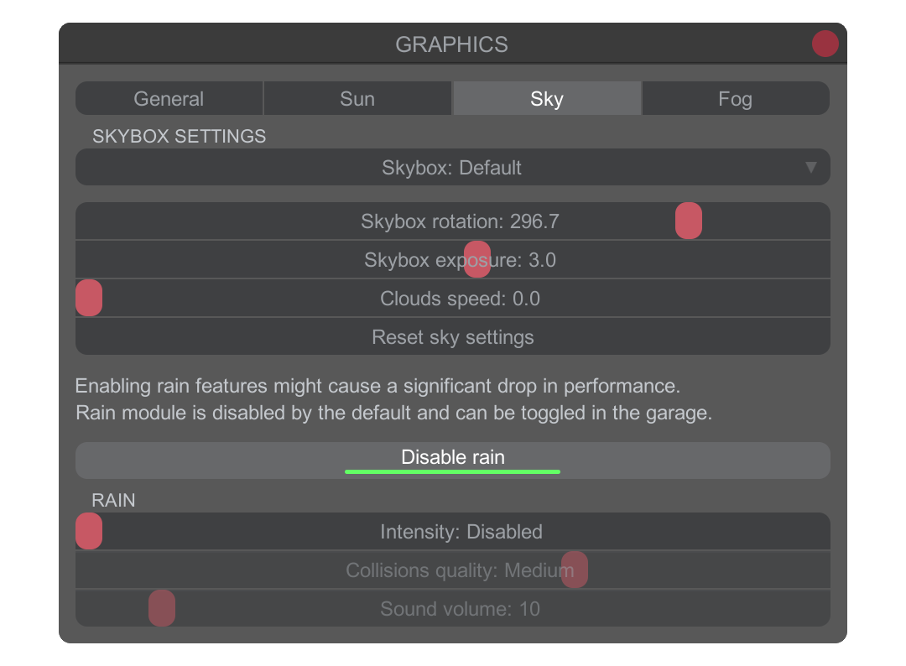
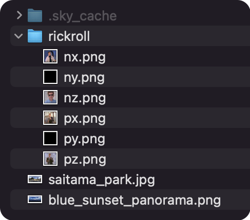
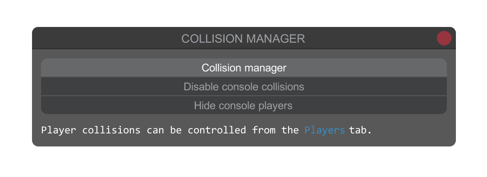
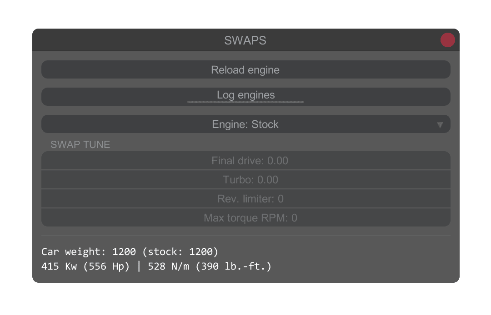
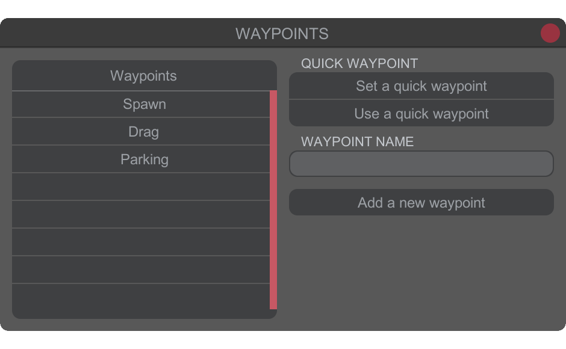
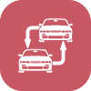
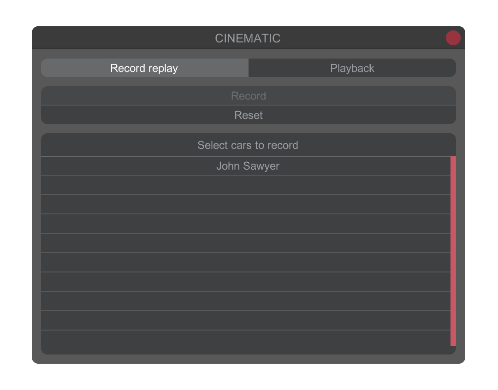
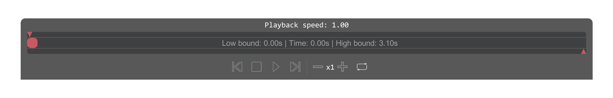
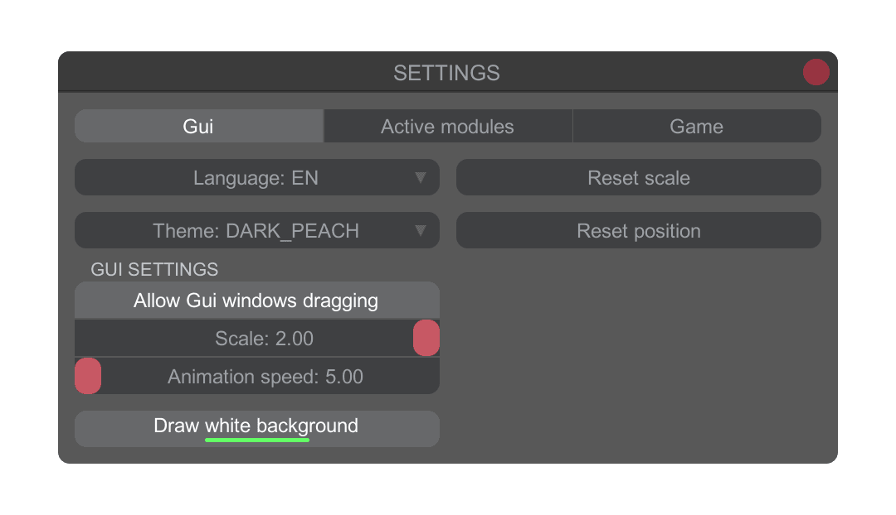

# Basic Usage

This manual is going to guide you through the main mod's features and provide a short guide on how to use them.


## Extras

  
Extras is the module given to kino supporters.  
In the extras tab you can enable your custom nametag as well as select whether it will show in the front or after you nickname. Your tag can be set in the `tag.txt` file located at:  
`../Carx Drift Racing Online/BepInEx/plugins/KN_Base/tag.txt`  
  
Here's an example of how the file should look:  


Aside from the nametag Extras include [engine swaps](#swaps).  
And ability to manage player's [collisions](#players).

## Lights

  
In this tab you can adjust settings of your headlights such as horizontal angle (affects vertical as well), brightness and the colors of the beam.

Also you have an option for daylight running lights which hide the beams and toggle pop-ups in **fully open** and **sleepy** modes.

P.S. Pop-up headlights don't work on AE86 due to the model issue.


## Hazards

  
Here you can set up your hazard lights. Settings allow you to change their blinking interval and adjust positions to fit your bodykit.


## Neon

  
Color settings, brightness and lighting mode for your underglow.


## License plates

  
In license plates settings you can add plates for front and rear of the car, adjust their positions, change the format and put your own text on it.


## Graphics

  
In the graphics tab you can adjust in-game lighting, enable the fog and use custom skyboxes.

General settings enable you to toggle `HD shadows` and `Realtime reflections`.  
Realtime reflections have 2 quality options: **Low** only relfects skybox and the map while **Medium** reflects cars and shadows as well.  




To load your own skyboxes you need to have them in the following formats:




**For cubemaps:**

> **nx = +x  
> ny = -y  
> nz = -z  
> px = +x  
> py = +y  
> pz = +z**

**png** and **jpg** only

All the face images should be inside a folder.

**For panoramas:**  
Panoramas can be used in .png and .jpg formats. You can convert HDR and EXR skyboxes to .png or .jpg to use them with the mod.

Skyboxes are installed into the following folder:

```
CarX Drift Racing Online\BepInEx\plugins\KN_Base\sky
```

## Players

  
In the **players** tab you can teleport to a selected player by clicking on their name in the list.  
`S` button next to a players name allows you to check the selected players specs.

**Extras only**  
`H` button allows you to hide players.  
`C` button disables selected player's collision.


## Collision manager

  
In the collision manager you can disable collisions for console players or hide them completely. Per player collisions can be manged from the [players](#players) tab.


## Swaps

  
**AS OF NOW ENGINE SWAPS ARE ONLY AVAILABLE TO KINO SUPPORTERS**  
In this tab you can swap the engine of the car and adjust the engine settings on the track.


## Tune

  
From here you can save and load your tunes, as well as enable suspension monitor to see live values for your camber and enable custom backfire.

The saved tunes can be found inside the **tunes** folder.
It can be found at:

```
...\CarX Drift Racing Online\BepInEx\plugins\KN_Base\visuals
```

To use a downloaded tune put it in this folder as well.


## Maps

  
Kino features a custom maploader that allows you to load the maps in the .obj format.  

Downloaded maps should be installed into:

```
...\CarX Drift Racing Online\BepInEx\plugins\KN_Base\maps
```

To instal the map you need to put the folder containing the .obj file in the aformentioned folder. No .zip or .rar files.  
If you wish to create your own maps, refer to the [this guide](Map%20Conversion.md).

## Waypoints

  
This feature allows you to save multiple points on the map that you can quickly teleport to. Every native map already has some preset waypoints.  


## Change car

  
Change car feature allows you to switch your car on the track (works only in multiplayer). You can bind a shortcut button for it in the [keybinds](#keybinds) tab of the mod.

## Cinematic

  
Select players you want to record from the list and click on the record button to record a replay. Click on the stop button to save your replay once you're done.
  
From the playback tab you can load your replays and focus on cars from the replay by choosing a ghost from the list and pressing F3.

You replays are saved to:

```
...\CarX Drift Racing Online\BepInEx\plugins\KN_Base\replays
```

  
On the timeline you can set the starting and ending point of your replay by dragging arrows at the start and the end of the timeline. You can also adjust the playback speed and loop your replay.


## Custom HUD

  
Currently only allows you to enable simplified tachometer that only works with in-game UI hidden (F11 by default.)


## Visuals

  
In the visuals tab you can load and save your liveries. Additionally you have some additional features to help you with livery creation such as camera zoom and offset along with the ability to enable and disable symmetry for all the layers at once as well as change their material.

The saved liveries can be found inside the **visuals** folder.  
It can be found at:

```
...\CarX Drift Racing Online\BepInEx\plugins\KN_Base\visuals
```

To use a downloaded livery put it in this folder as well.


## Air suspension

  
A module rewarded as a part of Discord exclusive rewards for 2nd tier Patreon supporters.

It allows you to control the suspension height, switch between air and hydraulics modes, save up to 3 presets for the air suspension and set up [keybinds](#keybinds) for a more convenient use.

The first time you open the module you will be greeted with a tutorial containing some information on how to use the features.


## Noclip settings

  
In the noclip settings you can change the speed and the speed multiplier.  
Default keybinds:  
`F1` to activate noclip.  
`Left Shift` to speed up (uses speed multiplier setting).  
`Home` to freeze your car in place.  
`End` to unfreeze the car.

**Noclip only works in singleplayer and modded lobbies (with _CORRUPTED_ tag).**

## Settings

  
In the gui settings you can change the mod language, color theme, enable window dragging or change the scale of the mod's window.
  
From the modules tab you can enable and disable some of the mod's features.
  
In the game settings you have some _quality of life_ features as well as toggles for synchronization of different mod features between kino users (on by defaul).


## Keybinds

  
Here you can bind shortcuts for some of the mod's features. Controller is supported, however some buttons can not be binded due to certain limitations.


## Resource manager

  
For some of the mod's features you might have to download an asset bundle containing resouces needed for the feartures to function. In this tab you can download and update the bundle.

